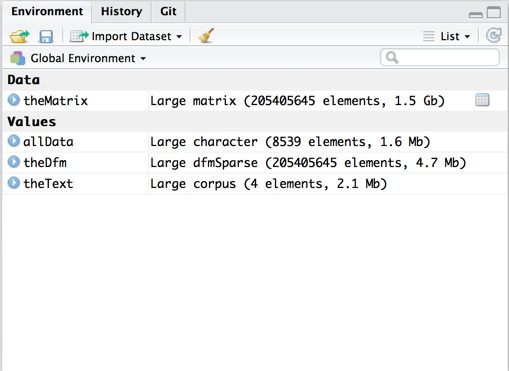
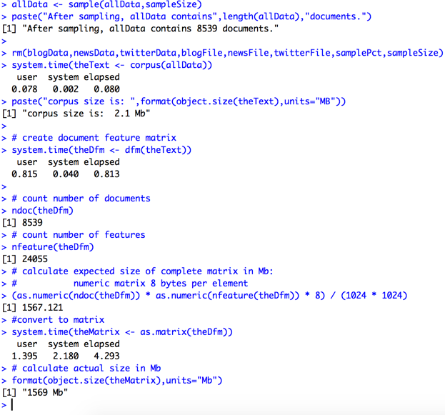

# Common Problems: Converting Document Feature Matrix to a Regular Matrix

A common tool in natural language processing is the document feature matrix, also known as a [document term matrix](http://bit.ly/2B6ILE4). Many of the text analysis packages in R use a special type of sparse matrix to minimize the amount of memory used to store a document feature matrix.

Sometimes people new to natural language processing attempt to convert a document feature matrix to a regular matrix in R. Usually this procedure fails because the computer runs out of memory. Why does this happen? Converting a document feature matrix to a regular matrix is very expensive in terms of memory. The document feature matrix doesn't consume memory for empty cells in the matrix, whereas a regular numeric matrix consumes 8 bytes per element, plus overhead.

To illustrate the comparison, I took a .2% sample of the data from the [Heliohost Corpus](http://bit.ly/2qm30YY) used for the *Johns Hopkins University Data Science Specialization* Capstone project, generated a document feature matrix, and then converted it to a matrix. The document feature matrix of words consumes about 1.5Gb as a matrix.

We can calculate in advance the size of the matrix by using the `ndoc()` and `nfeature()` functions. Each element in a numeric matrix consumes 8 bytes of RAM. One can then compare the predicted size with actual size via `object.size()`.

As illustrated in the output posted below, the actual size of the matrix is within 2 Mb of the estimate.

If one uses  this technique on the `Corpus.tokens.dfm` object, it quickly becomes evident why the `as.matrix()` function runs out of memory when applied to a document frequency matrix.

The code listed above was run on the MacBook Pro with the following configuration.

<table>
    <tr>
        <th>Computer</th>
        <th>Configuration</th>
    </tr>
    <tr>
        <td valign=top>Apple Macbook Pro</td>
        <td>
            <ul>
                <li>Operating system: OS X Sierra 10.12.6 (16G29)</li>
                <li>Processor: Intel i5 at 2.6Ghz, turbo up to 3.3Ghz, two cores with two threads each</li>
                <li>Memory: 8 gigabytes</li>
                <li>Disk: 512 gigabytes, solid state drive</li>
                <li>Date built: April 2013</li>
            </ul>
        </td>
     </tr>
</table>
