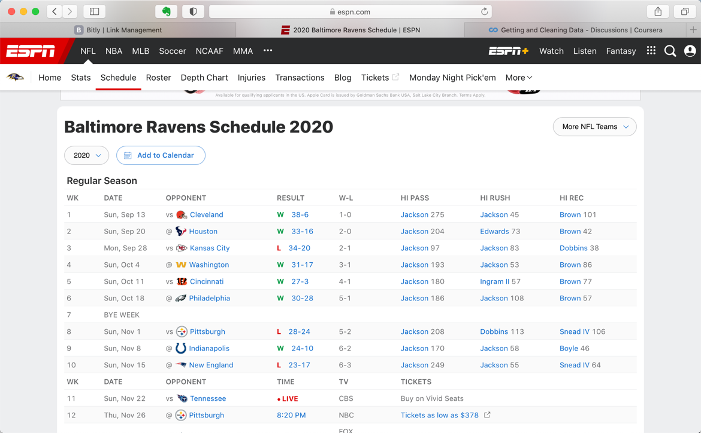
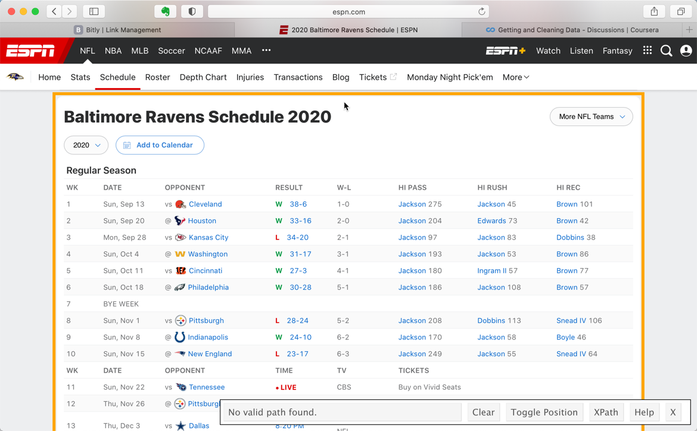
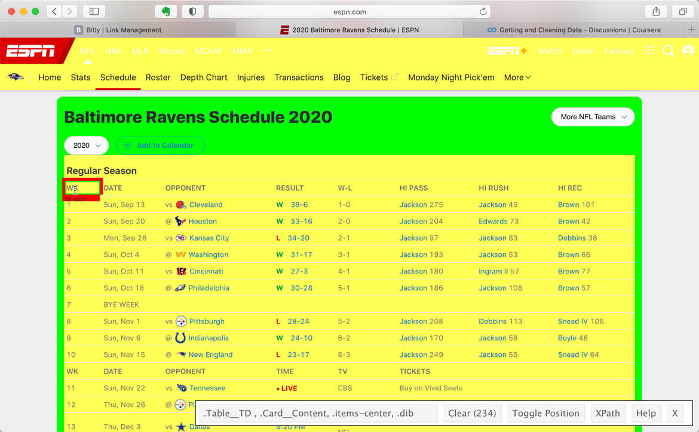
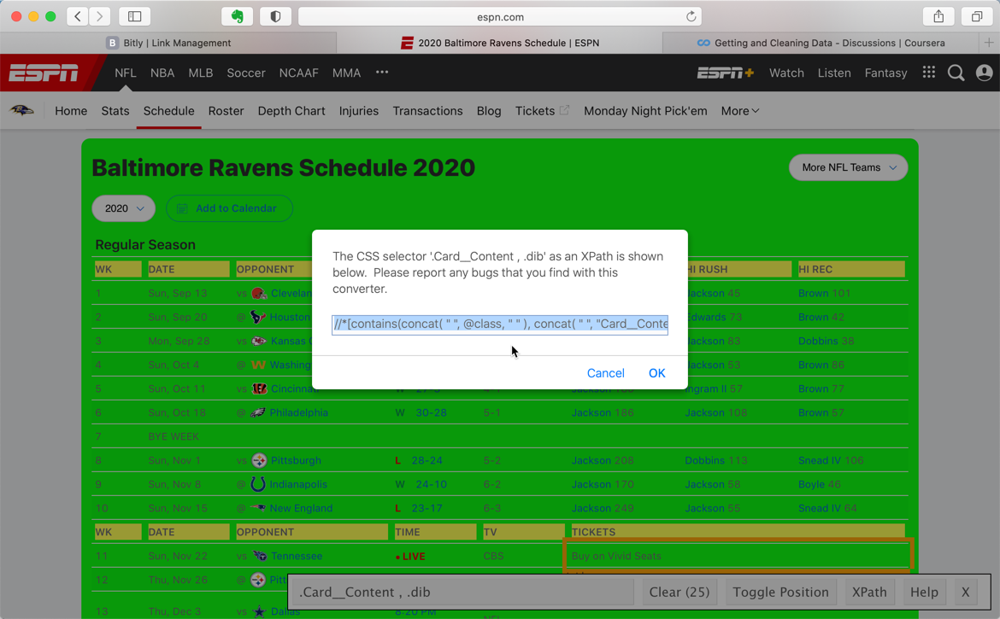
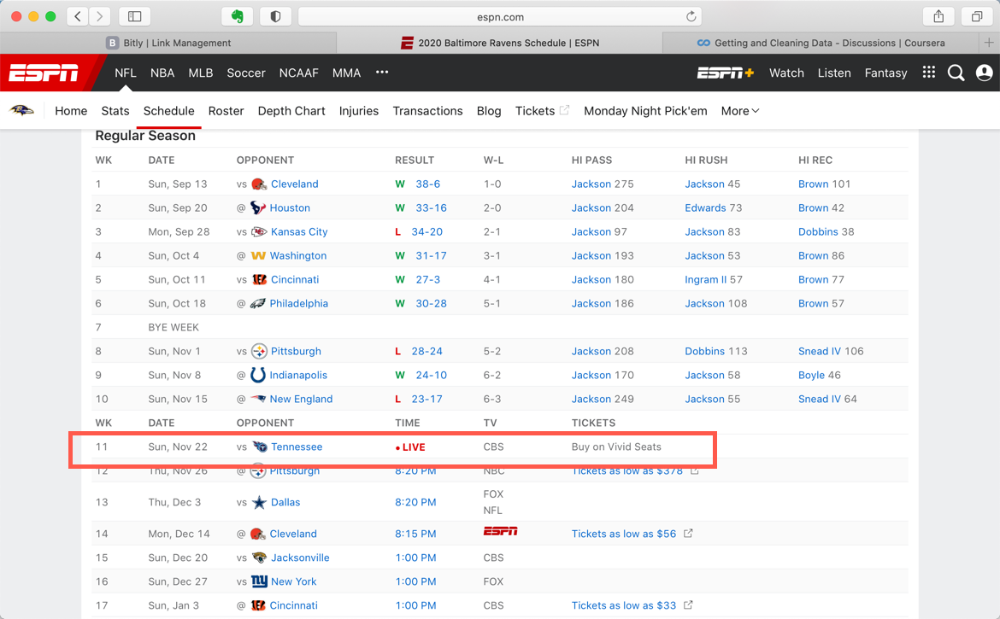
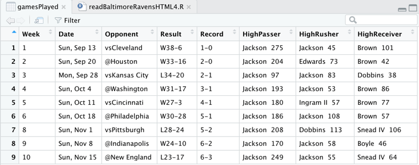
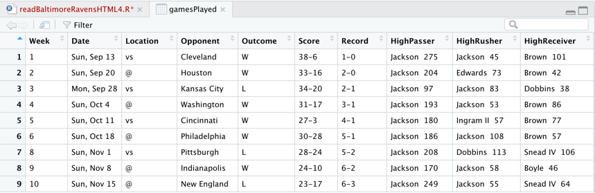

# Demystifying HTML Parsing: Baltimore Ravens ESPN Home Page

Students in the Johns Hopkins University *Getting and Cleaning Data* course on [coursera.org](http://coursera.org) bring a variety of expectations to the course. Given that the lectures focus on the R code needed to collect and transform data from a wide variety of data sources, students often try to replicate the examples from the lectures.

Since the lectures were recoded in the 2013 - 2014 timeframe, sometimes the data sources change. One such example is the *Reading XML* lecture, where the code from the final example in the lecture no longer accurately parses the data source. When situations like this happen, students periodically express their frustrations on the Discussion Forums. Between summer of 2016 and August 2017, 18 different posts on this topic were written within the *Getting and Cleaning Data* discussion forum.

# Background on the Example

Approximately 9 minutes into the lecture, Professor Leek introduces the ESPN home page for the Baltimore Ravens, an American football team. He uses this web page to illustrate how to read it into R and parse it with the `xpathSApply()` function.  

 Professor Leek proceeds to use a web browser to view the source code, and highlights items that are tagged with the HTML  list`<li>` tag that are coded with a specific `class` name.

Finally, he demonstrates how to read the file into R and parse the `score` and `team-name` elements from the list tags.

# What's Broken? (2020 Update)

Today is November 22, 2020 at about 3:00PM. Once again our friends at ESPN have decided to redesign their website, rendering inoperable the solution I developed in 2017. The latest design is heavily dependent on cascading style sheets and indirect references, making it extremely difficult to figure out how to extract the content with a simple set of steps.

That said, and because even the Community Mentors need to eat the [hacker mentality](http://bit.ly/2nGskYS) [dog food][1] periodically, I decided to update this article with code that reads the ESPN [2020 Baltimore Ravens Schedule](https://es.pn/36Y6hF0) web page.

## General Approach

We'll figure out this problem in 4 steps.

1. View content on the website through a browser and determine the `xpath` selector required to read the content we want to extract  
2. Parse the content into R with `rvest`  
3. Inspect the data to determine the additional effort needed to clean and restructure the content into an R-friendly format, such as a data frame, and   
4. Clean and convert data into data frame and inspect the results.

## Setup

This year I'll use Hadley Wickham's [rvest](https://bit.ly/2USF7d3) package to read the data. We'll start by loading a tool called the [Selector Gadget](https://bit.ly/36WxGXO), a JavaScript Bookmarlet which allows one to visually inspect a rendered page for its cascading style sheet references. We will use these references in an `xpath` query of the HTML document structure to retrieve the content.

To install the Selector Gadget, navigate to its page (via the link in the prior paragraph), and drag the gadget onto your bookmark list.

Once the gadget is installed, we can navigate to the 2020 Ravens Schedule, and use the gadget to find the `xpath` selector needed to query content from the web page.

Once the Selector Gadget is turned on, we can use it toggle different pieces of content to inspect their `xpath` selectors.  This is what the page looks like when we click the gadget on the table representing the schedule and scores.

We can highlight the table we want to extract, which will turn the elements in scope to green, as illustrated below.  

Next, we click on the xpath button in the lower right portion of the web page, which then displays the following popup.

We copy the code from the selector window to use within R. The `xpath` query looks like this:

     //*[contains(concat( " ", @class, " " ), concat( " ", "Table__TD", " " ))] | //*[contains(concat( " ", @class, " " ), concat( " ", "Card__Content", " " ))]//*[contains(concat( " ", @class, " " ), concat( " ", "items-center", " " ))]//*[contains(concat( " ", @class, " " ), concat( " ", "dib", " " ))]

## Reading the Content

The first part is very easy. We identify the URL to read, load the `rvest` package, and parse the page into an HTML tree.

    library(rvest)
    baseURL <- "https://www.espn.com/nfl/team/schedule/_/name/bal"
    html <- read_html(baseURL)

Next, we use the xpath query from above as an argument to the `html_nodes()` function, and extract the text using `html_text()`.

**NOTE:** we use the single tick version of quote to encapsulate the `xpath=' '` argument because the query returned by the Selector Gadget uses double quotes. That is, we insert the query between two single quotes so R parses the double quotes as content for the argument. 

    ## content selected with rvest SelectorGadget
    theTable <- html_nodes(html,xpath='//*[contains(concat( " ", @class, " " ), concat( " ", "Table__TD", " " ))] | //*[contains(concat( " ", @class, " " ), concat( " ", "Card__Content", " " ))]//*[contains(concat( " ", @class, " " ), concat( " ", "items-center", " " ))]//*[contains(concat( " ", @class, " " ), concat( " ", "dib", " " ))]')

    textData <- html_text(theTable)

At this point `textData` is a vector with 157 entries. The easiest way to inspect the contents of the vector is to convert it into a data frame and `View()` it.

    df <- data.frame(textData)
    View(df)

We find the following patterns in the data. First, starting at element 11, each game is represented in 8 elements of data, including week, date, opponent, result, win / loss record, high passer, high rusher, and high receiver. Second, the bye week is represented by only 2 element in week 7. Finally, weeks yet to be played have a different data structure, as illustrated below. Yes,  the Ravens are playing as I write so the game time is rendered as ***live***.

We will extract the content for the games played and convert them into an R data frame. We create a vector to represent the element numbers where the content starts each week, and then use `lapply()`to extract a set of vectors, each containing 8 elements.  We then use `do.call()` with `rbind()` on the resulting list, which we use as input to `data.frame()`. Finally, we add column names to the data frame.

    # elements 59, 60 are BYE week
    rowStartIDs <- c(11,19,27,35,43,51,61,69,77)
    gamesPlayed <- data.frame(do.call(rbind,
                                      lapply(rowStartIDs,function(x) textData[x:(x+7)])))
    colnames(gamesPlayed) <- c("Week","Date","Opponent","Result","Record","HighPasser",
                               "HighRusher","HighReceiver")

The data frame looks like this in the RStudio data frame viewer.

## Limitations

Note that this technique is dependent on the date and time when the script is run. As of 7PM EST on 22 November, week 11 will be "in the books" for the Ravens, and we can adjust the code to add `85` to `rowStartIDs`.

Second, to parse a different team's page we'd need need to know its bye week, as only a small number of teams are off each week. For the 2020 season, bye weeks occur between week 5 and week 13. Since the bye weeks are based on the overall NFL calendar, different numbers of teams may be inactive. For example, week 10 has 4 teams inactive, week 11 has 6 teams inactive, and week 13 has only 2 teams inactive.

Finally, the code is extremely dependent on the the `xpath` selector used to parse the HTML document. For example, a slightly simpler `xpath` query on the Baltimore Ravens schedule page results in additional data elements, a total of 18 per row. This enables us to separate some of the columns that have more than one data element (e.g. Opponent contains two variables: home / away as well as the actual opponent).  

    library(rvest)
    baseURL <- "https://www.espn.com/nfl/team/schedule/_/name/bal"
    html <- read_html(baseURL)
    ## content selected with rvest SelectorGadget
    theTable <- html_nodes(html,xpath='//*[contains(concat( " ", @class, " " ), concat( " ", "Table__TD", " " ))] | //span')
    textData <- html_text(theTable)

The `xpath` selector used above results in a vector of 365 elements instead of the 157 from the other query. Some of the columns contain redundant information so we will remove them before generating the output data frame. Using the process we described above to find the entry points into each week's data, we use the following code to process the data into a data frame.

    # assign ID value based on element in vector where played games start,
    # ignoring bye week
    rowStartIDs <- c(43,62,81,100,119,138,160,179,198)

    # columns to retain include 1,3,6,8,10,11,12,14,16,18
    gamesPlayed <- data.frame(do.call(rbind,
                              lapply(rowStartIDs,function(x) textData[x:(x+18)])))[c(1,3,6,8,10,11,12,14,16,18)]
    # add column names
    colnames(gamesPlayed) <- c("Week","Date","Location","Opponent", "Outcome",
                     "Score","Record","HighPasser","HighRusher","HighReceiver")

The resulting data frame looks like this. Notice that the location content is now a separate column from the opponent column, and the win / loss column is separate from the score. These variables were combined in the first extract, based on differences in the `xpath` selector used.

## Generalizing the solution

Since we know that the content varies by time written and bye week, it is possible to develop a solution that reads multiple teams' scores and combines them into a single data frame.  We will leave this as an interesting exercise for the reader.

## Conclusions

Parsing of HTML pages to extact data into R is a great way to reduce data entry. That said, for websites in the digital media space that compete for attention through new and engaging content, the code you write may have a limited shelf life.   

The original article written in 2017 is included here for historical purposes, so students can learn how the Baltimore Ravens content has evolved since 2013 when the JHU professors originally recorded the *Getting & Cleaning Data* lectures.

# What was Broken in 2017?

I'm writing this article on September 3, 2017. The National Football League in the U.S. has just completed its pre-season, and is about to begin the 2017 - 2018 regular season. Almost four years have passed since the screen capture of the Baltimore Ravens Homepage on ESPN.com was saved by Professor Leek in late December 2013. The 2017 version looks quite a bit different than the 2013 version, as ESPN has added a scrollable scoreboard and other features to the NFL team homepage.

Given that the page design has changed, it's not surprising to discover that the HTML document class tags have changed. By inspecting the page, we find that opponents' team names are now stored in a division `
` tag instead of the list tag, with a class name of `game-info`.

 Similarly, the `score` class has been moved from a list tag to a division tag. Therefore, the example code on page 13 of the lecture slides results in empty vectors because the `xpathSApply()` function calls return zero results.

## Solving the Problem

By making minor modifications to the example code, we can effectively read and parse the data from the current version of the Ravens ESPN home page. First, we'll change `//li` to `//div` in `xpathSApply()`. Second, we will change the class name for the team information from `team` to `game-info`.

As we can see from the output in the R console, the code now accurately reads the scores and team names.

## Untidy Data?

During Week 1 of *Getting and Cleaning Data*, students are also introduced to the concept of tidy data as described in Hadley Wickham's [August 2014 article](http://bit.ly/2guNg2K) on this topic. the ESPN American football home pages provide an example of "untidy" data. When we inspect the `teams` vector, we see that it actually contains not one, but two different data elements: game location and opponent. If we wanted to use this data in an analysis, we would need to parse the `team` vector to extract the game locations.

# Problem \#2: A Seasonality Effect

Having demonstrated how to correct the example code to read the current version of the Baltimore Ravens home page, we turn our attention to a problem that appears between mid February and early August of each year: the example code fails because the Baltimore Ravens page no longer has current year scores.

After each National Football League season, scores are migrated to a year-specific history page. Since the design of the history page does not match the design of the current year home page, a different solution is required to read the history page.

Complicating matters is the fact that the history pages are rendered as HTML tables, so we aren't able to use the `@class=` strings to find all of the required content. The implications of this change are as follows.

1. We will need to key on the standard table cell tag, `<td>` for some of the data.  
2. We will also need to use additional content within the tag to determine whether to include a given element, so we'll need to find patterns (e.g. wins vs. losses) to ensure the lengths of the output vectors match across data elements.  
3. There is a one week period called a "bye week" in the National Football League, where a subset of teams take a week off during the middle part of the season. This is why although the regular season is 17 weeks long, each team plays only 16 games.  

We address each of these challenges in the following R script.

      fileUrl <- 'http://www.espn.com/nfl/team/schedule/_/name/bal/year/2016'
      doc <- htmlTreeParse(fileUrl, useInternal=TRUE)

      # score vector is straightforward, using <li> tag   
      score <- xpathSApply(doc,"//li[@class='score']", xmlValue)

      # game status is a bit more tricky, because there are two different types
      # first, we combine the two classes in an R object
      gameStatus <- c("//li[@class='game-status loss']","//li[@class='game-status win']")

      # second, we use the object as the query string in xpathSApply()
      result <- xpathSApply(doc,gameStatus,xmlValue)

      opponent <- xpathSApply(doc, "//li[@class='team-name']", xmlValue)

      # third, use a similar technique to extract game dates from the table, ignoring bye week
      daysOfWeek <- c("//td['Sun,']","//td['Mon,']","//td['Thu,']","//td['Sat,']")
      date <- grep("Sun,|Mon,|Thu,|Sat,",xpathSApply(doc,daysOfWeek,xmlValue),value=TRUE)

      # finally, combine into a data frame and print
      team <- rep("Baltimore Ravens",length(opponent))
      scoresData <- data.frame(team,date,opponent,result)
      scoresData

By comparing the R console output with the history page that we displayed earlier in the article, we can see that the content matches except for the "bye week" where the Ravens did not play.

[1]: http://bit.ly/2rv6Kfn "Eating Your Own Dogfood - Wikipedia"
