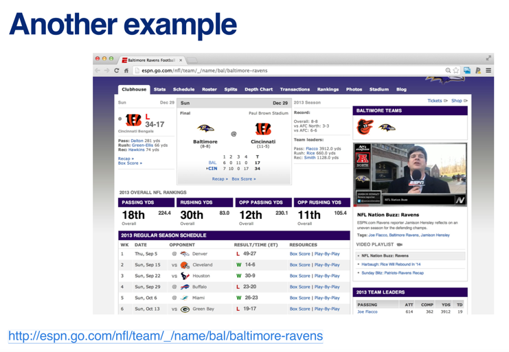
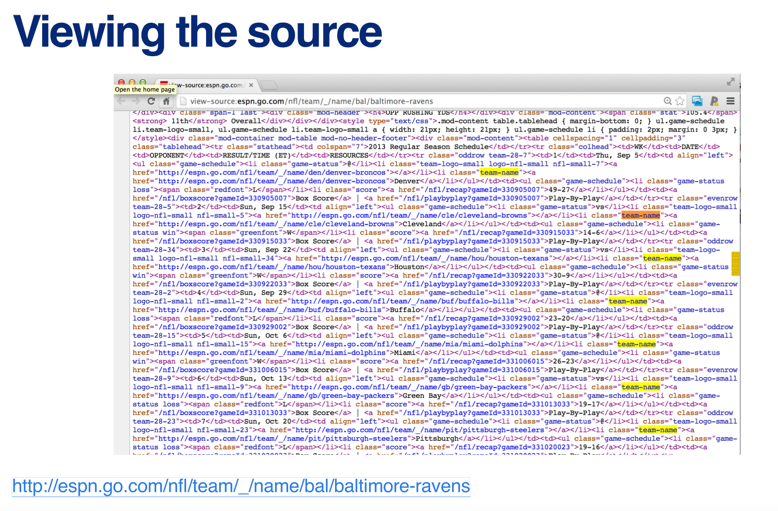
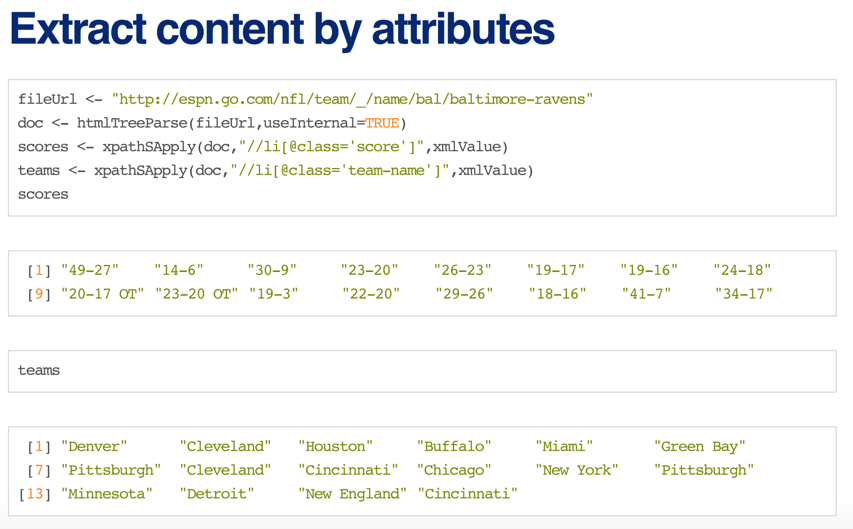
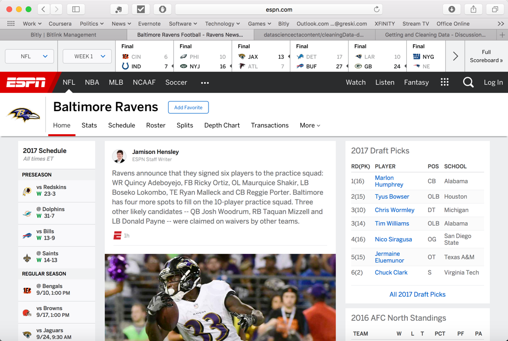
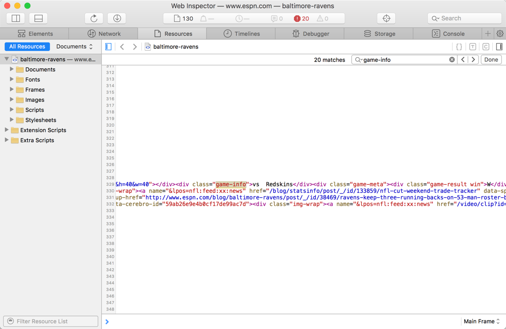
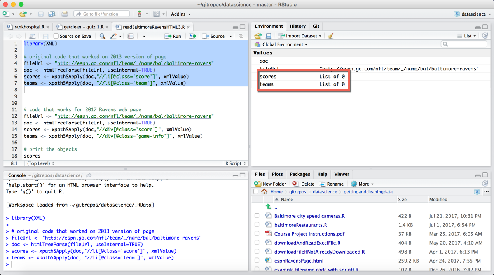
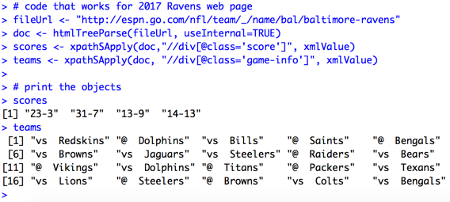
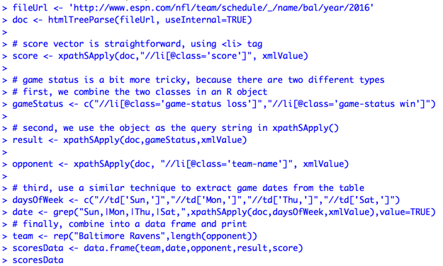
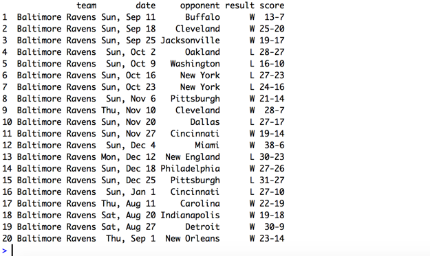

# Demystifying HTML Parsing: Baltimore Ravens ESPN Home Page

Students in the Johns Hopkins University *Getting and Cleaning Data* course on [coursera.org](http://coursera.org) bring a variety of expectations to the course. Given that the lectures focus on the R code needed to collect and transform data from a wide variety of data sources, students often try to replicate the examples from the lectures.

Since the lectures were recoded in the 2013 - 2014 timeframe, sometimes the data sources change. One such example is the *Reading XML* lecture, where the code from the final example in the lecture no longer accurately parses the data source. When situations like this happen, students periodically express their frustrations on the Discussion Forums. Between summer of 2016 and August 2017, 18 different posts on this topic were written within the *Getting and Cleaning Data* discussion forum.

# Background on the Example

Approximately 9 minutes into the lecture, Professor Leek introduces the ESPN home page for the Baltimore Ravens, an American football team. He uses this web page to illustrate how to read it into R and parse it with the `xpathSApply()` function.  

 Professor Leek proceeds to use a web browser to view the source code, and highlights items that are tagged with the HTML  list`<li>` tag that are coded with a specific `class` name.

Finally, he demonstrates how to read the file into R and parse the `score` and `team-name` elements from the list tags.

# What's Broken?

I'm writing this article on September 3, 2017. The National Football League in the U.S. has just completed its pre-season, and is about to begin the 2017 - 2018 regular season. Almost four years have passed since the screen capture of the Baltimore Ravens Homepage on ESPN.com was saved by Professor Leek in late December 2013. The 2017 version looks quite a bit different than the 2013 version, as ESPN has added a scrollable scoreboard and other features to the NFL team homepage.

Given that the page design has changed, it's not surprising to discover that the HTML document class tags have changed. By inspecting the page, we find that opponents' team names are now stored in a division `
` tag instead of the list tag, with a class name of `game-info`.

 Similarly, the `score` class has been moved from a list tag to a division tag. Therefore, the example code on page 13 of the lecture slides results in empty vectors because the `xpathSApply()` function calls return zero results.

## Solving the Problem

By making minor modifications to the example code, we can effectively read and parse the data from the current version of the Ravens ESPN home page. First, we'll change `//li` to `//div` in `xpathSApply()`. Second, we will change the class name for the team information from `team` to `game-info`.

As we can see from the output in the R console, the code now accurately reads the scores and team names.

## Untidy Data?

During Week 1 of *Getting and Cleaning Data*, students are also introduced to the concept of tidy data as described in Hadley Wickham's [August 2014 article](http://bit.ly/2guNg2K) on this topic. the ESPN American football home pages provide an example of "untidy" data. When we inspect the `teams` vector, we see that it actually contains not one, but two different data elements: game location and opponent. If we wanted to use this data in an analysis, we would need to parse the `team` vector to extract the game locations.

# Problem \#2: A Seasonality Effect

Having demonstrated how to correct the example code to read the current version of the Baltimore Ravens home page, we turn our attention to a problem that appears between mid February and early August of each year: the example code fails because the Baltimore Ravens page no longer has current year scores.

After each National Football League season, scores are migrated to a year-specific history page. Since the design of the history page does not match the design of the current year home page, a different solution is required to read the history page.

Complicating matters is the fact that the history pages are rendered as HTML tables, so we aren't able to use the `@class=` strings to find all of the required content. The implications of this change are as follows.

1. We will need to key on the standard table cell tag, `<td>` for some of the data.  
2. We will also need to use additional content within the tag to determine whether to include a given element, so we'll need to find patterns (e.g. wins vs. losses) to ensure the lengths of the output vectors match across data elements.  
3. There is a one week period called a "bye week" in the National Football League, where a subset of teams take a week off during the middle part of the season. This is why although the regular season is 17 weeks long, each team plays only 16 games.  

We address each of these challenges in the following R script.

      fileUrl <- 'http://www.espn.com/nfl/team/schedule/_/name/bal/year/2016'
      doc <- htmlTreeParse(fileUrl, useInternal=TRUE)

      # score vector is straightforward, using <li> tag   
      score <- xpathSApply(doc,"//li[@class='score']", xmlValue)

      # game status is a bit more tricky, because there are two different types
      # first, we combine the two classes in an R object
      gameStatus <- c("//li[@class='game-status loss']","//li[@class='game-status win']")

      # second, we use the object as the query string in xpathSApply()
      result <- xpathSApply(doc,gameStatus,xmlValue)

      opponent <- xpathSApply(doc, "//li[@class='team-name']", xmlValue)

      # third, use a similar technique to extract game dates from the table, ignoring bye week
      daysOfWeek <- c("//td['Sun,']","//td['Mon,']","//td['Thu,']","//td['Sat,']")
      date <- grep("Sun,|Mon,|Thu,|Sat,",xpathSApply(doc,daysOfWeek,xmlValue),value=TRUE)

      # finally, combine into a data frame and print
      team <- rep("Baltimore Ravens",length(opponent))
      scoresData <- data.frame(team,date,opponent,result)
      scoresData

By comparing the R console output with the history page that we displayed earlier in the article, we can see that the content matches except for the "bye week" where the Ravens did not play.
