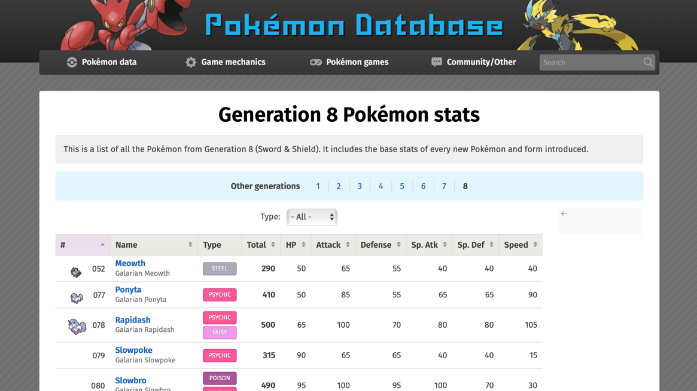
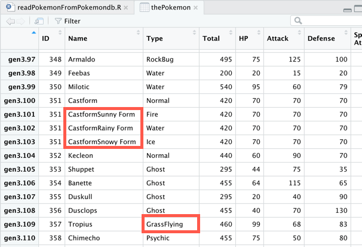
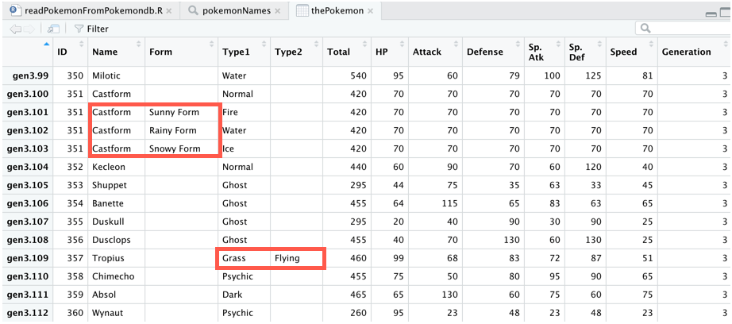

# Week 1: HTML Parsing - Gotta scrape 'em all

In [Demystifying HTML Parsing: Baltimore Ravens Scores](http://bit.ly/2gv12SS) we document periodic changes that have occurred in the structure of the ESPN website that caused the example code from the week one HTML lecture to fail.  The 2020 update illustrates how as a large media company attempts to keep its content fresh by regularly changing the customer experience, it makes life difficult for anyone attempting to use content from the website in an automated fashion.

In fact, numerous articles have been written about the challenges gathering data via HTML scraping. One such article by [Namrata Date](https://medium.com/@namrata_28907/about) is [Web Scraping in R with CSS Selectors](https://bit.ly/3986pUT). The more complicated the design of a web site's user experience, the more difficult it is to extract the data.

Fortunately many websites are significantly less complicated than the ESPN website, simplifying the task of extracting data when it periodically changes.

One such example is Pokémon statistics. A number of years ago Alberto Barradas posted a database of Pokémon statistics on Kaggle.com called [Pokémon with stats](https://www.kaggle.com/abcsds/pokemon). At the time of its publishing the database included Pokémon through Generation 6, a total of 721 Pokémon. Since then Nintendo has released a number of new games, anime shows, and conducted in person events that introduced multiple generations of Pokémon. As of November 2020 the total number of Pokémon in the National Pokedex is 898.

Complicating matters further is the fact that when Generation 7 Pokémon were released, 26 other Pokémon received changes to their statistics. Although I had augmented Alberto Barradas' original data with Generation 7 Pokémon, by Generation 8 I wanted to see whether I could automate the updates. Fortunately, there are many websites on the internet devoted to Pokémon games, including detailed backgrounds and statistics.

# Our data source: pokemondb.net

After reviewing a number of Pokémon websites, I decided that [pokemondb.net](https://pokemondb.net) was worth the investment of time to see whether I could extract the data for all 8 generations of Pokémon.

Pokémon stats are stored on a number of pages on the site, viewable by Generation. The data for [Generation 8 Pokémon](https://bit.ly/36TSYp2) looks like this.

Ideally we'd like to scrape the data for all 8 generations of Pokémon. The folks at [pokemondb.net](https://pokemondb.net) made this easy for us because the URL for the stats pages is consistent. The only part of the URL that varies by generation is its number, as illustrated by the URL for Generation 8.

    https://pokemondb.net/pokedex/stats/gen8

Furthermore, when we look at the HTML for these pages, we discover that the data is stored in an HTML table, which greatly simplifies the task of extracting the data.

## Extracting with rvest

Since the data is stored in an HTML table, it's particularly well suited to be processed with the `html_table()` function in the `rvest` package.

In fact, if we use an `apply()` function we can extract data from the pages representing all 8 generations of Pokémon in 10 lines of code.

    library(rvest)
    pages <- 1:8
    baseURL <- "https://pokemondb.net/pokedex/stats/gen"

First, we load the `rvest` library, set a vector to represent each generation of Pokémon, and assign a value to `baseURL`. We'll add the generation numbers to the base URL to extract the data from each generation's stats page.

    pokemonList <- lapply(pages,function(x){
      html <- read_html(paste0(baseURL,x))
      tableNode <- html_node(html,xpath="//*[(@id = 'pokedex')]")
      data <- html_table(html,header=TRUE)[[1]]
      colnames(data)[1] <- "ID"
      data$Generation <- x # add generation ID
      data
    })

The `lapply()` function executes a series of steps within an anonymous function once for each value in the `pages` vector. It combines the generation number with the base URL, reads the html page, extracts the table node by using an `xpath` selector, and converts it into a data frame with `html_table()`.

Once the data is in a data frame, we assign the Generation number to a column and return the data frame back to the parent environment.

At this point the `pokemonList` object contains 8 data frames, one for each generation of Pokémon.

We combine the list elements into a single data frame as follows.

    thePokemon <- do.call(rbind,pokemonList)

## Cleaning the data

Unfortunately, our friends at [pokemondb.net](https://pokemondb.net) decided to include multiple data elements within a single column. First, Form / Region information is combined with certain Pokémon names, as we can see from the entry for Pokémon 052 in Generation 8, Galarian Meowth.  Second, a Pokémon can have two types. The website combines the type information into a single data element.

These problems are easily discovered through the RStudio data viewer. Here we highlight the additional data added to the `Name` field for Castform, and the rendering of the `Type` column for Tropius.

## Cleaning the data with regular expressions

We can use regular expressions to separate the content once we understand the patterns. For the `Name` column, the pattern is a Pokémon name immediately followed by a capital letter with no space. A similar pattern applies to the `Type` field, where the second type starts with a capital letter immediately following the final letter of the first word.

Since spaces are valid between words in the `Name` column (e.g. the space between Sunny and Form for the Pokémon Castform), we need to be careful in how we parse the data. I'm not a frequent user of regular expressions, but thanks to contributors at [Stackoverflow](https://stackoverflow.com/questions/36778221/breaking-up-pascalcase-in-r/36778559#36778559), it's easy to find a solution for our problem, separating text written in [Pascal Case](https://techterms.com/definition/pascalcase) into distinct words.

To split the `Type` column into two columns, we combine `strsplit()` with `gsub()` and the following regular expression.

    gsub('[a-z]\\K(?=[A-Z])', ' ',thePokemon$Type, perl=T)

We use this expression and a couple of additional lines of code to separate the Pokémon types into `Type1` and `Type2` fields.

    types <- strsplit(gsub('[a-z]\\K(?=[A-Z])', ' ',thePokemon$Type, perl=T)," ")
    thePokemon$Type1 <- unlist(lapply(types,function(x) x[1]))
    thePokemon$Type2 <- unlist(lapply(types,function(x) ifelse(is.na(x[2])," ",x[2])))

Splitting the Name field is a more complicated challenge because if we simply add a space between the [Pascal Case](https://techterms.com/definition/pascalcase) words, it will be very difficult to separate a Pokémon's name from the region / form information. However, if we use a double dash `--` instead of a space, we can use that to split the data.

    pokemonNames <- strsplit(gsub('[a-z]\\K(?=[A-Z])', '--', thePokemon$Name, perl=T),"--")
    thePokemon$Name <- unlist(lapply(pokemonNames,function(x) x[1]))
    thePokemon$Form <- unlist(lapply(pokemonNames,function(x) ifelse(is.na(x[2])," ",x[2])))

At this point we have added three columns to the data frame, `Type1`, `Type2`, and `Form`. Two cleanup items remain. First, we'll drop unnecessary columns and reorder the remaining ones to make the data easier to read as a table. Second, Pokémon 29 and 32, the female and male forms of Nidoran, have names denoted with the appropriate gender symbol, ♀ or ♂. We replace these with Male and Female in the Form column as follows.

    # reorder columns & remove special characters from male & female Nidoran
    thePokemon <- thePokemon[,c(1,2,14,12,13,4,5,6,7,8,9,10,11)]
    thePokemon[29,"Name"] <- "Nidoran"
    thePokemon[29,"Form"] <- "Female"
    thePokemon[32,"Name"] <- "Nidoran"
    thePokemon[32,"Form"] <- "Male"

The following illustration shows how we have resolved the data problems highlighted earlier in the article.

Now the data is ready for subsequent analysis.
