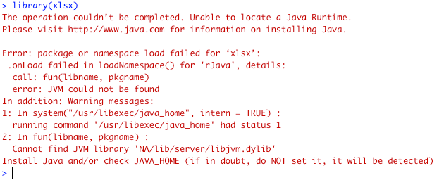

# Common Problems: Getting & Cleaning Data Quiz 1 -- Java and xlsx Package

Students often have problems answering quiz questions related to the xlsx package that is used to read Excel spreadsheets. This article highlights common problems and their solutions.

# Java Runtime Not Installed

First, many students new to the Data Science Specialization have not previously needed to install a Java runtime on their computers. The `xlsx` package depends on the `rJava` and `xlsxjars` packages.  `rJava` requires the Java Runtime Environment 1.2 or above to also be present on the student's computer.

If a student attempts to load the xlsx package without a Java runtime envrionment installed, s/he will receive the following message \(in Mac OSX, similar error will display in Windows\):

After this error message is displayed at the operating system level, RStudio will terminate.

## Solution 1: Use an Excel Reader Package that Doesn't Require Java

<b>PRO TIP: </b> The easiest way to work around this problem is to use an R package that does not depend on Java, such as [openxlsx](https://cran.r-project.org/web/packages/openxlsx/openxlsx.pdf) or [readxl](https://cran.r-project.org/web/packages/readxl/readxl.pdf). 

For `openxlsx`, it's very easy.

      install.packages("openxlsx")
      library(openxlsx)
      # read the help file to identify the arguments needed to 
      # correctly read the file
      ?openxlsx
      theData <- read.xlsx(...)
      
The same process can be used for `readxl`. 

      install.packages("readxl")
      library(readxl)
      # read the help file to identify the arguments needed to 
      # correctly read the file 
      ?readxl
      theData <- read_excel(...)
      

## Solution 2: Install Java and Required R Packages

That said, for students who want to use the `xlsx` package to answer the question, there are workable solutions for  Windows,  Mac OSX, and Ubuntu Linux.

<b>SOLUTION (Windows): </b> Download and install the latest version of the [Java Runtime Environment](https://java.com/en/download/) from Oracle. Note that if you are running the 64-bit version of R, you need to install the 64-bit version of the Java Runtime. 

<b>SOLUTION (Mac OSX):</b> As of newer releases of Mac OSX, this has become more complicated. A specific set of commands needs to be followed after installing the [Java Development Kit]() on the computer. These are documented on the [rJava Issue 86 github page](https://github.com/s-u/rJava/issues/86). I have included a screenshot of this solution for students to reference directly.

<b>SOLUTION (Ubuntu):</b> Use the Ubuntu Advanced Packaging Tool to install Java, then reconfigure Java in R. 

      sudo apt-get install openjdk-8-jdk # openjdk-9-jdk has some installation issues
      sudo R CMD javareconf

Then in R / RStudio install the `xlsx` package. 

      install.packages("xlsx")

# 32-bit vs. 64-bit Java in Windows

Another common problem students may encounter is an incompatibility between the version of the Java Runtime Environment that is installed on their computer and the version of R, either 32-bit or 64-bit.

For example, if one has installed the 64-bit version of R but has the 32-bit version of Java Runtime Environment installed, R will not have visibility to the Java Runtime Environment, generating the same "Java not installed error" as noted above.

<b>SOLUTION: </b> This problem can be resolved by either [installing the 64-bit version of Java Runtime for Windows](https://java.com/en/download/), or by changing the RStudio configuration to use the 32-bit version of R.

*last updated 23 November 2017* 
