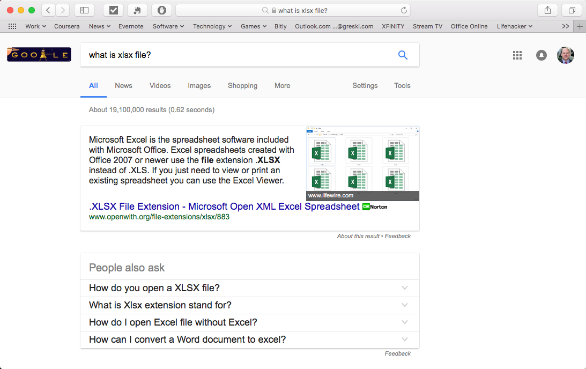
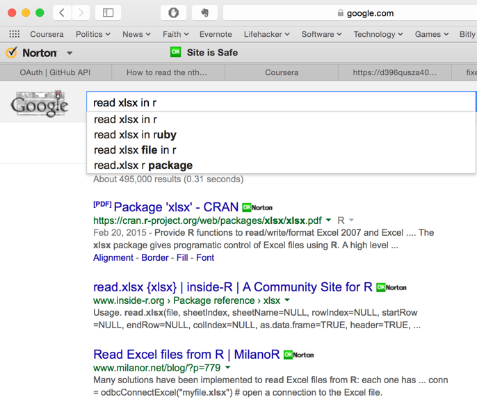

# Getting & Cleaning Data - Reading Files and APIs

*This article was originally posted on the Discussion Forum for Getting & Cleaning Data in August 2015.*

Hello everyone. I'm noticing a number of people posting on the bulletin board about difficulties in solving the Quiz 2 questions. I thought that it might be helpful to discuss a general approach to determining the R features required for each one.

The theme of Quiz 2 is reading and working with different types of data, based on the variety of approaches Professor Leek introduced during the first two lectures. As one works through the five questions in quiz, a general pattern of requirements emerges.

**1) What type of file / API must I read, and how do I determine its type?**

To answer this question, you can directly access the file via a web browser, or download it to your computer and edit it with a text editor. This will help you see whether the data is separated by delimiters, or consists of fixed or hierarchical records.

Sometimes the file type can be determined from the file extension. By now we all know what a .XLSX file is because it was reviewed in the Week 1 lecture, *Reading Excel Files*.  However, if you didn't know what an XLSX file is, remember, Google is your friend:

In a similar manner, you can run a Google search to explain a file extension that you've never seen before.

If the file has an associated code book, read the code book. This is often the case with hierarchical file formats.

**2) What function(s) will read this type of file / API?**

Again, Google is your friend. If it isn't obvious (e.g. XLSX files must be read with read.xlsx() or read.xlsx2() functions), run a search on "read <filetype\> into R", such as:

Once you know the function name, you can install the required package(s) needed to use the function.

**3) How do I use the arguments for the function that will read the file?**

Before using the function to process a data file, review the help content to understand the options that are used with the function. For example, before using `download.files()` to download a file, it is important to know that the correct value of the `method=` parameter varies by operating system, so code that works on Mac OSX will not work on Windows without modifying this argument.  

Also, since multiple packages can be used do to the same thing in R, arguments that work with one package \(e.g. `utils::read.fwf()`\) might not be supported or work exactly the same way in another package, such as `readr::read_fwf()`.

**4)  How do I take advantage of any hints provided by the professor in the question text?**

Sometimes the quiz questions provide extra information that you can use, such as [oauth2 demo script](https://github.com/hadley/httr/blob/master/demo/oauth2-github.r) that was provided with question 1. Hadley Wickham's R script provides a shell that you can use to pull data from github. All you have to do is identify the parts that must change in order to suit your purposes, such as:

* does the API require authentication, and if so, how do I create my own credentials?
* where do I alter the example code to access the specific API resource I need?

If you're having trouble accessing the resource, and it's available via HTTP, navigate to it with a web browser and check out the file directly. Once you see its structure, it may become clear how to process the file.

**5) Do I need to know column numbers on the input file?**

If you're reading fixed length files, you'll need to identify the start & stop columns in the input file in order to read it correctly.

**_PRO TIP:_** use a file editor that can display the column number at which the cursor is located as you navigate the file (e.g. Notepad++ for Windows, or [Atom](http://atom.io) which is open source), or use a file editor such as [UltraEdit](http://www.ultraedit.com/?gclid=CJzq_veIrNICFdWEswodO7cAwg) that displays a column, as illustrated here.

If you really want to "go geek" with fixed files, you might give [RecordEditor](http://sourceforge.net/projects/record-editor/) a try.

_Historical note:_ in antediluvian times (i.e. before the World Wide Web), it was considered "normal" for text editors on mainframe computers to display column information, because the file editors were trying to mirror 80 column punch cards. The ability to read data in a wide variety of formats was considered an essential skill for any mainframe programmer.  If you're frustrated with the learning curve of R, you can be thankful you don't have to learn [Job Control Language](https://en.wikipedia.org/wiki/Job_Control_Language) to complete the programming assignments for this course.

**6)  How do I navigate the R object(s) that are created by reading the file?**

Here, you'll need to use the functions we've already learned to figure out how an R object is composed, such as `head()`, `str()`, `class()`, etc.

**7) What technique(s) must I use to navigate the objects and produce the output(s) required to answer the quiz question?**

Review your notes and slides from the lecture topics, and identify the functions you'll need to navigate the objects. Is it a list? If so, you might use techniques like `myList$objectname` to get at the right object in the list. If the object is an XML document, you might use `xpathSApply()`, etc.

**8) Occam's razor applies -- use the simplest approach possible**

Sometimes, the "obvious" approach isn't the best one. If you only need to read a line of text from a file, it doesn't matter whether it's a fixed length file, an HDF5 file, an XML document, or any other non-binary file, the easiest way to pull the text you need from the file is with `readLines()`.  Don't waste your time with a more complex approach.  Reference: [Occam's Razor](https://en.wikipedia.org/wiki/Occam%27s_razor).

## Git 'er done!

In closing, we've outlined a relatively straightforward plan of attack to figure out how to read almost any type of data into R and be productive with the resulting R objects.  In the spirit of "eating my own dog food," (reference: [Eating your own dog food](https://en.wikipedia.org/wiki/Eating_your_own_dog_food)) I used this approach to complete Quiz 2 when I took the *Getting and Cleaning Data* class.

One last note: yes, it can be frustrating to put together correctly working code for this quiz because the processes for reading external content often require stringing together multiple R functions in a sequence to accomplish a goal, such as the oauth2 question to access repository data in Github. Figuring out how to put all the pieces together to solve a real world problem, including overcoming roadblocks, is a normal part of the life of a data scientist.

For a more detailed example of how the discovery process for reading data files works in practice, review [Real World Example: Reading American Community Survey Data](http://bit.ly/2bAdLE9).

# Appendix

For a detailed discussion of the last question on the Week 2 quiz, please read [The Definitive Guide to Week 2 Question 5](http://bit.ly/2wVyR6K)

*last updated: 25 February 2017*
