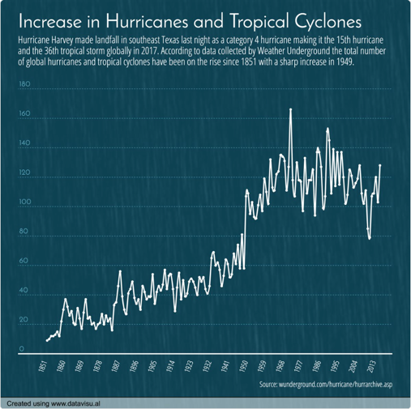
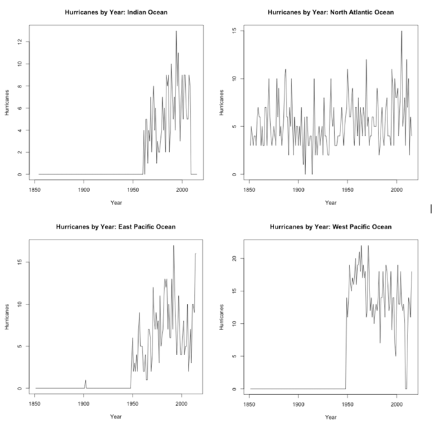
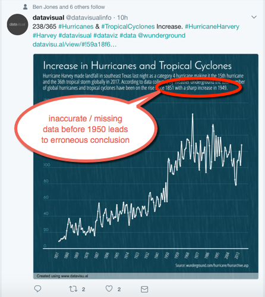
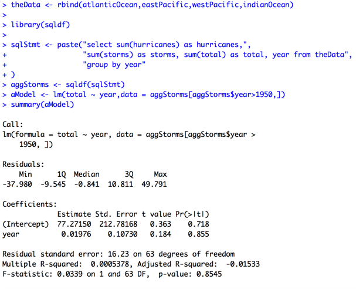

# Importance of Getting and Cleaning Data

Hurricane Harvey was a major weather event in the United States during late August 2017. Within 48 hours of the time Harvey made landfall on August 25th, I observed a graphic posted on Twitter by [@datavisualinfo](http://bit.ly/2izTItC) regarding the frequency of hurricanes between 1851 and 2015. The graphic  illustrates why it is so important to thoroughly understand the data one collects. [@datavisualinfo](http://bit.ly/2izTItC) published the following chart to showcase their data visualization tool.

As we can see from the chart footer, the data was sourced from the [Weather Underground Hurricane Archive](http://bit.ly/2vz4S2L). Using techniques learned in the Johns Hopkins University *Getting & Cleaning Data* course on [coursera.org](http://coursera.org), we can parse the HTML data into R and analyze it ourselves. There are four regions for which data is collected, including:

* North Atlantic Ocean
* Indian Ocean
* East Pacific Ocean
* West Pacific Ocean

When we draw some simple plots (a technique taught in the Johns Hopkins *Exploratory Data Analysis* course), we observe some very interesting patterns in the regional data. Since these were exploratory plots, I didn't take the time to standardize the Y axis across the four charts.

Three of the four regions appear to have little to no data collection prior to 1950, and the only region with data back to 1851 seems to have no discernible trend in hurricane frequency. If I run a linear model on the Atlantic Ocean data, we find that year explains only 4.92% of the variability in number of hurricanes, meaning that the two variables year and hurricane are pretty close to independent (*R squared* = 0). The percentage of variability in annual hurricanes explained by year is statistically significant (p < 0.01) but substantively meaningless.

A search on the internet for [Indian Ocean Cyclones](http://bit.ly/2wIpkDC) shows that there were many [cyclones recorded before 1950](http://bit.ly/2vz5zcI). Therefore, the data on the Weather Underground site used for the Data Visual chart is incomplete. Another search for *Pacific Ocean Cyclones* results in additional information about [cyclones before 1950 in New Zealand](http://bit.ly/2vz5zcI), calling into question the data for the two Pacific Ocean regions.

**Bottom line:** the conclusion drawn in the original chart is wrong until we can confirm the accuracy of data collected for hurricanes and tropical storms prior to 1950.

Another error in the [@datavisualinfo](http://bit.ly/2izTItC) chart is that it includes both hurricanes and tropical storms, but draws the conclusion that "hurricanes and tropical cyclones are increasing," not accounting for the data showing that tropical storms are more numerous than hurricanes / tropical cyclones, and therefore, should have more variability.

If we aggregate the data across all four regions, the standard deviation for hurricanes is 13.8, whereas the standard deviation for storms per year is 28.6, more than twice the  standard deviation for hurricanes. Therefore, it is not appropriate to draw conclusions about hurricanes & cyclones after combining them with the tropical storms data.

Furthermore, given our demonstration above that the data prior to 1950 is not complete, what happens if we run a linear model on year and the sum of storms + hurricanes? If the conclusion "on the rise since 1851" is appropriate, `year` should explain a substantively meaningful proportion of variance in total storms and hurricanes after 1950 as well as before 1950.

As we see from the following model output, in the aggregated data after 1950, year explains 0.05% of the variance in the total storms + hurricanes. Its regression slope is neither statistically (p > 0.10) nor substantively significant.

# Appendix

## Reproducible Research, Anyone?

Since the data on web pages can change frequently, I saved the relevant HTML pages from the [Weather Underground Hurricane Archive](http://bit.ly/2vz4S2L) so I (or others) could reproduce the research from the files I used on August 26, 2017. These files are stored on my [datasciencedepot github repository](http://bit.ly/2xDLoMX).

To reproduce my research, one can run the following R scripts.

First, we need the code to read one of the HTML files. We've built it as an R function because the code is the same for all four HTML files.

    #
    # readHurricaneHistory.R
    #

    readHurricaneData <- function(fileUrl,firstTableRow=606,startYear=1851,endYear=2015){

         # data we need ends well before row 2500 in the input file
         theFile <- readLines(fileUrl,n=2500)

         # clean out text stings that would prevent us from converting
         # raw data to numeric
         theFile <- gsub("\t","",theFile)
         theFile <- gsub("<td>","",theFile)
         theFile <- gsub("</td>","",theFile)
         theFile <- gsub(",","",theFile)

         # data in the table is in reverse year order
         year <- endYear:startYear

         # create vectors to store parsed data
         storms <- rep(0,length(year))
         hurricanes <- rep(0,length(year))
         deaths <- rep(" ",length(year))
         damage <- rep(" ",length(year))

         # create a data frame using vectors we initialized
         theData <- data.frame(year,storms,hurricanes,deaths,damage,stringsAsFactors=FALSE)

         # raw data is in sequences of 10 rows of HTML per year
         lineCt <- seq(from = firstTableRow,to = sum(firstTableRow,length(year) * 10,-1),by=10)
         i <- 0 # output row
         for (line in lineCt ){
              i <- i + 1 # increment output data frame row counter

              # parse the data and write it to appropriate column in data frame
              # items were originally located by visually inspecting the HTML files
              theData[i,"storms"] <- as.numeric(theFile[line + 2])
              theData[i,"hurricanes"] <- as.numeric(theFile[line + 3])
              theData[i,"deaths"] <- theFile[line + 4] # some rows have > symbols
              theData[i,"damage"] <- theFile[line + 5]
         }
         theData
    }

Next, we need the code to generate execute the reader on the four files and generate the charts. The original data is not structured enough to be read by an R script. I had to hand edit the files to ensure each year's entry spanned 10 and only 10 lines within the HTML files.

Therefore, in order to execute this code, one must clone the [lgreski/datasciencedepot](http://bit.ly/2eN3K6i) github repository to use my hand edited versions of the HTML data files, and edit the following code to point to its data directory.

    #
    # set directory where datasciencedepot/data was cloned
    #
    gitRepoDir <- "~/gitrepos/datasciencedepot/data/"

Run the following code to generate the four charts that I posted on Twitter, and the linear model.

    #
    # read the four regional hurricane history files
    #

    fileUrl <- paste(gitRepoDir,"/indianOceanHurricanes.html",sep="")
    # first row of table data: 606
    # last row of table data: 606 + 10 * 165 - 1 = 1650 + 606 -1 = 2255
    indianOcean <- readHurricaneData(fileUrl,
                                     firstTableRow=606,startYear=1851,endYear=2015)

    # North Atlantic Ocean

    fileUrl <- paste(gitRepoDir,"/northAtlanticHurricanes.html",sep="")
    atlanticOcean <- readHurricaneData(fileUrl,
                                       firstTableRow=606,startYear=1851,endYear=2015)

    # East Pacific Ocean
    fileUrl <- paste(gitRepoDir,"/eastPacificHurricanes.html",sep="")
    eastPacific <- readHurricaneData(fileUrl,
                                     firstTableRow=606,startYear=1851,endYear=2015)

    # West Pacific Ocean
    fileUrl <- paste(gitRepoDir,"/westPacificHurricanes.html",sep="")
    westPacific <- readHurricaneData(fileUrl,
                                     firstTableRow=606,startYear=1851,endYear=2015)

     atlanticOcean$area <- "Atlantic"
     eastPacific$area <- "E. Pacific"
     westPacific$area <- "W. Pacific"
     indianOcean$area <- "Indian"
     atlanticOcean$total <- atlanticOcean$hurricanes + atlanticOcean$storms
     eastPacific$total <- eastPacific$hurricanes + eastPacific$storms
     westPacific$total <- westPacific$hurricanes + westPacific$storms
     indianOcean$total <- indianOcean$hurricanes + indianOcean$storms

    plot(indianOcean$year,indianOcean$hurricanes,type="l",
         xlab = "Year",
         ylab = "Hurricanes",
         main = "Hurricanes by Year: Indian Ocean")

    plot(atlanticOcean$year,atlanticOcean$hurricanes,type="l",
         xlab = "Year",
         ylab = "Hurricanes",
         main = "Hurricanes by Year: North Atlantic Ocean")

    plot(eastPacific$year,eastPacific$hurricanes,type="l",
         xlab = "Year",
         ylab = "Hurricanes",
         main = "Hurricanes by Year: East Pacific Ocean")

    plot(westPacific$year,westPacific$hurricanes,type="l",
         xlab = "Year",
         ylab = "Hurricanes",
         main = "Hurricanes by Year: West Pacific Ocean")

    aModel <- lm(hurricanes ~ year,data = atlanticOcean)
    summary(aModel)

## Analyzing the Aggregated Data

The following code was used to aggregate the four hurricane files and generate a linear model for the total storms + hurricanes after 1950.

    theData <- rbind(atlanticOcean,eastPacific,westPacific,indianOcean)

    library(sqldf)

    sqlStmt <- paste("select sum(hurricanes) as hurricanes,",
                     "sum(storms) as storms, sum(total) as total, year from theData",
                     "group by year"
    )
    aggStorms <- sqldf(sqlStmt)
    aModel <- lm(total ~ year,data = aggStorms[aggStorms$year>1950,])
    summary(aModel)
