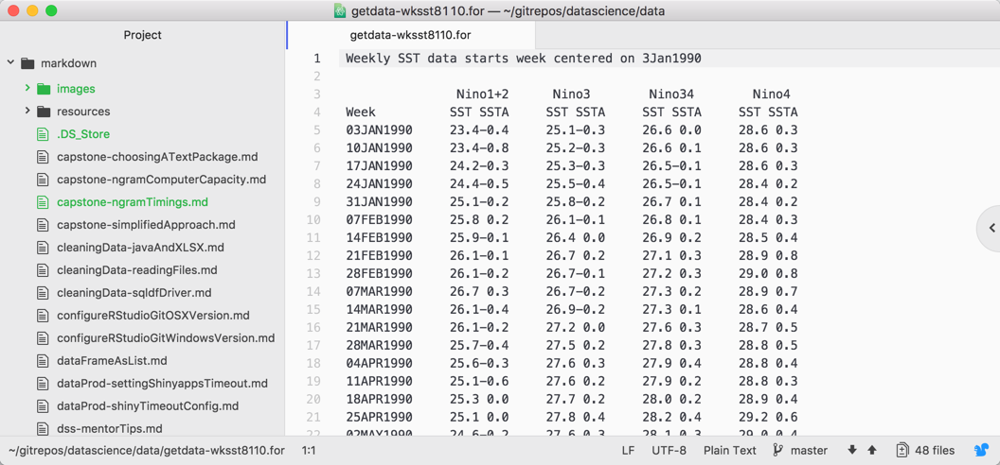
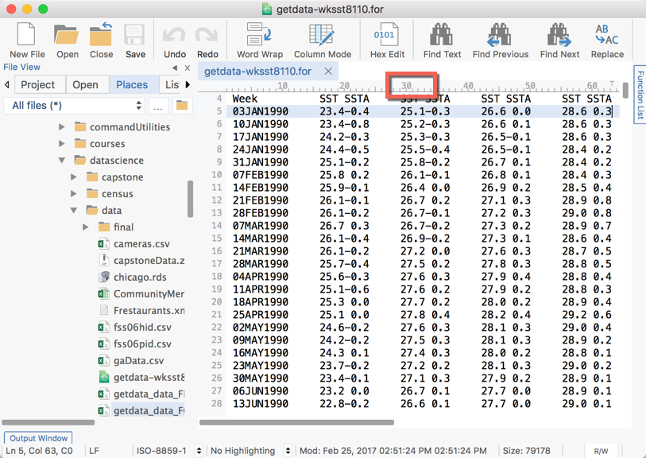
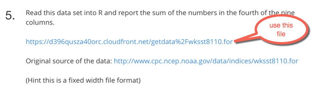
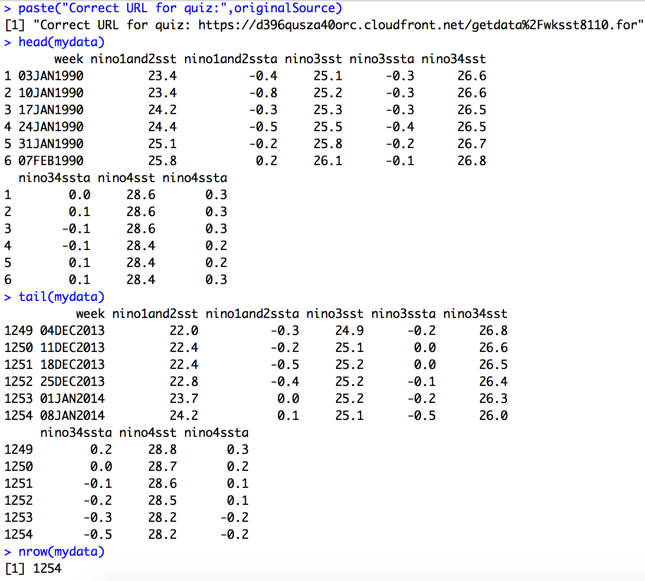
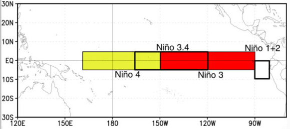
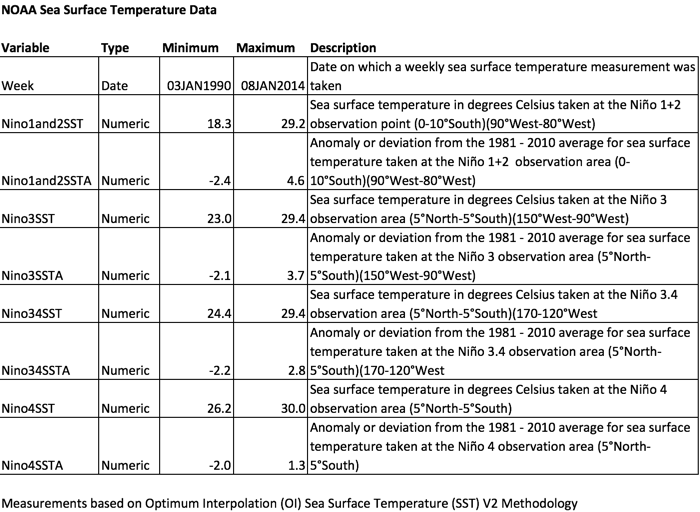

# The Definitive Guide to Solving Week 2 Question 5

Question 5 in the week 2 quiz for *Getting and Cleaning Data* in the Johns Hopkins Data Science Specialization on Coursera is deceptively simple: *report the sum of the fourth of the nine columns.* To answer this question correctly, one **MUST**  view the file before writing R code. As noted in [Strategy for Reading Files & APIs / Quiz 2](http://bit.ly/2e4L5oF), one can download the [Atom](http://atom.io) editor for free and use it to view the file.

Nine columns? At first glance the screen capture looks like 5 columns, not 9. However, there are truly 9 columns of data in this file, including:

1. Week
2. Nino1and2SST
3. Nino1and2SSTA
4. Nino3SST
5. Nino3SSTA
6. Nino34SST
7. Nino34SSTA
8. Nino4SST
9. Nino4SSTA

For detailed descriptions of each data element, please review the [NOAA SST and SSTA Data Set Codebook](http://bit.ly/2wVyR6K) included in the Appendix of this article.

The subtlety one must see to distinguish 9 columns from the list of 5 is that for some rows, the initial character for some of the columns is a minus sign.

The challenge is how to read the fourth column, Nino3SST, correctly. The columns are real numbers, not integers as stated in a Discussion Forum post on Coursera. That is, they contain decimal points and one value to the right of the decimal point.

A text editor such as UltraEdit that provides a column number display makes it a bit easier to know which columns to read.

The negative signs and column numbers must both be accounted for in the R function used to read the data.

## Additional Considerations

To answer the quiz question correctly, students must read the correct data file. The quiz question provides two URLs, [one to be used for the quiz](https://d396qusza40orc.cloudfront.net/getdata%2Fwksst8110.for) and another that is a link to the original data source that is continually updated.

Many students get frustrated because they read the original data source directly from [the NOAA website](http://www.cpc.ncep.noaa.gov/data/indices/wksst8110.for), which has more records than the file to be used for the quiz. The correct file has 1,254 observations, starting with data from January 3, 1990 and ending on January 8, 2014, as illustrated below.

As of October 14, 2017, the data from the NOAA has 1,449 observations, the most recent of which is from October 4th, 2017.

**[PRO TIP]** Use the `summary()` function to compare the data set you load into R against the values listed in the codebook below to confirm that the data file has been read correctly.

# Appendix

The data set is maintained by the United States National Oceanographic and Atmospheric Administration. SST is an abbreviation of *sea surface temperature*. SSTA is an abbreviation of *sea surface temperature anomaly*. *Anomaly* is calculated as the deviation from a 30 year average. for the *Sea Surface Temperature Index* data set, the mean includes data collected within the El Niño Southern Oscillation between 1981 and 2010.

The El Niño Southern Oscillation is a combined atmospheric and ocean system consisting of four regions for which the NOAA collects data, as illustrated below.

### El Niño Southern Oscillation

### Codebook

**[PRO TIP]** Bookmark this article because you can use the codebook illustrated here as a template for your final project in *Getting and Cleaning Data*.  Ironically, most of the data sets on the NOAA website have no codebooks or they are very difficult to find and poorly written, as students will discover during the *Reproducible Research* course within the Data Science Specialization.

# References

[Climate Glossary](http://bit.ly/2ynHKcC): Climate Prediction Center of the National Oceanographic and Atmospheric Administration, United States of America, retrieved 14 October 2017.

[El Niño Southern Oscillation](http://bit.ly/2gapR73): Climate Prediction Center of the National Oceanographic and Atmospheric Administration, United States of America, retrieved 14 October 2017.

[Monthly Atmospheric and Sea Surface Temperature Indices](http://bit.ly/2xFkUcz): Climate Prediction Center of the National Oceanographic and Atmospheric Administration, United States of America, retrieved 14 October 2017.

[Optimum Interpolation Sea Surface Temperatures - V2](http://bit.ly/2z8n1GT): Climate Prediction Center of the National Oceanographic and Atmospheric Administration, United States of America, retrieved 14 October 2017.

*Last Updated: 14 October 2017*
