# Configuring RStudio to work with Git and Github: Mac OSX Version

In addition to using the command line version of git to synchronize a local repository with Github, it is possible to configure RStudio to work with it directly.

## Prework Steps

This walkthrough is intended for students who have already completed Week 2 in the Johns Hopkins University *The Data Scientist's Toolbox* on Coursera. During the week 2 lectures, students are taught how to install git, register for an account on Github, create / fork a repository, and clone a repository from Github to one's local machine. 

Key steps that must be complete prior to this walkthrough include:

1. Install R
2. Install RStudio
3. Setup an account on Github.com
4. If necessary, install git on the local machine, and configure your username and email address (they are saved to the `.gitconfig` file) as explained during the Week 2 lectures in *The Data Scientist's Toolbox*. 
5. Clone a remote repository from Github to git on o local machine. 

For detailed instructions on how to configure git on your local machine, please review the *Git / Github* section on the [Data Science Specialization: Toolbox](http://bit.ly/2c9FGMa) page of the *DSS community content* that has been posted to the internet. 

Once you've made it this far, you should be able to start RStudio, and run git from a command line.

## Configure RStudio
Start RStudio, and from the main pulldown menu, select **Preferences**

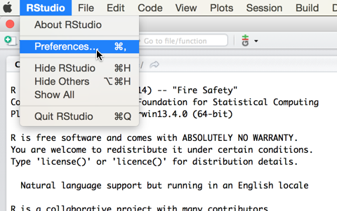

From the **Preferences** window, (1) click on the Git/SVN icon, and make the following changes to the version control configuration -- (2) press the checkbox to enable version control, and (3) configure the path to the git executable, using Browse if needed. When finished, press the **Apply** button.

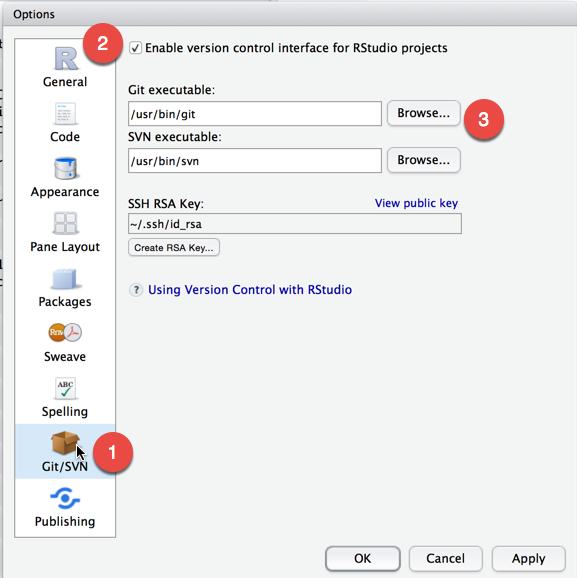

Now you are ready to configure a Github project to work with RStudio.

From the main menu, **select File > New Project**

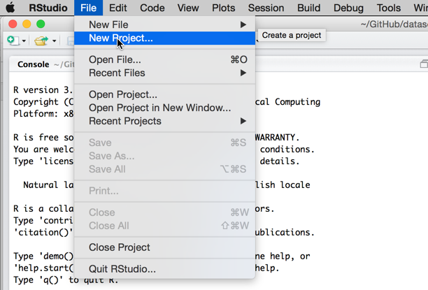

From the **New Project** window, select **Existing Directory** to link RStudio with an existing local git project directory. To set up a new repository, select **New Directory**.

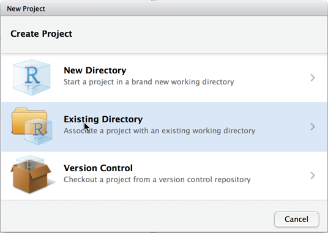

RStudio will display the **New Project** window. Press the **Browse** button to bring up the File Manager (Windows) or Finder (OSX), and...

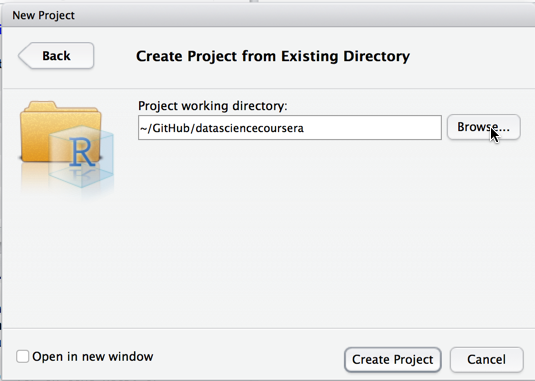

Select the folder where the repository to be linked with RStudio is located, and press the **Open** button.

Back at the **New Project** window, press the **Create Project** button.

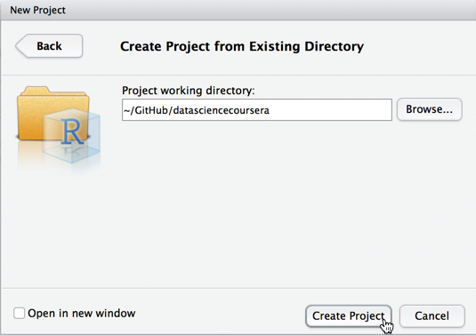

Once you return to the main RStudio window, you can now see a list of files in the Files tab of the lower right pane of RStudio.

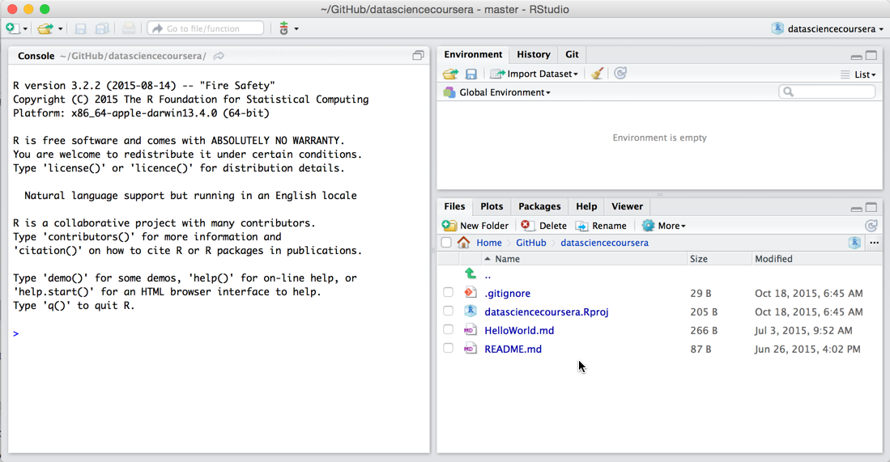

We'll select README.md by clicking the link on README.md in the Files pane, which displays the file in the RStudio code editor. I added the line "adding some content..." so we can illustrate how to commit to the local machine and push the changes to Github.

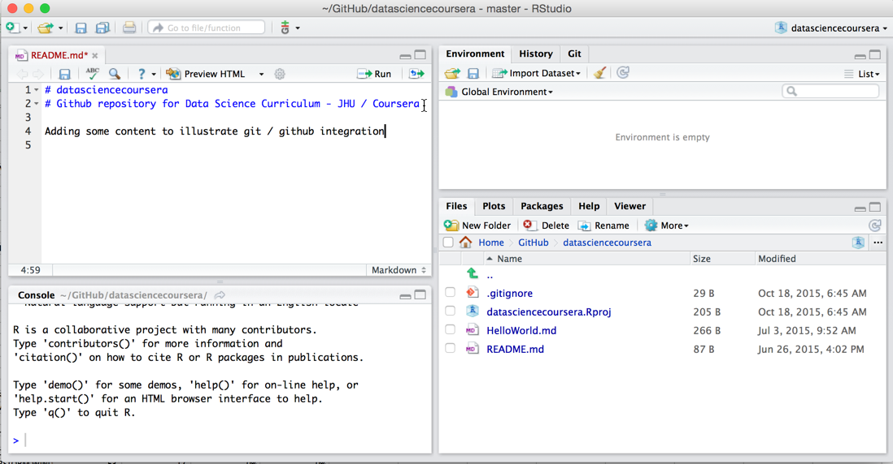

Save the edited code, and then **select the Git tab** in the upper right pane of RStudio. From the Git window, **select the checkbox in the Staged column** to select the file for commit, and press the **Commit** button.

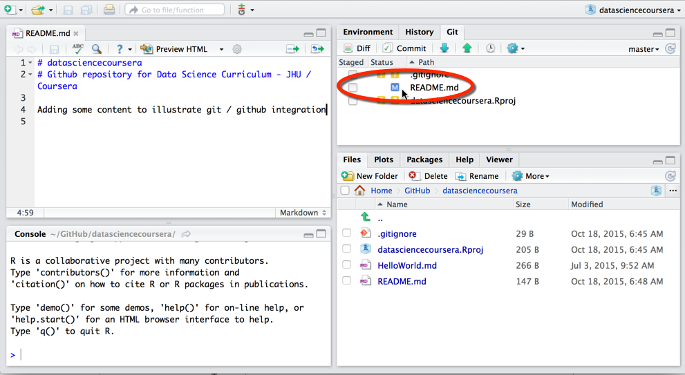

This causes RStudio to display the Git commit window box. First, enter a commit message into the message entry area. Next, press the **Commit** button to commit the changes to your local repository.

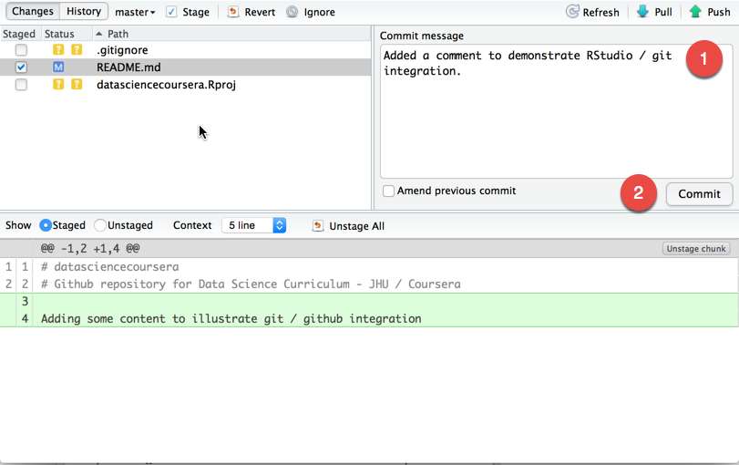

RStudio will commit the changes to the repository and display a dialog box communicating the status of the commit. Review the message and press the **Close** button.

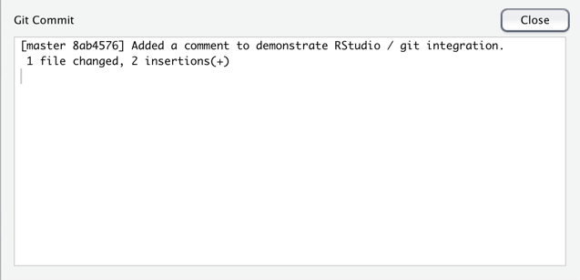

Back at the Commit window, press the **Push** button to push the changes that were committed to your local repository up to Github.

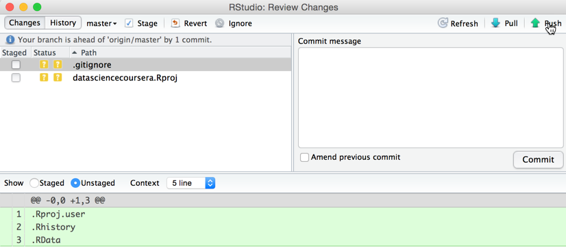

RStudio will display a dialog box to display the status of the push to the remote repository. This may take 30 seconds to a minute if your internet connection is slow. Also, RStudio may prompt you for your Github userid and password here, depending on your local git configuration. Note that if your local repository isn't up to date with the remote repository, RStudio will display a message instructing you to conduct a **Pull** before attempting a **Push**.

After reviewing the message to confirm the push command completed successfully, press the Close button.

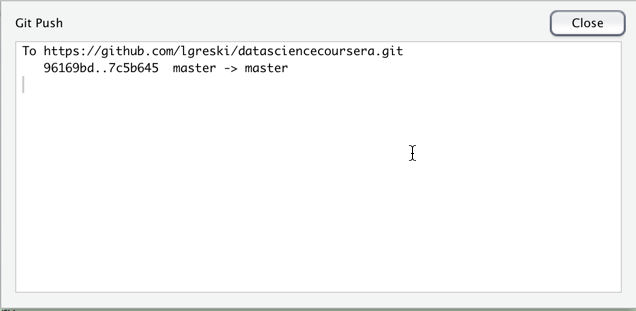

Now you can check the file on github.com and see that it has been updated with the latest changes.

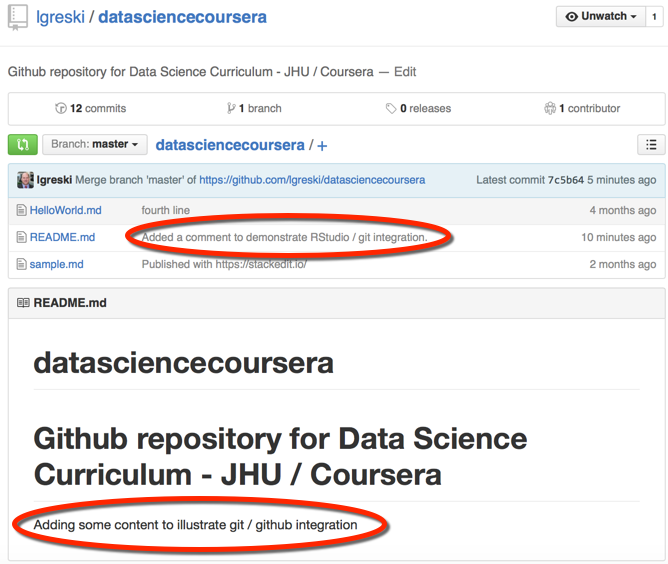
