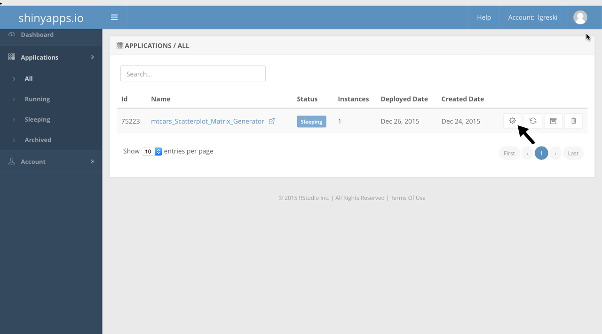
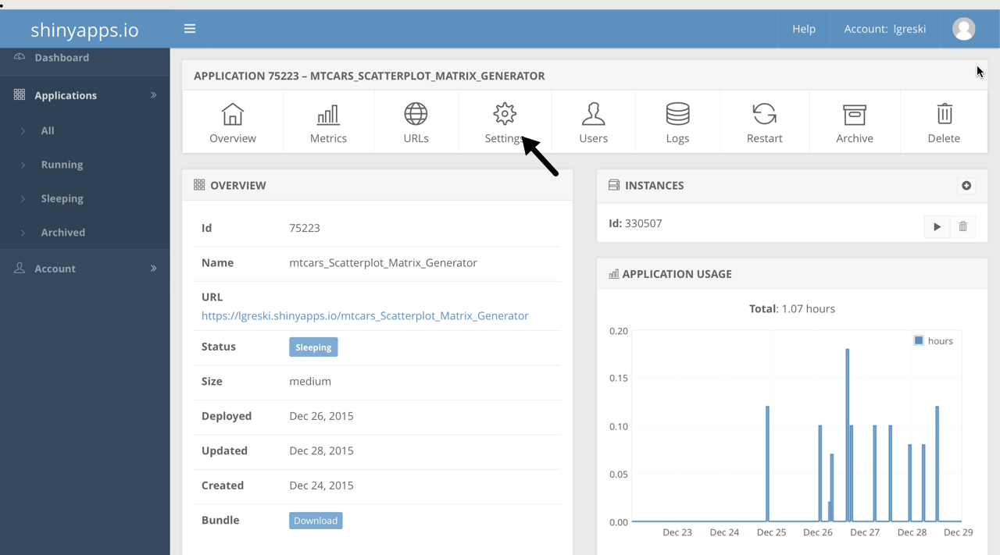
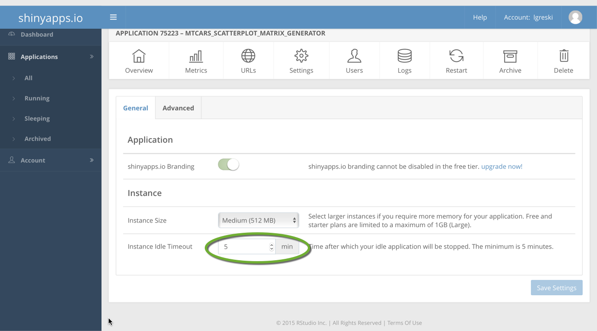

Because the free membership level on shinyapps.io only provides 25 hours of CPU time per month, it's important to set the Instance Idle Timeout for your application to the smallest value possible, 5 minutes.

The procedure to do this is:

1. Login to shinyapps.io
2. Navigate to the **Applications / All **panel by selecting this on the left navigation bar
3. Select Settings on your app (the gear) to view the Application Overview
4. Select Settings (the gear) to view the application settings, and on the General tab,
5. Change the **Instance Idle Timeout** time to 5 minutes by scrolling the spinner selector.

## Step 3

## Step 4

## Step 5

As you can see from the chart in Step 3, my application has been accessed a total of 11 times since December 25th, for a total of 1.07 hours of total execution time. We receive 25 hours of CPU time per month at the "free" membership level. Since the default Instance Idle Time is 30 minutes (if my memory is correct), one can quickly burn up an entire month's time allotment after only 50 views of an application where timeout is set to the default settings.
