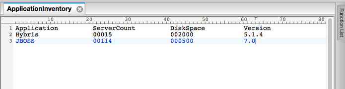
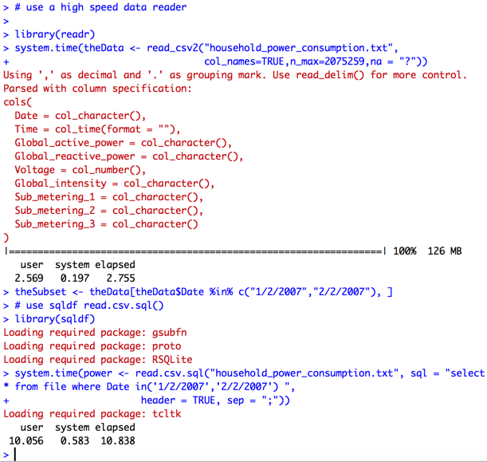
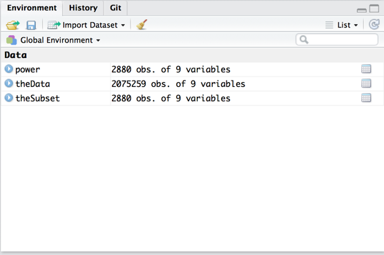

# Reading a Subset of Raw Data into R

The first programming assignment in *Exploratory Data Analysis* requires students to read a subset of power consumption data, based on a set of dates.

Students who have constrained memory and/or slow CPU speed often ask what is the most efficient way to subset the data, i.e. without having to read the entire file and then subset the result.

## Approach 1: `readLines()` and parsing

If the data is in a fixed length format, one could use a text editor like [UltraEdit](http://www.ultraedit.com) (license required) or [Atom](https://atom.io) (free) to open the raw data file, and count the columns. Once the columns in which the data needed to subset the file are known, one can write an R script with `readLines()` to read one line at a time, parse the specific columns into an R object, and decide whether to keep the data.

As an example of visually inspecting a file, here is a file of software application data that has been read into the *UltraEdit* text editor.

Notice the column numbers across the top of the editor window. These can be used to evaluate the location of data in a fixed record format.  

Another way to access this information is to  use `readLines()` to read the first 10 lines of the file, and then inspect the contents in R.

For a detailed example illustrating how to parse data with `readLines()`, please read [Real World Example: Reading American Community Survey U.S. Census Data](http://bit.ly/2bAdLE9).

## Approach 2: `read.csv.sql()` for Comma Separated Values Files

Another approach that works for comma separated values files is to use the `sqldf` package and the `read.csv.sql()` function, which allows one to include a `where` clause to subset the data.  

## Approach 3: Use a High Speed Reader

 Finally, one could read the data using using a high speed data reader such as  `readr::read_csv2()`, leaving everything as character variables, and then subset the data.

Comparing the last two options on the power consumption data for *Exploratory Data Analysis*, we see that `readr::read_csv()` and a subset via the extract operator is significantly faster (2.76 seconds) than `sqldf::read.csv.sql()` (10.84 seconds).

We also see that the output of each approach results in the same number of rows written to the result data frame, 2,880, or 1 observation per minute (1,440) for two days.

## Conclusions

The counter-intuitive result is that if one has access to a highly efficient mechanism to read the entire file, it can be faster to read it and then subset, rather than using a more complex but less efficient approach.

For a highly complex file with many variables, `readLines()` and parsing will outperform `readr`. Files with multiple record types for a single observation require an approach like the one demonstrated in [Real World Example: Reading American Community Survey U.S. Census Data](http://bit.ly/2bAdLE9)

# Appendix: Computer Specifications

The performance timings in this article were generated on a Macbook Pro with the following specifications.

<table>
    <tr>
        <th>Computer</th>
        <th>Configuration</th>
    </tr>
    <tr>
        <td valign=top>Apple Macbook Pro</td>
        <td>
            <ul>
                <li>Operating system: macOS Sierra 10.12.4 (16E195)</li>
                <li>Processor: Intel i5 at 2.6Ghz, turbo up to 3.3Ghz, two cores</li>
                <li>Memory: 8 gigabytes</li>
                <li>Disk: 512 gigabytes, solid state drive</li>
                <li>Date built: April 2013</li>
            </ul>
        </td>
     </tr>
</table>
