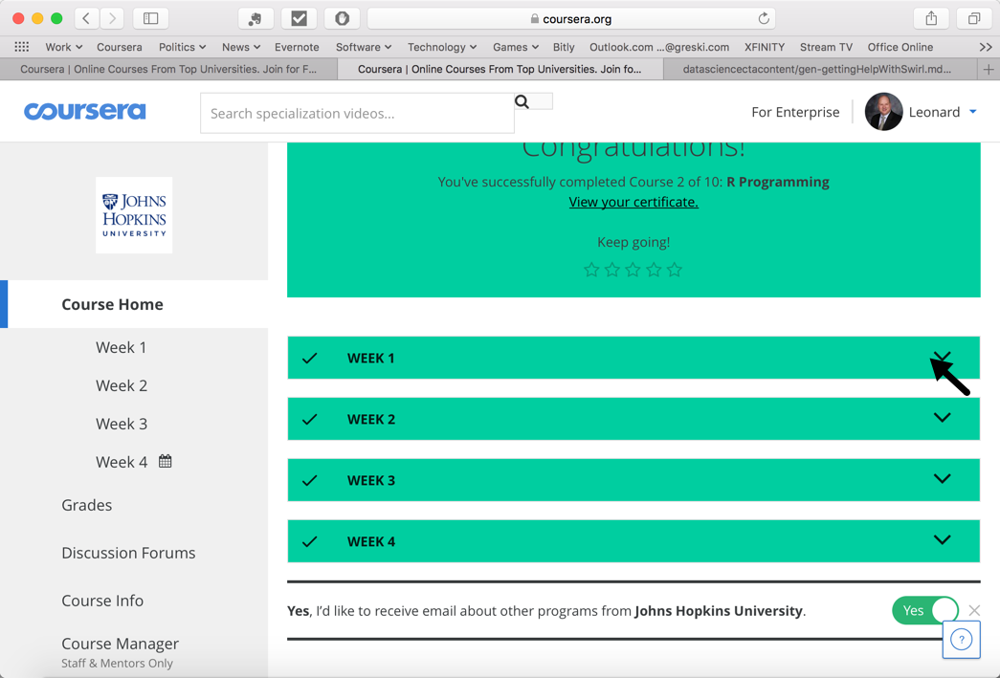
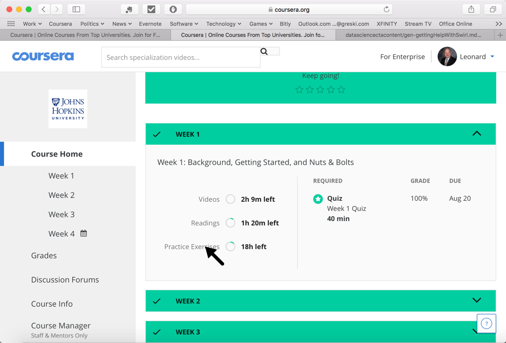
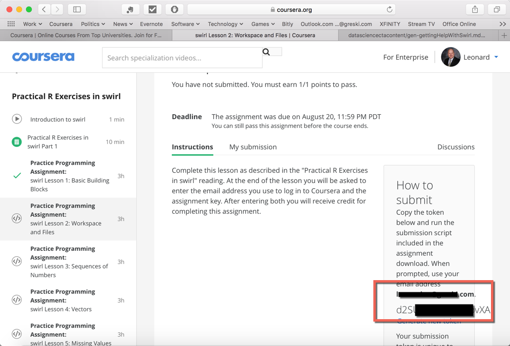

# Swirl: Common Problems and Getting Help

Students in the Johns Hopkins *Data Science Specialization* are introduced to `swirl`, an interactive environment for learning R and data science.

They sometimes have problems either installing the software or running it with the version of R installed on their computers. They also have problems submitting swirl assignments for credit through Coursera.

## ISSUE 1: Swirl works with the current version of R

Sometimes students start the *Specialization* after having previously installed an older version of R on their computers. Swirl only works with the latest version of R, so it is important to upgrade to the latest version before installing swirl.

Most students' problems with swirl can be resolved by running the latest version of R.

**SOLUTION:** Install / upgrade to the current version of R before installing swirl. If you already have a large volume of R packages installed, see also [How to Upgrade R without Losing Your Packages.](http://bit.ly/2uGKYFY)

## ISSUE 2: Problems Submitting Work for Credit

Students (especially those outside the United States) sometimes experience difficulties getting the grading of swirl assignments to work correctly. Often this is due to connectivity problems (e.g. firewalls, virtual private networks, etc.) between a student's computer and Coursera servers. All swirl assignments in the *Data Science Specialization* are optional. Therefore, it is not required to submit them for credit on Coursera in order to pass any of the courses in the Specialization.

**SOLUTION:** Finish the assignments and don't worry about getting "credit" for them.

## ISSUE 3: Finding the Assignment Token

Another common problem students experience when attempting to submit work for credit is where to find the assignment token that is requested by swirl at the end of a lesson.

From the course home page, select the Week 1 pull down to make the content visible for Week 1.

The Week 1 content includes videos, a quiz, and practice exercises. Select the `Practice Exercises` icon.

This will bring up the assignment instructions page. The Assignment Token is visible in a shaded box on the right side of the web page. Use the email address and assignment token when requested by Swirl to grade your assignment and have the grade posted to Coursera. 

# Where to Get Help with Swirl

Swirl is supported by [swirlstats.com](https://swirlstats.com), whose lead developer is [Sean Kross](http://seankross.com).

One can obtain help for swirl in the following places:
* [Swirl help page](http://swirlstats.com/help.html)
* [Frequently Asked Questions for swirl](http://swirlstats.com/faq.html)
* [Swirl google discussion group](https://groups.google.com/forum/#!forum/swirl-discuss)
* [Reporting problems with swirl](https://github.com/swirldev/swirl/issues)
