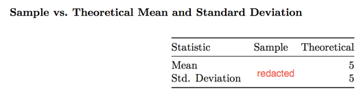

One of the things that is useful about `kable()` within the `knitr` package is that anything you can structure into a data frame can be printed as a table. I used this technique to create figures to compare actual vs. theoretical values for the Exponential Distribution assignment in the *Statistical Inference* course (sample values redacted).

The code to produce this table looks like:

    Statistic <- c("Mean","Std. Deviation")
    Sample <- c(round(theMean,2),round(theSd,2))
    Theoretical <- c(5.0,5.0)
    theTable <- data.frame(Statistic,Sample,Theoretical)
    rownames(theTable) <- NULL
    kable(theTable)

regards,

Len
