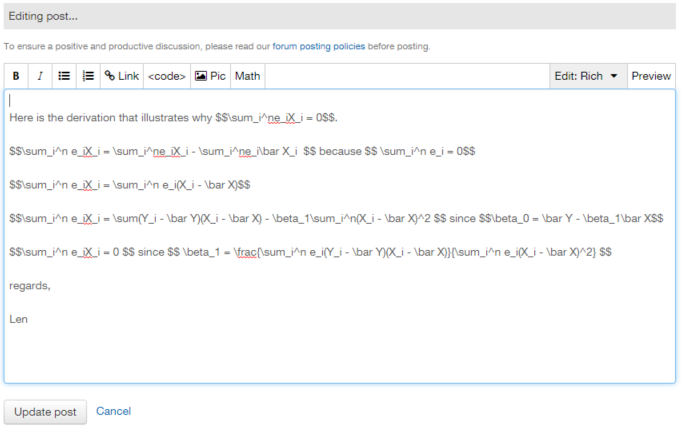
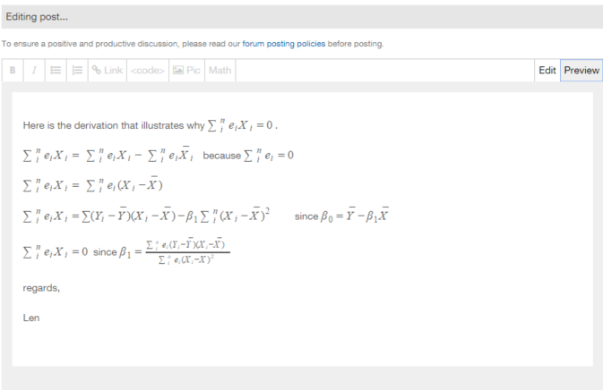
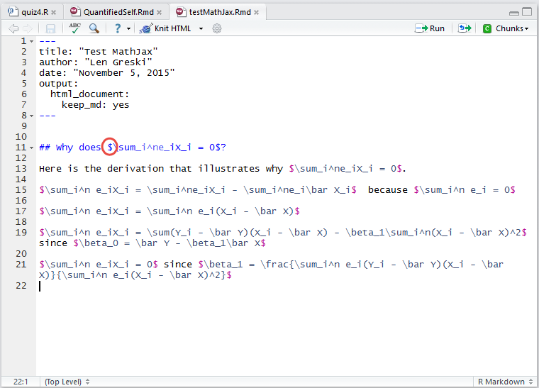
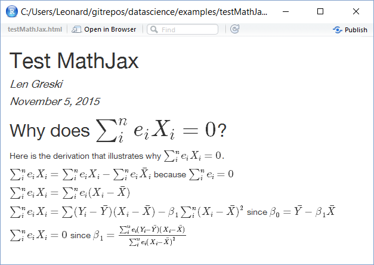
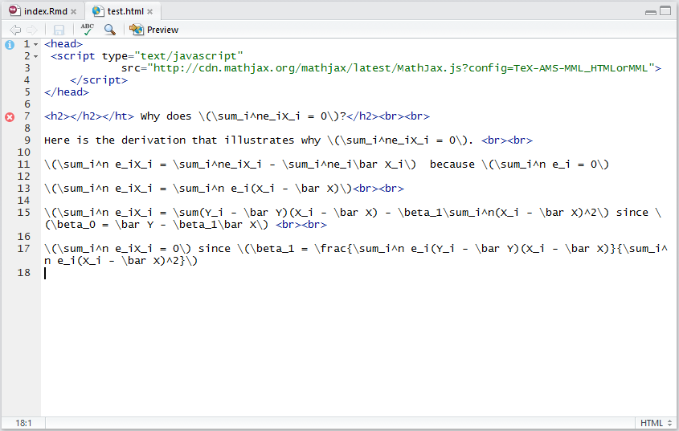

# Using Mathjax / LaTeX Forumlas in the Data Science Specialization

Students in the *Statistical Inference* and subsequent classes often need to use formulas as part of their communication in three different areas:

* To explain points within course Discussion Forums,
* In documentation for course projects, and
* In HTML / Markdown files on Github.

Coursera, RStudio, and Github all use [LaTeX](https://en.wikibooks.org/wiki/LaTeX/Mathematics) to specify formulas, and [MathJax](http://docs.mathjax.org/en/latest/start.html) to render the formulas in HTML and/or Markdown.

Unfortunately, the techniques required to display the content correctly vary slightly for each output format. This article illustrates how to write the correct formula syntax for each type of deliverable.

## Mathjax & LaTeX in Discussion Forums
In the Coursera Discussion Forums, the syntax to begin and end a formula is the double dollar sign: `$$`.  In the text editor, one can specify formulas as illustrated below.

To see how the formulas will render once the item is posted to the forum, press the `Preview` button to the upper right of the editor toolbar.

## Mathjax & LaTeX in Project Assignments / R Markdown

In R Markdown the syntax to begin and end a formula are the single dollar sign `$` and the double dollar sign: `$$`. The single dollar sign is used to include a formula as part of a sentence. The double dollar sign is used to break to a new line, center, and display a formula. The alternate Mathjax syntax of `\(` and `\)` for inline equations, and `\[` `\]` to display the equations centered on separate lines of text.

Notice the subtle difference in the following illustrations from R Markdown versus the illustrations for the Discussion Forums.

Once the markdown document is knit to HTML, PDF, or a Word document, the formulas are rendered.

One can choose to keep the intermediate markdown file that is generated during the `knit2html()` process. For some of the Data Science Specialization classes, one of the requirements of the course projects is to keep and publish the markdown file to Github, along with any supporting figures.

Note that although the formulas will be rendered correctly in an HTML output file from R Markdown that is subsequently posted to Github pages, the formulas will not render in the associated .md markdown file if it is also  posted to Github.

## Mathjax in HTML on Github / Github Pages

To display LaTeX formulas in an html page on Github that was built outside RStudio / R Markdown, the following code block must be included in the heading section of the HTML file to load the Mathjax interpreter.

    <head>
     
    </head>

The remainder of the document should be coded with HTML commands, and then the file can be accessed as an HTML file within Github pages and correctly rendered when viewed through a web browser. Note that the syntax for LaTeX must use the `\(`  `\)`  style syntax, not the `$` `$$` style that is used within the Discussion Forums or R Markdown.

Note that this syntax added to a markdown file will not cause the LaTeX to be correctly interpreted into equations in a Markdown file on Github. For more information on this topic, see [Using Mathjax on Github  Pages](http://christopherpoole.github.io/using-mathjax-on-github-pages/).

## References

1. Poole, Christopher (2012) -- [Using Mathjax on Github  Pages](http://christopherpoole.github.io/using-mathjax-on-github-pages/), retrieved December 3, 2015.
2. Wikipedia (2015) -- [LaTeX Mathematics](https://en.wikibooks.org/wiki/LaTeX/Mathematics), retrieved December 3, 2015.
