# Running R and RStudio on Chromebook?

Since its introduction in 2013, the Chromebook has become a common computing platform in primary and secondary education settings. Its low cost, ease of administration, and accessibility of the Google Apps suite make the Chromebook a compelling standard for [educational technology](https://thejournal.com/Articles/2015/04/14/3-Reasons-Chromebooks-Are-Shining-in-Education.aspx?Page=1), as highlighted in [THE Journal](https://thejournal.com/pages/about-the-journal.aspx), an education and technology publication.

However, the characteristics that make the Chromebook great for most students can be a challenge for more advanced students, such as those taking advanced placement courses in computer science or statistics. These types of courses typically require students to use software that is not designed for the Chromebook, including various programming languages and interactive development environments.

Fortunately, over the past 4 years enterprising developers have built tools such as [crouton](https://github.com/dnschneid/crouton) to unlock the Linux environment on which the [Chrome Operating System](https://en.wikipedia.org/wiki/Chrome_OS) is built, enabling people to install and run traditional Linux development tools devices that run Chrome OS.

## The Challenge: Integrating R with Google Sheets for AP Statistics

In my role as Community Mentor in the Johns Hopkins University Data Science Curriculum on [Coursera](https://www.coursera.org/specializations/jhu-data-science), a student in the July 2017 run of *R Programming* asked a question about how to load R packages onto the [r-fiddle](http://www.r-fiddle.org/#/) website. R-fiddle is a cloud based implementation of the statistics language R, and it enables people to develop and share small amounts of R code.

This particular student is a high school math teacher and is preparing to introduce R to high school students in an upcoming advanced placement statistics class. Students who take the class will have Chromebook laptops, and r-fiddle would be a good way to introduce R in a way that would work on a Chromebook.

Students will also be required to collect data and store it in Google Sheets prior to analyzing it with R. Ideally, students would use the `googlesheets` package to analyze the data within r-fiddle. Unfortunately, r-fiddle does not have the the capability for end users to install R packages, so it's not currently possible to use Google spreadsheets with r-fiddle.

## Another solution: Install R and RStudio Directly on the Chromebook

One approach to making R work on the Chromebook is to install the Linux operating system with a tool called [crouton](https://github.com/dnschneid/crouton), short for Chromium OS [chroot](https://en.wikipedia.org/wiki/Chroot) Environment. Crouton enables the Chrome OS to install a linux partition, as well as the ability to toggle back and forth between Chrome and Linux. Once Linux is installed on the Chromebook, one can install R and RStudio, following instructions such as those in a 2016  article on [Installing RStudio on Ubuntu Xenial](https://www.r-bloggers.com/how-to-install-r-on-linux-ubuntu-16-04-xenial-xerus/).

## Target Audience

Given that this article is a response to a question related to a high school AP statistics class, the primary audience is instructors and students in AP Statistics who wish to use R and RStudio to support the instructional process.

Data science has changed dramatically in the last 20 years, and the demand for data scientists will continue to increase for the foreseeable future. If you are a high school AP Statistics student reading this article, you are fortunate that your instructor is challenging you to use the types of analytic tools that are used by professional data scientists.

Take advantage of this opportunity to develop skills that you can use to advance your career, and begin to develop the confidence that comes with figuring out how to solve ambiguous and challenging real world problems.

## Prerequisites

Before we begin, we'll list a few prerequisites for the process, including:

* Administrator access to the Chromebook,   
* USB memory stick for additional storage, and   
* The "hacker mentality," and   
* Enough Linux knowledge to be "dangerous."

### Administrator Access

Most of the Linux work requires administrator rights to the operating system. In Linux this means one must have the ability to run programs as "superuser." In practice, one's user account in the Linux operating system must have administrator privileges so s/he can run commands with superuser privileges via the  [sudo](https://en.wikipedia.org/wiki/Sudo) (or "superuser do") command.

### The "hacker mentality"

Students in the Johns Hopkins University Data Science Specialization are [introduced to this concept early in the specialization](http://bit.ly/2nGskYS). The "hacker  mentality" is the idea that a data scientist needs to have a certain tenacity to solve ill-defined problems, and the resourcefulness necessary to pull together enough information to solve a problem from any available resource.

As an example, the question of how to integrate Google Sheets with r-fiddle is well outside the scope of the *R Programming* course, but since it was an interesting problem I did the research necessary to write this article. In the process of writing the article I had to piece together content from a wide variety of sources to deliver a working system that could access Google spreadsheets. I also had to learn a fair amount by trial and error (i.e. multiple installs of Linux to test out various sets of parameters / graphical desktops).

If one takes the time to complete all the steps in this article, one will have a good start in understanding how to install a sophisticated operating system that is used by a wide variety of businesses, to configure it, and to install various types of open source software.

### USB memory stick

Since the typical Chromebook has only 16Gb of on device storage, we'll need extra space to store data and R programs. I like to use the low profile USB memory sticks that are made by SanDisk and Samsung that look like the following image.

Once installed in the Chromebook the low profile makes it easy to leave the memory stick attached to the device rather than removing it each time the device is turned off. The low profile stick is also less likely to be damaged while inserted in the device.

### Enough Linux knowledge to be "dangerous"

1. Ability to use a command line terminal
2. Installing software
3. Interpreting error messages

#### Using the terminal

Many of the steps in this walkthrough require use of the Linux terminal. In Chrome OS, the Linux terminal may be accessed by pressing `<CNTL>+<ALT>+<T>`.  From Chrome OS, the `crosh` (short for Chrome OS shell) shell looks like this.

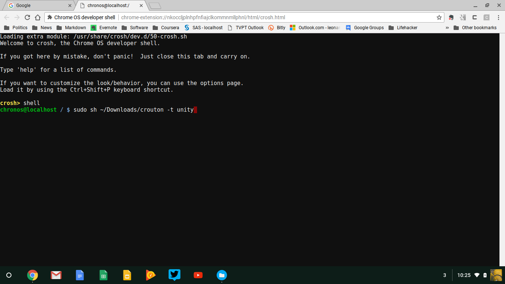

The Linux shell increases one's visibility to any error messages generated as we configure the operating system to work with R and RStudio, and the ability to work with an operating system via terminal commands is a useful skill for anyone who aspires to be a data scientist because many of the software components that data scientists use do not have friendly graphical user interfaces.

#### Installing software

Most of the process described in this article is focused on installing software libraries (code that is directly accessed by other software programs, instead of end users) and software applications. An aspiring data scientist needs to get comfortable experimenting with different pieces of software because there is a large amount of innovation underway in the machine learning and artificial intelligence spaces, and one of the primary ways the innovation is distributed to data scientists is through open source software.

The primary tool you will use to install software is the [Ubuntu Advanced Packaging Tool](https://help.ubuntu.com/community/AptGet/Howto), or APT. The command line version of this tool is `apt-get`.

#### Interpreting error messages

One last skill you'll need to get through this process is the ability to figure out why a process failed. As I worked through the process to install all the software needed to run the `googlesheets` package in RStudio, I experienced a number of errors where a step failed because of one or more Linux libraries on which the step depended were not already present in my Linux installation. The primary reason for this is that with Crouton we are installing a stripped down version of `Ubuntu` to save space, and therefore some of the libraries that we need aren't included in this version of Ubuntu. Fortunately, the [Ubuntu Advanced Packaging Tool](https://help.ubuntu.com/community/AptGet/Howto) makes it easy to add the components we need when we need them.

While I have tried to minimize the need to respond to error messages by adding steps to install required Linux libraries before loading R and RStudio, depending on the choices you make (e.g. which GUI desktop to install), some libraries that automatically installed for me may not be present in your installation. If a process step fails, review the log for error messages, identify the missing library or libraries, and install them with `apt-get` before retrying the step that failed.

# Step 1: Install Linux on Chromebook

## Before you begin

Configuring a Chromebook to run in Developer mode with Linux does have consequences. First, the boot time will increase from about 5 seconds to about 30 seconds each time the Chromebook is booted. This impact can be mitigated by putting the Chromebook into sleep mode rather than doing a complete shutdown.

Second, a specific sequence of commands must be entered each time you wish to run a Linux session on the Chromebook. Given the value of being able to run a full version of RStudio on the device, these are minor inconveniences.

Finally, it's important to know that you are never more than a [Powerwash](https://www.laptopmag.com/articles/how-to-reset-a-chromebook) away from starting over. Since the base Chrome installation stores most items to the Google cloud, there is little downside risk to experimenting with the device.

## The Process

The remainder of this section is based on Whitson Gordon's 2013 article on [lifehacker.com](http://lifehacker.com), [How to Install Linux on a Chromebook and Unlock its Full Potential](http://lifehacker.com/how-to-install-linux-on-a-chromebook-and-unlock-its-ful-509039343). The content is copied here to make it easier to follow the entire set of instructions without jumping back and forth to multiple websites. Installing Linux requires three specific activities, including:

* Enable developer mode,   
* Install Crouton, and   
* Optimize the Linux Desktop for your Chromebook.   

### Enable Developer mode

This step will wipe local data, so make sure you back up anything that is not already stored in the cloud prior to proceeding.

1. Press and hold the `<ESC>` and `<Refresh>` keys together, then press the `Power button` (while still holding the other two keys). This will reboot the Chromebook into Recovery Mode.   
2. As soon as you see Recovery Mode pop up -- the screen with the yellow exclamation point -- press `<CTRL>+<D>`. THis will bring up a prompt asking if you want to turn on Developer Mode.   
3. Press `<Enter>` to continue, and then allow the machine time to process. It will pop up with a new screen for a few moments, then reboot and go through the process of enabling Developer Mode. This will take some time, as much as 15 - 20 minutes, and will wipe out your local information.   
4. When the process is complete, it will return to the screen with the red exclamation point. Leave this alone until it reboots to the Chrome OS, which should take another 30 seconds or so.

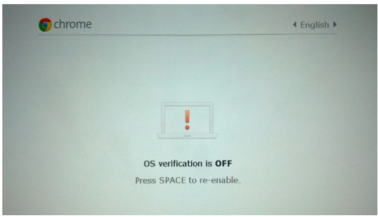

Note that some older Chromebooks have a physical switch that must be flipped in order to turn on Developer Mode. Consult the user manual for your specific device for additional instructions for enabling Developer Mode.

At this point you will need to login to the Chromebook with its original factory settings, connect to a wireless access point, and reconnect to your Google account.

### Install Crouton

Installing Crouton and loading Ubuntu Linux is multi-step process.

1. [Download Crouton](http://goo.gl/fd3zc) and save it in your `Downloads` folder.    
2. Press `<CNTL>+<ALT>+<T>` to bring up a terminal in your Chromebook.   
3. At the terminal, enter the `shell` command to enter an Ubuntu shell.

       shell

4. Next, run the following command to install Crouton with the xfce desktop:

       sudo sh -e ~/Downloads/crouton -t xfce

5. If you would prefer to run the Unity desktop, which is the standard for Ubuntu Linux but takes up more space than xfce, run the following command:

       sudo sh -e ~/Downloads/crouton -t unity

   

**NOTE:** the name of the new environment defaults to the version of the operating system being installed. For the default install of Ubuntu Linux, the current production version is named `xenial`. This is important if you need to uninstall the image at a later point.

6. If you're installing Linux on a device that has a touchscreen, such as the Chromebook Pixel or the HP Chromebook 11 G5 EE, enter the following to install touch support with the xfce desktop:

       sudo sh -e ~/Downloads/crouton -t touch,xfce
7. Optional: you can encrypt your desktop with the optional `-e` flag, since Developer Mode weakens the security of the Chromebook. See the [Crouton Github site](https://github.com/dnschneid/crouton/blob/master/README.md) for more information about encryption.    At this point your computer will install crouton and Ubuntu. Depending on the speed of your machine and internet connection, this may take 20 - 30 minutes.   When the install is complete, it will ask you for a username and password for the new Ubuntu installation. This userid will have administrator rights, so it's important to guard the userid and password carefully.   
8. Once installation is complete, enter the following command if you've installed xfce as your desktop environment.

       sudo startxfce4
9. If you installed Unity as your desktop, enter the following command to start the desktop.

       sudo startunity

If you've installed Unity, the desktop will look similar to this.

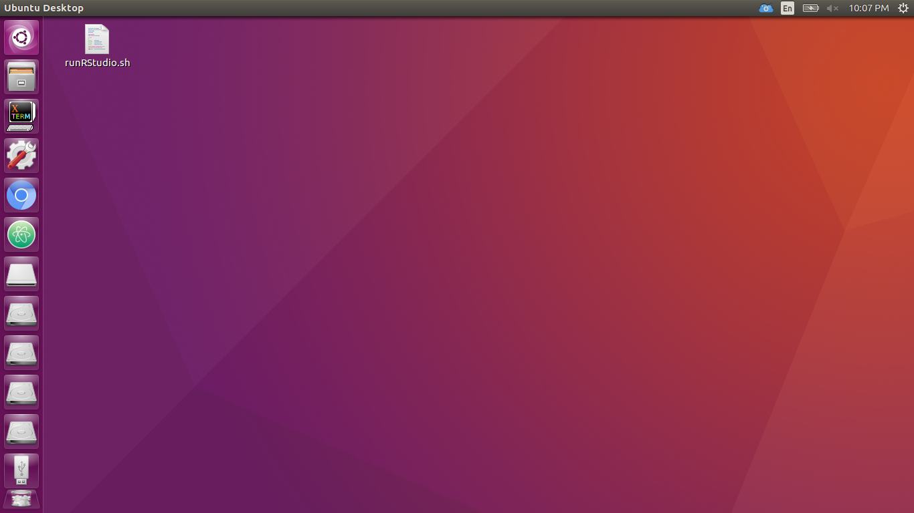

 Note that there are other desktop interfaces that can be installed instead of xfce or Unity, such as LXDE, KDE, or the Gnome Desktop. Please refer to the [Crouton Wiki](https://github.com/dnschneid/crouton/wiki) for information on the desktops that are supported by Crouton.

 If you don't like the desktop that you installed, you can use crouton to uninstall the Linux partition, and start over again. To uninstall an Ubuntu partition installed with the default name of `xenial`, enter the following command in the crosh window in Chrome OS.

       sudo delete-chroot xenial

### Optimize Linux Desktop for Chromebook  

Once installed, one can switch back and forth between Chrome OS and Ubuntu by pressing the following keys: `<CNTL>+<ALT>+<Shift>+<Backward>` and `<CNTL>+<ALT>+<Shift>+<Forward>`. Note that some hardware uses `<CNTL>+<ALT>+<Backward>` and `<CNTL>+<ALT>+<Forward>` so you may have to check the documentation for your Chromebook to confirm which version of these keystrokes is correct for your hardware.

For example, Whitson Gordon's article says that Intel machines use `<CNTL>+<ALT>+<Backward>` and `<CNTL>+<ALT>+<Forward>`, but my Chromebook has an Intel processor yet the commands that work correctly on my machine are `<CNTL>+<ALT>+<Shift>+<Backward>` and `<CNTL>+<ALT>+<Shift>+<Forward>`.

As you access the desktop, you'll notice that it has few programs installed, and that many of the default Ubuntu tools are left out. We'll explain how to install additional software later in this document.

Also, if you installed the XFCE desktop, disable the screensaver because it causes graphics problems in Chrome OS.

You'll notice that the Downloads folder in Chrome OS is the same as the Downloads folder on the Linux desktop, so you can use this as a common directory between Chrome and Linux. Once you install a USB stick in the Chromebook, it is also accessible between Linux and Chrome.

As we noted earlier in the article, once your Chromebook is in Developer Mode, it will take up to an extra 30 seconds to boot since it shows the Developer Mode message. You can skip this by pressing `<CNTL>+<D>`.

If you want to remove the Linux desktop and return solely to Chrome OS, you can reboot the Chromebook and press the spacebar at the prompt to re-enable OS verification. This will remove Crouton and Linux, and restore the Chromebook to its factory settings. Be sure you back up any files that aren't saved to the cloud before resetting the machine.

# Step 2: Prepare Linux for RStudio

In this step we will install a number of Linux software applications that will be useful to someone working in RStudio, including Git for source code version control,and Linux libraries on which R packages depend, such as `libxml2`, `curl`, and `libcurl`. We will also set the Linux locale to U.S. English with UTF-8 encoding, which is required for RStudio in the U.S.

## Install Linux libraries

List the Linux libraries that one needs to install in advance to support installation of R and RStudio. These libraries are necessary to download files in R via the `download.files()` function, and to use secure sockets with Google Sheets.

1. Install libcurl with the following commands in a Linux terminal.

        sudo apt-get -y install libcurl4-gnutls-dev
        sudo apt-get -y build-dep libcurl4-gnutls-dev
2. Install curl with the following command from a Linux terminal.

        sudo apt-get install curl
3. Install openssl with the following command from a Linux terminal.

        sudo apt-get install openssl

## Install Key Linux applications

At this point we will install a couple of applications that make the rest of the process easier, including the Chromium browser and the Atom text editor.

### Install the Chromium browser

Chromium is the open source browser on which Google Chrome is based. The [Chromium version excludes a number of proprietary software extensions](https://askubuntu.com/questions/6253/whats-the-difference-between-google-chrome-and-or-chromium-what-are-the-advant) such as Adobe Flash that are included in Google's version. To install Chromium, open a Linux terminal and enter the following command.

      sudo apt-get install chromium-browser  

### Install the [Atom](http://atom.io) text editor

As students interact with various forms of data, sometimes it is helpful to look at the raw data files to understand their content, such as "does this file have a header row of variable names?" The open source text editor, [Atom](http://atom.io), is useful for this purpose. To install Atom, take the following steps.

1.  Download Atom from the Atom website's [download page](http://atom.io/download/deb).  
2. Once the software has completed the download, open the file viewer, navigate to the Downloads folder, and double click on the `atom-amd64.deb` package to start the Ubuntu Package Installer.  
3. The Package Installer will analyze the file, confirm that all required Linux libraries are present, and enable the `<Install Package>` button. Press the button to install the package.  
4. When complete, you can find Atom in the Applications folder or by searching for Atom from the Unity search button in the upper left corner of the Desktop.    
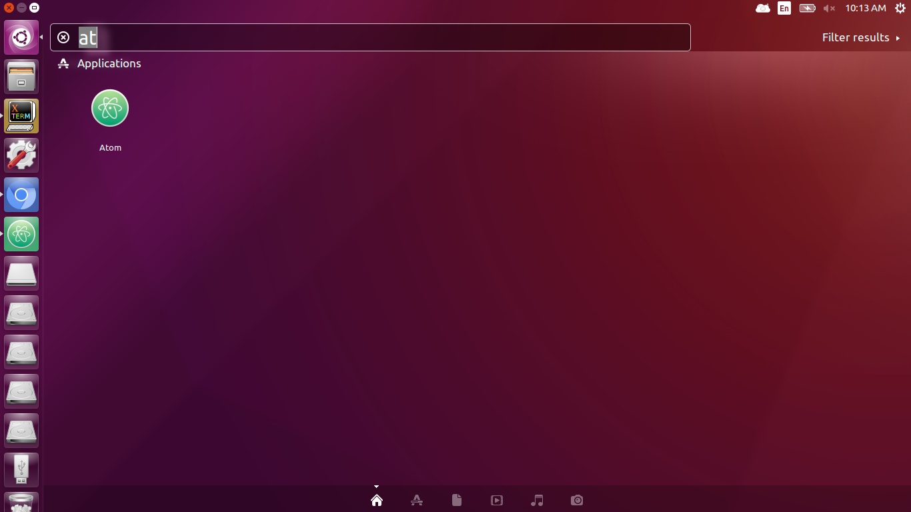  
5. Double click the icon to start Atom.

### Install Git for source code version control

Git and [GitHub](https://github.com) are components of a larger toolkit used by professional data scientists to create [reproducible research](https://simplystatistics.org/2014/06/06/the-real-reason-reproducible-research-is-important/). As one begins to learn R programming, it is useful to write and save small snippets of code in case one needs to revert to a prior version of a program.

Git is a version control application that saves and tracks multiple versions of software source. To install git, open a Linux terminal and type the following command.

      sudo apt-get install git

### Install Ubuntu Software Center

The [Ubuntu Software Center](https://apps.ubuntu.com/cat/applications/precise/software-center/) is a graphical user interface that allows one to access a large volume of open source software that runs on Ubuntu. A searchable list of applications available for Ubuntu is also available via web browser as the [Ubuntu Apps Directory](https://apps.ubuntu.com/cat/).

[Ubuntu Software Center](https://apps.ubuntu.com/cat/applications/precise/software-center/) may be installed in a Linux terminal via the following command.  

      sudo apt-get install software-center

## Configure Linux Locale to US English

The default installation of Ubuntu does not set the locale (i.e. language and country settings) to a specific language and country. RStudio will generate warning messages about the need to set the locale to `en_US.UTF-8` unless we set it in advance. To set the locale, use the following command in a Linux terminal.

      sudo dpkg-reconfigure locales

This will bring up a character-based application where we can set the locale to the right format.  
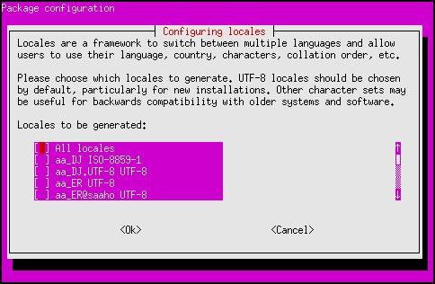  
The formats are based on 2 character language codes, and underscore, a country code, and an encoding format. Scroll down to `en_US.UTF-8` and press the `<space bar>` to toggle the selection, as illustrated below.  
  
  
Next, press the `<TAB>` key to move to the pushbuttons below the scrollable list. Highlight the `<OK>` button by tabbing to it, and then press `<ENTER>` to select it. This will generate the appropriate encodings into the environment.

To access the new encodings, one must logout of the Linux environment and log back in.

After logging in, one can confirm that the locale has been set correctly by entering the following command in a Linux terminal.

       locale

The output should match the following image.

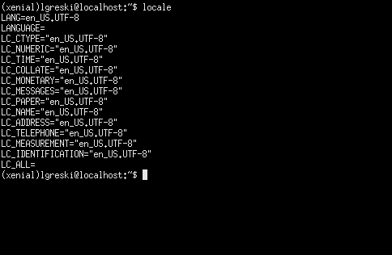

## Install libxml2 Library

`libxml2` is required to for R to compile the Google Sheets package. To install it, enter the following commands from the command shell.

     apt-cache search libxml2
     sudo apt-get install libxml2-dev

# Step 3: Install R and RStudio

Now we're finally ready to install R and RStudio. This section is largely based on an [r-bloggers article](https://www.r-bloggers.com/how-to-install-r-on-linux-ubuntu-16-04-xenial-xerus/)  by [Kris Eberwein](https://www.r-bloggers.com/author/kris-eberwein/) that describes how to install R and RStudio on Ubuntu Linux.  As with Whitson Gordon's article on installing Crouton and Linux on Chromebook, we've replicated the steps here as I used them on my Chromebook to reduce the number of websites one must have open in order to follow the directions. We have also edited the instructions so they reference the most recent version of RStudio.

## Install R

As described in Kris Eberwein's article, we will install the most recent version of R versus the one that is available through the Ubuntu Software Center.

1. Add the R Repository to the `/etc/apt/sources.list` file by executing the following commands in a terminal window.  

        sudo echo "deb https://cloud.r-project.org/bin/linux/ubuntu xenial-cran35/" | sudo tee -a /etc/apt/sources.list
2. Add R to the Ubuntu Keyring by entering the following commands in a terminal window.  

        gpg --keyserver keyserver.ubuntu.com --recv-key E084DAB9
        gpg -a --export E084DAB9 | sudo apt-key add -
3. Update the application repository and install `r-base` and `r-base-dev` with the following terminal commands.

        sudo apt-get update
        sudo apt-get install r-base r-base-dev
The R installation will take 15 - 30 minutes depending on the speed of your machine and internet connection. The install will compile R from source, versus installing it from compiled modules as is the case with R on Windows or Mac OS X.

## Install RStudio

### Alternative 1: install from command line
Since we're installing most of our software through the terminal window instead of the Ubuntu Software Center or the Synaptic Package Manager, we'll use the following commands to install RStudio. As of summer 2017, the version of RStudio was 0.99.896. Before running these commands, check the [RStudio website](http://bit.ly/2hEYW4q) to obtain the current version number.

        sudo apt-get install gdebi-core
        wget https://download1.rstudio.org/rstudio-0.99.896-amd64.deb
        sudo gdebi -n rstudio-0.99.896-amd64.deb

**NOTE:** Once RStudio is installed, we will need to run it with administrator privileges in order to install packages in the correct folders within the operating system.

### Alternative 2: download and install from custom Installer

Since the time of the original writing of this article RStudio created an install package for Ubuntu. The install package for Ubuntu 9+ can be downloaded from the [RStudio download page](http://bit.ly/2hEYW4q). Once downloaded, double click on the package and the Ubuntu Software Center will install the software on the computer.

## Test the Installation

To test the R installation, enter `sudo R` at a terminal prompt. This will bring up an R session, into which one can execute R functions.

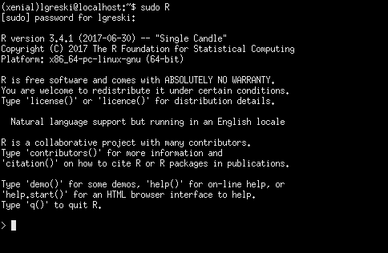

Here, we'll create a vector and calculate its mean.

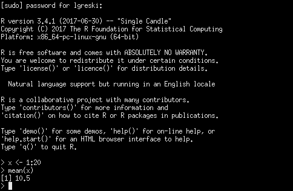

So far, so good. to exit R, enter `quit()` at the R command prompt. Answer `n` when asked whether to save the workspace, and you will be returned to the terminal window.

Next, we'll test the RStudio installation. To start RStudio, we'll enter `sudo rstudio` in the terminal window. RStudio will display its four-paned user interface. In the console (lower left quadrant) of RStudio, we'll enter the same statements we entered in command line, R, and not surprisingly, we receive the same result.

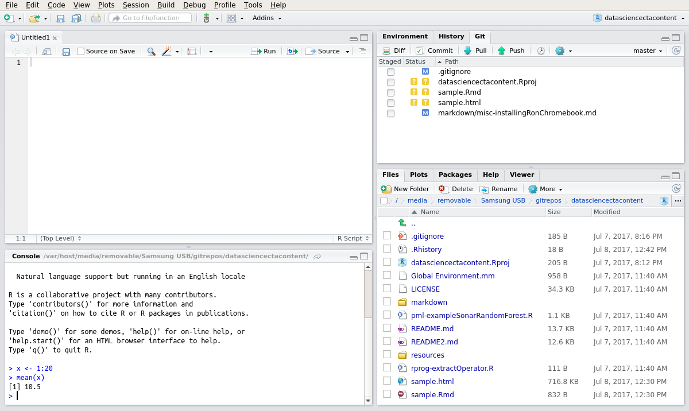

Congratulations! You now have a working version of RStudio installed on your Chromebook.

# Step 4: Install R Packages

Now that we've demonstated that both R and RStudio are working, we can execute the following code to run Google Sheets within RStudio. We'll use the `install.packages()` function after we create a list of packages for R to install.

      pkgList <- c("openssl","curl","dtplyr","googlesheets")
      install.packages(pkgList)

Note, in addition to these packages, R will install any packages on which these depend, such as `httr` for `googlesheets`.

In Ubuntu R must install all packages from source, so this process will take a while as R downloads and compiles all the packages required to support Google Sheets. I also included the `curl` package because it is necessary for the `download.files()` function, which is very useful to gather data from websites.

To load a package once it's been downloaded, we use the `library()` function.

      library(googlesheets) #loads the googlesheets package

# Step 5: Register for Github and Connect with Local Git

This step is optional, but recommended. It enables you to store your R programs and data on Github, in case your Chromebook is lost, damaged, or stolen. There is an entire set of videos about configuring git and Github from Data School: [Data School Github Video Series](https://www.youtube.com/playlist?list=PL5-da3qGB5IBLMp7LtN8Nc3Efd4hJq0kD). We'll leave it to you to sign up for Github.

## Create an apStats Repository on Github

Once you've registered a free account on Github, you can create a repository by selecting the `Repositories` tab from your Github home page. To create a repository, press the `New` button in the upper right section of the page.

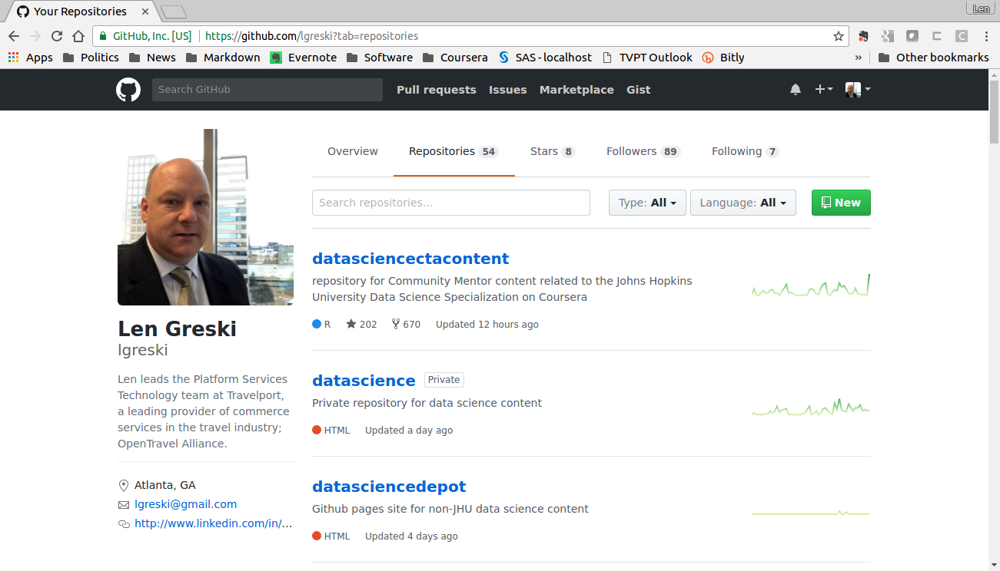

This causes Github to display the new repository page. Enter the following information on the page in order to initialize the repository with a README file.

1. Enter `apStats` as the repository name,
2. Add a description for the repository, which will be used to initially popultae he README.md file,  
3. Leave the `Public` radio button checked (private repositories require a paid Github account),
4. Select an open source license (optional).
5. Press the `Create Repository` button to create the repository.

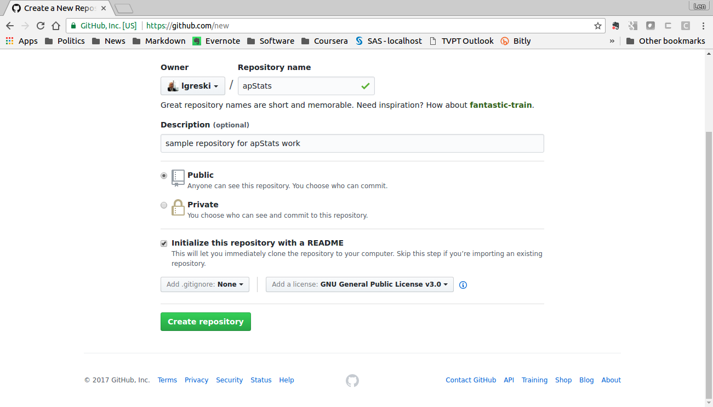

GIthub will then display the home page for your repository. You can now clone this locally to your Chromebook and use it with RStudio.

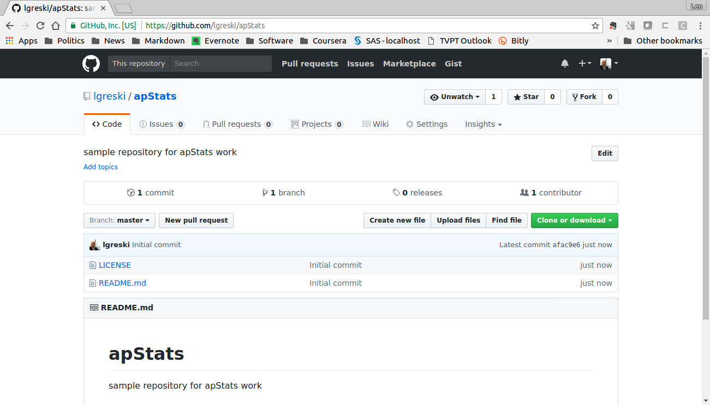

## Setting up Git on the Chromebook

When you set up git on your Chromebook, it's a good idea to create a single directory in which your git repositories will be stored. Create this directory on your USB drive to conserve disk space on the Chromebook's SSD drive. On my Chromebook, my USB disk is named "Samsung USB", so the following sequence of terminal commands would be used to create a `gitRepositories` directory.

      cd "/media/removable/Samsung USB"
      mkdir gitRepositories
      cd gitRepositories

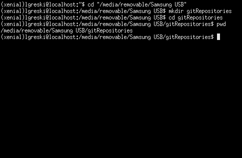

The easiest way to synchronize a local copy of a remote Github repository is to use the `git clone` command.

**NOTE:** Always run the `git clone` command from your `gitRepositories` directory so you can easily keep track of all of your repositories. Since we already have a terminal session open to this directory, we will clone the `apStats` repository that we created on Github.  The syntax for `git clone` is:

      git clone https://github.com/username/repositoryName

Since my Github userid is `lgreski`, I would enter the following:

      git clone https://github/lgreski/apStats

Git will clone the repository from Github, storing its contents into an `apStats` folder within the `gitRepositories` folder that we created earlier .

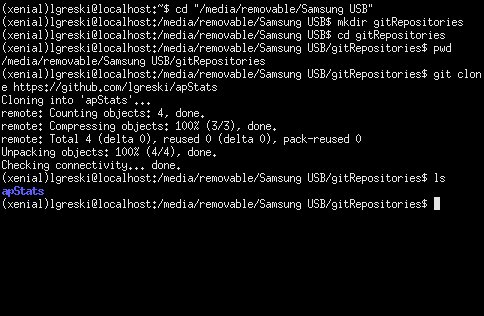

If we change directories to `apStats` and list the folder contents, we can see the `README.md` file that Github generated when we created the repository on Github.

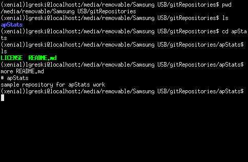

RStudio supports git / Github integration. To set this up within RStudio, please read [Configuring RStudio / Github Integration OSX Version](http://bit.ly/2c9Q2bf). Since Mac OSX is actually a customized version of Linux, these instructions will work with your Chromebook.

# Using the System

From a boot of the Chromebook, the steps to run RStudio include:

1. After logging into the Chromebook, press `<CNTL>+<ALT>+<T>` to start a Linux terminal in the Chrome browser.  
2. In the terminal, enter `shell`   
3. In the terminal, enter `sudo startunity` to start Ubuntu  
4. Once Ubuntu initializes, open a terminal and type `sudo rstudio` to start RStudio  

### Size of Problems One Can Solve

R processes everything in the [random access memory](https://en.wikipedia.org/wiki/Random-access_memory) (RAM) of the computer. Since Chromebooks typically have between 2Gb and 4Gb of RAM, an R installation on a Chromebook will be limited to data sets that consume less than the memory installed on your Chromebook. One can conduct very sophisticated analyses on a machine with 2Gb of RAM, such as the analysis of [extreme weather events](http://bit.ly/2xoJraj) data from the [United States National Oceanographic and Atmospheric Administration](http://bit.ly/2zcZ0Qf) that is used as the final project in the Johns Hopkins University [Reproducible Research](https://www.coursera.org/learn/reproducible-research) course on [Coursera](http://coursera.org). The raw data file for this project consumes about 540Mb of RAM once it is loaded into R.

Since it is unlikely that students in an AP Statistics course will analyze data sets larger than the NOAA storm data, the Chromebook has more than enough capacity to handle any problem that is covered in a high school statistics course.

### Runtime Performance

We ran two tests to check the performance of the Chromebook relative to other platforms on which I run RStudio. The first test was a run of an analysis conducted on data from the National Oceanographic and Atmospheric Administration regarding extreme weather events.

The output is an R Markdown document published to RPubs, [NOAA Storm Data Analysis -- Chromebook Version](http://bit.ly/2trj5RC). This version of the analysis runs in less than 2 minutes. Not bad for a data file that consumes over 500Mb of RAM in R.

The second test focuses on the raw compute capacity of the Chromebook, using the final project from the Johns Hopkins University [Practical Machine Learning](https://www.coursera.org/learn/practical-machine-learning) course on [Coursera](http://coursera.org). The subject of the final project is an analysis called [Qualitative Activity Recognition of Weight Lifting Exercises](http://groupware.les.inf.puc-rio.br/work.jsf?p1=11201). Given that students in *Practical Machine Learning* frequently experience difficulties using the `randomForest` machine learning algorithm with this data set, I have written an article, [Improving Runtime Performance of Random Forest Models with caret::train()](http://bit.ly/2bYtutG), that explains how to improve the runtime performance of these types of models.

Not only does the analysis run to completion on the Chromebook, its performance compares favorably to another machine that is optimized for long battery life: the HP Envy X2 tablet. This analysis runs in 20 minutes on the Chromebook, but takes over 70 minutes on the Envy X2.

The bottom line is that not only does the Chromebook have the capacity to tackle relatively large data sets, it can also handle complex compute tasks with an acceptable response time.

# Working with Google Sheets

After all of this effort, we can finally address the original question posed at the start of the article: *Can we make R work with Google Sheets on a Chromebook?* Having installed the `googlesheets` R package, we can fire up an RStudio session and attempt to access a Google Spreadsheet. For this exercise I've posted a copy of Pokémon statistics that I use for other articles on R. This data is based on Alberto Barradas' [Pokémon Stats](http://bit.ly/2ovmmxu) data from kaggle.com. Barradas' data includes basic statistics for the first 6 generations of Pokémon. The original data and separate files by Pokémon generation are also available at the [lgreski/pokemonData repository](http://bit.ly/2nB2Zzy) on Github.

First, we'll start a new RStudio session from the Linux terminal by typing `sudo rstudio`. Once RStudio begins, we'll load the `googlesheets` library and attempt to list the spreadsheets associated with one of my Google accounts.  You can either type the code directly into the R console, or create a new R script in the upper left pane of RStudio, type the code, highlight it and press the `<Run>` button

      library(googlesheets)
      theList <- gs_ls()

The Google Sheets package will generate a URL for you to cut and paste into a browser, so Google can generate an authorization token that will allow the Google Sheets package to interact with your Google Drive and Google Docs documents, including Sheets.

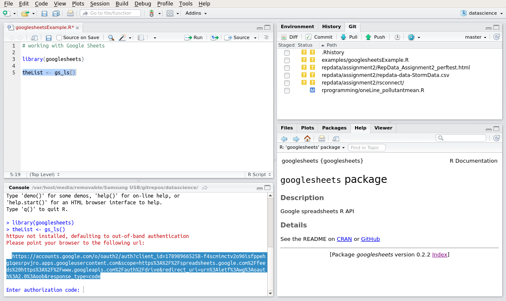

Highlight the URL, copy it into the clipboard with `<CNTL>+<C>`,  start a Chromium browser session, and paste the URL from the clipboard into the URL field in the browser. Google will respond with an account for you to login.  

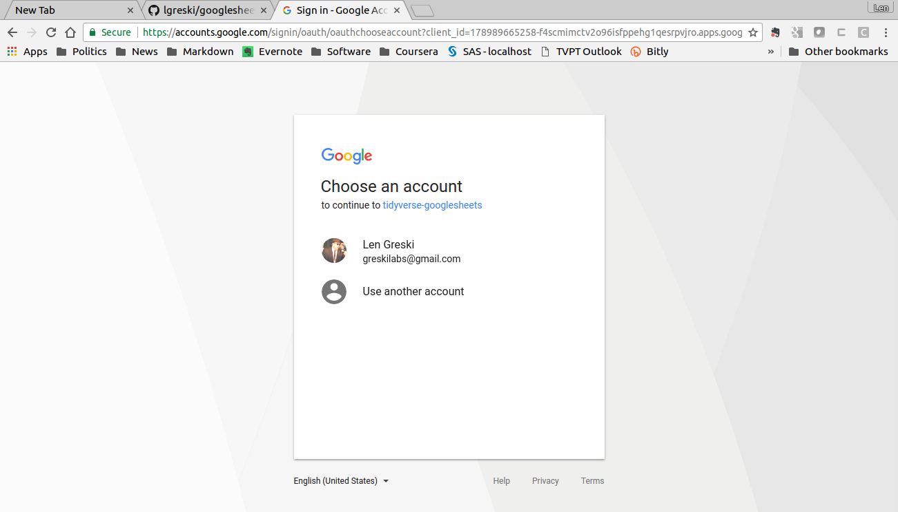

After logging in, Google will ask you to give permission to the Google Sheets application to access Google Drive. Press the `<Allow>` button to continue.

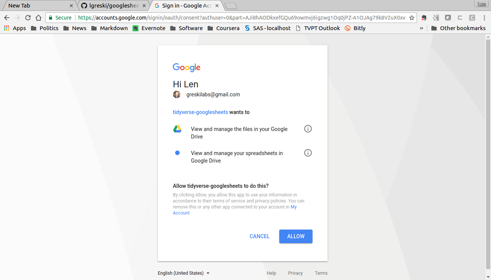

Next, Google will display an authorization token (my token has been blurred out for this walkthrough).  Highlight the entire token and copy it into the clipboard. Then, return to RStudio.

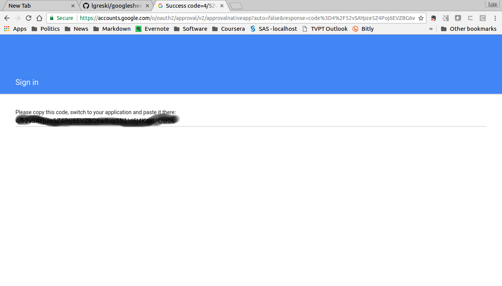

Now, paste the authorization code into the R Console and press `<Enter>` for R to continue processing.

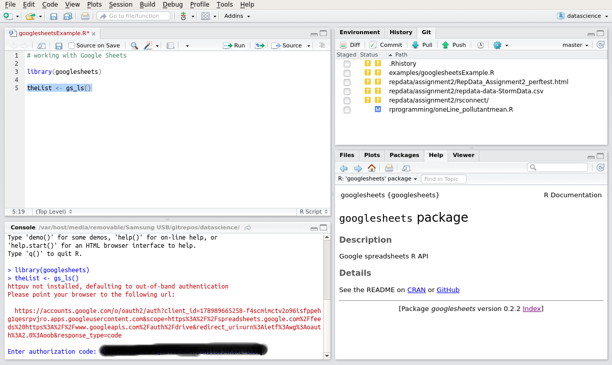

Next, we'll print the object created by `gs_ls()` to show the spreadsheets that are on Google Drive for the account we just authorized.

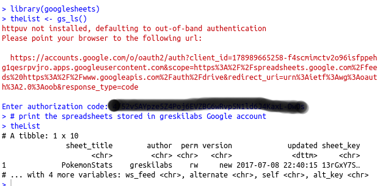

To work with a Google spreadsheet in R, one must "register" the sheet with the `googleapps` package. One way to do this is via the spreadsheet's url, using the `gs_url()` function as illustrated below. We save the result to an object called `pokemonGS`. We use this object as the argument to the `gs_read()` function to load the data from Google into R.

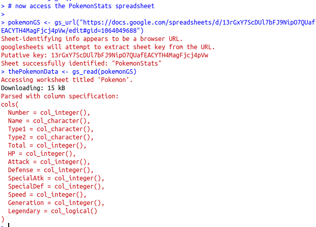

Finally, to print the first few rows of the data, we use the `head()` function.

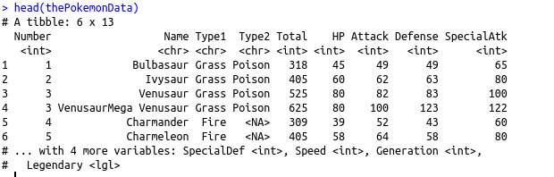

At this point we can conduct a variety of data analyses on the Pokémon data.

# Conclusion

At this point we have configured an operating system suitable for professional software development with leading tools for data science, including statistics, integration with Google Spreadsheets, and professional grade source code version control. We have also demonstrated that a Chromebook configured in this manner can tackle very sophisticated data science problems.

Finally, this solution is very cost effective. All of the software used in this article is available for free over the internet, and a 128Gb low profile memory stick costs about $40 USD. Therefore, for less than $50 USD beyond the price of a Chromebook or less than $200 including the cost of a Chromebook, one can do serious "data science."

# Appendix

## Chromebook Hardware Specifications

We installed R and RStudio on an early model Chromebook that has what would be considered in 2017 the "minimal" level of compute power available on a Chromebook. As of 2017 one can purchase Chromebooks that have significantly more capacity than the HP 14-q010nr, if we can make the install work on this machine, we can be confident that it will work on any Chromebook, even those in use in middle and high schools in the U.S.

<table>
    <tr>
        <th>Computer</th>
        <th>Configuration</th>
    </tr>
    <tr>
        <td valign=top>HP Chromebook 14-q010nr</td>
        <td>
            <ul>
                <li>Operating system: Chrome OS</li>
                <li>Processor: 1.4GHz Intel Celeron 2955U Processor, two cores </li>
                <li>Memory: 2 gigabytes 1600Mhz DDR3L SDRAM</li>
                <li>Disk: 16 gigabytes, solid state drive</li>
                <li>Date built: November 2013</li>
            </ul>
        </td>
     </tr>
</table>

## RStudio: R Markdown Test

To run a more complex test of the RStudio implementation, we'll create an R Markdown document by selecting it from the menu bar. Since I've already updated all the required packages for R Markdown and knitr, I did not receive messages asking me to update these packages, but "your mileage may vary."

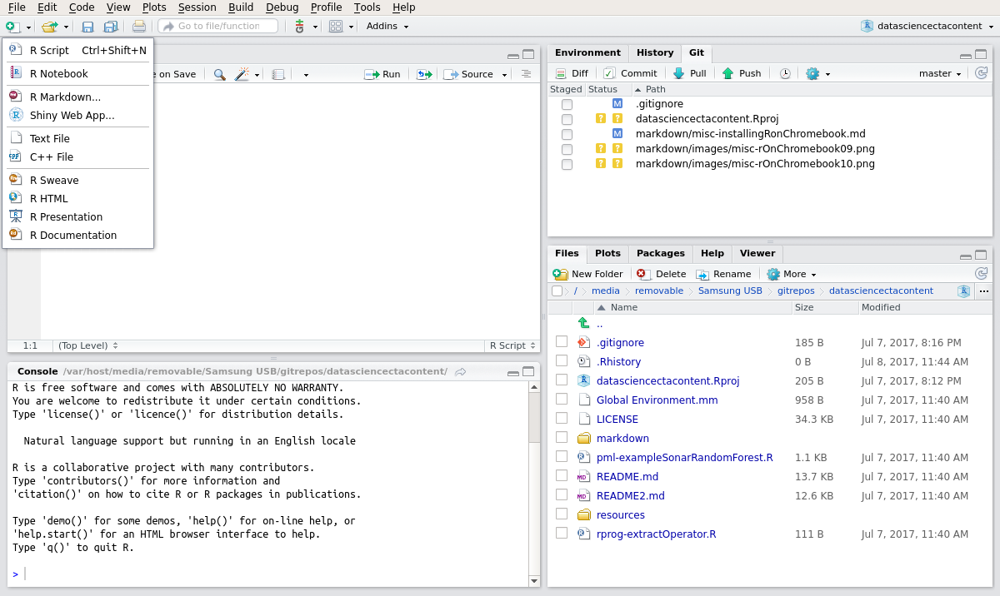

At this point, RStudio may ask to update R packages related to R Markdown. If prompted to do so, enter `<Yes>` or `<Update>` as requested.

Next, we'll enter `Sample` as the title and `Sample` as the author. Leave HTML selected as the output format, and press the `<OK>` button.

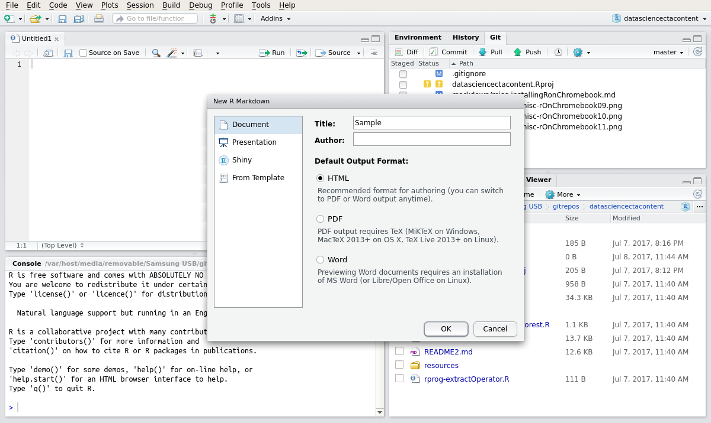

RStudio automatically generates a simple markdown document based on the Motor Trend cars dataset that is part of the R `datasets` package. The markdown document generates a scatterplot of data from the `mtcars` dataset.

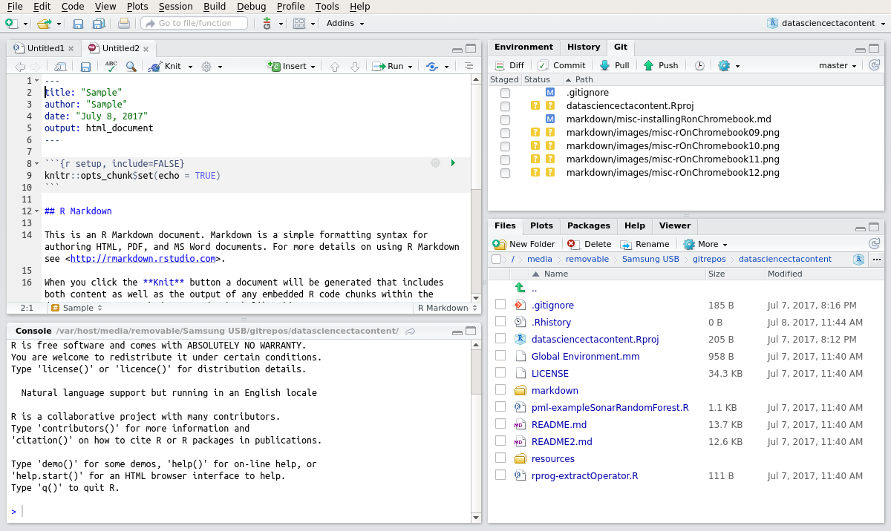

To execute the program, press the `<knit>` icon at the top of the code editor pane in the upper left quadrant of RStudio. From the  popup menu that displays, select `<Knit to HTML>` to start the process of generating the graph.

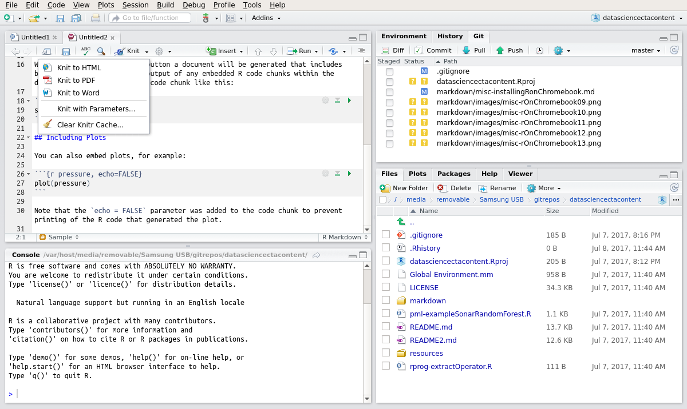

At this point RStudio may ask to install a number of packages that are required to knit the document. Press the `Yes` button to update these packages. Once the packages are updated, RStudio will knit the document.  

Enter `sample` as the name of the file when RStudio presents a file window, and then RStudio will generate an HTML document as listed below.

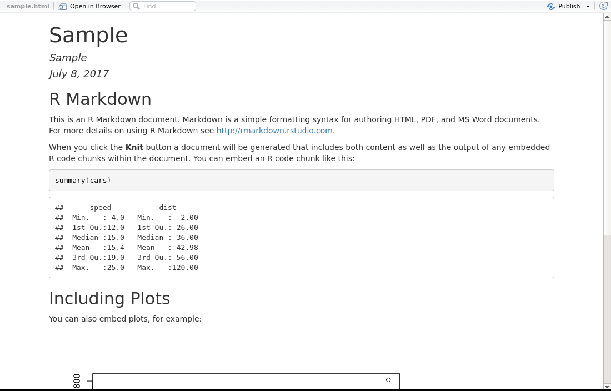

If you scroll down, you can see the scatterplot generated by RStudio.

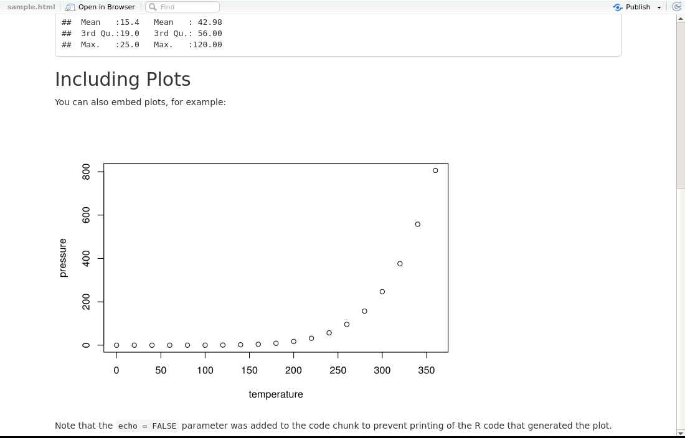

We've now demonstrated that our installation of RStudio will produce graphics.

## References

[Installing Linux on Chromebook](https://lifehacker.com/how-to-install-linux-on-a-chromebook-and-unlock-its-ful-509039343)

[Installing R on Ubuntu Linux 16.04](https://www.r-bloggers.com/how-to-install-r-on-linux-ubuntu-16-04-xenial-xerus/)

[crouton Wiki](https://github.com/dnschneid/crouton/wiki)

*Last update: 24 February 2019*
