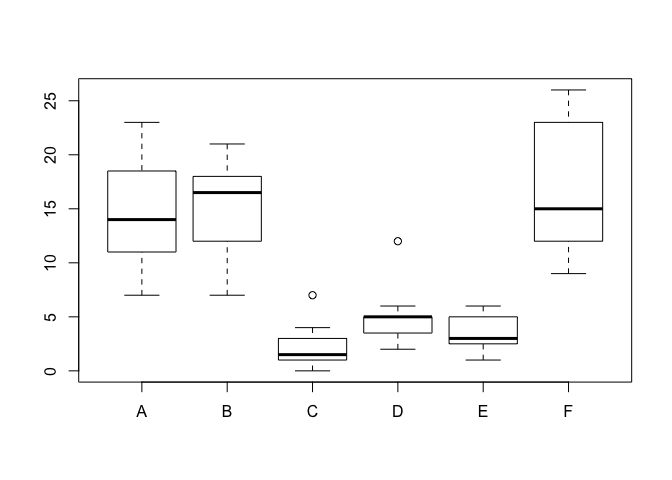
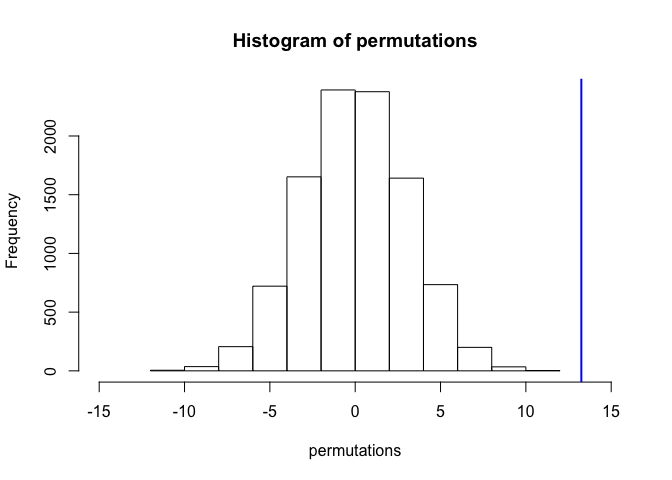

# Permutation Test Example
Len Greski  
April 30, 2016  


Illustrate the permutation test example in Statistical Inference taken from Resampling lecture. The point of this example is to demonstrate that the differences of means between groups B and C from the 10,000 samples is  


```r
data(InsectSprays)
boxplot(count ~ spray,data = InsectSprays)
```



```r
# create a subset of data where the spray is either B or C
subdata <- InsectSprays[InsectSprays$spray %in% c("B", "C"), ] 

# set y equal to the count column in subdata
y <- subdata$count

# convert spray from a factor to a character vector
group <- as.character(subdata$spray)

# create a function called testStat() which is defined as the difference
# of means between group B and C. Note that the g == "B"
# syntax generates a logical vector of TRUE / FALSE, which is used to
# then subset the w vector passed to the function
testStat <- function(w, g) mean(w[g == "B"]) - mean(w[g == "C"])

# next, calculate the difference of means across the entirety of the
# two groups, and save the result to observedStat
observedStat <- testStat(y, group)

# now, calculate permutations by taking 10,000 permutation samples 
# from y and group, calculating testStat() on each sample
permutations <- sapply(1:10000, function(i) testStat(y, sample(group))) 

# print the value of observedStat, which was calculated on all of the data
observedStat
```

```
## [1] 13.25
```

```r
# now calculate the average of number of permutations that were larger
# than observedStat, which we would expect to be zero because the permutation
# distribution we created should have a mean of zero, and the actual test statistic
# is 13.25
mean(permutations > observedStat)
```

```
## [1] 0
```

```r
# draw histogram of permutations, illustrating that they are approximately
# normally distributed with a mean of zero and compare to the actual test 
# statistic, which shows that the probability of achieving a test statistic of
# 13.25 from the permutation distribution is very low
hist(permutations,breaks=15,xlim=c(-15,15))
abline(v=observedStat,col = "blue", lwd=2)
```



*end of example*

