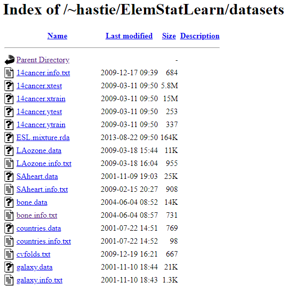
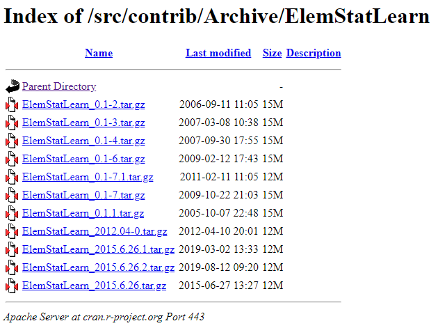

## What happened to the ElemStatLearn package and how does one access data from this package?

In early 2020 students in the Johns Hopkins *Practical Machine Learning* course on Coursera began to experience problems during quiz 3 and quiz 4 due to the fact that the `ElemStatLearn` package had been [archived by CRAN](https://CRAN.R-project.org/package=ElemStatLearn), the Comprehensive R Archive Network.

Quiz 3 requires data sets from *Elements of Statistical Learning* for two questions:

* Question four uses South African Heart Disease data, and
* Question five uses Deterding's Vowel Recognition data.

Quiz 4 uses Deterding's Vowel Recognition data.

## How do I obtain the data I need for the quizzes?

As usual, there are multiple ways to do something in R. To obtain the data needed for the *Practical Machine Learning* Quizzes, one can choose from the following alternatives.

1. Access the data from the [Elements of Statistical Learning](https://stanford.io/3gC7nKI) book website
2. Access the data from the [CRAN Github repository](https://bit.ly/2XfhFIL) of the `ElemStatLearn` package
3. Download and install the latest version of the package from the CRAN Archive

### Access data from the ESL website

All of the data sets supporting the book can be accessed from the `datasets` subdirectory on the web server where the course website is stored. The URL for this subdirectory is https://web.stanford.edu/~hastie/ElemStatLearn/datasets/. By navigating to this directory in a web browser we can view the names of the files in the directory. The following figure illustrates the first screen of data files.

We can access the file directly in an R session with `readr::read_csv()`. For example, to load the Deterding Vowel Recognition data, we use the following R code.

    library(readr)
    vowel.train <- read_csv("https://web.stanford.edu/~hastie/ElemStatLearn/datasets/vowel.train")
    vowel.test <- read_csv("https://web.stanford.edu/~hastie/ElemStatLearn/datasets/vowel.test")

Any other data set from the ESL website can be loaded into R once you know the name(s) of the files one must download.

### Access the data from the CRAN GitHub repository

Since CRAN maintains a mirror of all R packages on GitHub, we can also access data from the raw.githubusercontent.com domain. For this example, we'll download and access the South African Heart Disease data frame. Data in the `ElemStatLearn` package is stored in the data subdirectory of the master branch, as an R workspace, noted by the file extension `.RData`.

    theURL <- "https://raw.githubusercontent.com/CRAN/ElemStatLearn/master/data/SAheart.RData"

    download.file(theURL,"./data/SAheart.RData",mode = "wb") # use mode = "wb" to download as binary
    load("./data/SAheart.RData")
    head(SAheart)

This sequence of R functions produces the following output.

    > head(SAheart)
      sbp tobacco  ldl adiposity famhist typea obesity alcohol age chd
    1 160   12.00 5.73     23.11 Present    49   25.30   97.20  52   1
    2 144    0.01 4.41     28.61  Absent    55   28.87    2.06  63   1
    3 118    0.08 3.48     32.28 Present    52   29.14    3.81  46   0
    4 170    7.50 6.41     38.03 Present    51   31.99   24.26  58   1
    5 134   13.60 3.50     27.78 Present    60   25.99   57.34  49   1
    6 132    6.20 6.47     36.21 Present    62   30.77   14.14  45   0
    >  

### Accessing the archived version of the ElemStatLearn package

The last way to access the data needed for the quizzes is to download and install the last version of the `ElemStatLearn` package that was posted to CRAN, along with its dependencies. First, we navigate via web browser to the directory where the archive for `ElemStatLearn` [is stored](https://bit.ly/3dmvACA).

From the file listing, we see that `ElemStatLearn_2015.6.26.tar.gz` is the most recent version of the package that is saved in the CRAN archive. We use R to download the most recent version of the package and unzip it.  

    url <- "http://cran.r-project.org/src/contrib/Archive/ElemStatLearn/ElemStatLearn_2015.6.26.tar.gz"
    pkgFile <- "ElemStatLearn_2015.6.26.tar.gz"
    download.file(url = url, destfile = pkgFile)

Before installing the `ElemStatLearn` package it is important to install any package dependencies. Since `ElemStatLearn` has no dependencies, we can skip this step, and proceed directly to installing `ElemStatLearn`. We use the `type = "source"` and `repos = NULL` arguments to read the file as source, and not to reference a remote repository. To verify the installation, we load the package into memory and access the `bone` data set.

     install.packages(pkgs = pkgFile, type = "source", repos = NULL)
     library(ElemStatLearn)
     head(bone)

...and the output:

    > head(bone)
      idnum   age gender      spnbmd
    1     1 11.70   male 0.018080670
    2     1 12.70   male 0.060109290
    3     1 13.75   male 0.005857545
    4     2 13.25   male 0.010263930
    5     2 14.30   male 0.210526300
    6     2 15.30   male 0.040843210
    >

**Reference:** [How do I download a package that has been archived from CRAN?](https://bit.ly/2ZQQ42r)

## Appendix: downloading all data files from ESL website

Using techniques taught in the Johns Hopkins *Getting and Cleaning Data* course, we can parse the HTML page to obtain a list of all the data files associated with the *Elements of Statistical Learning* book, and download them to a local machine.

We will use the `rvest` package to process the HTML page, convert the table of files to a data frame, and download the files to subdirectory on our local machine.

    theURL <- "https://web.stanford.edu/~hastie/ElemStatLearn/datasets/"
    library(rvest)
    theFiles <- read_html(theURL)

At this point we can print the `theFiles` object to inspect its HTML tags. We see two of them, a `<head>` tag and a `<body>` tag.

    > theFiles
    {html_document}
    <html>
    [1] <head>\n<meta http-equiv="Content-Type" content="text/html; charset=UTF-8"> ...
    [2] <body>\n<h1>Index of /~hastie/ElemStatLearn/datasets</h1>\n  <table>\n<tr>\ ...
    >

Next, we'll process the `<body>` node. Within this node there is an HTML table, so we'll use `html_table()` to convert the table into a data frame. Since the column names for the data frame contain spaces, we'll convert the spaces to periods via `gsub()`.

html_node(theFiles,"body") %>% html_node("table") %>% html_table() -> eslFiles
names(eslFiles) <- gsub(" ",".",names(eslFiles))

It's always good to visually inspect the data to confirm that it has been read correctly. As we view the file in the RStudio data viewer, `View(eslFiles)`, we notice three things that need to be addressed in order to automate the downloads.

1.  The first two rows of the data frame represent the parent directory structure, so the `Last.modified` column is blank.
2.  There are two subdirectories in this directory, represented by file names that end in `/`.
3.  The last row of the data frame is blank.

We can clean items 1 and 3 by filtering rows where `Last.modified` is blank. We can resolve the second item by extracting the rows containing subdirectories and processing them with the same technique we used for the main directory.   

    eslFiles <- eslFiles[eslFiles$Last.modified != "",]

    subdirectories <- eslFiles$Name[grepl("/",eslFiles$Name)]
    # remove subdirectories & download main data directory
    eslFiles <- eslFiles[!grepl("/",eslFiles$Name),]

Next, we create a subdirectory to store the downloaded data files, and use the `Name` column in the `eslFiles` data frame with `lapply()` to download the files and save them in the subdirectory we just created.  

    # create directory if it does not exist
    if(!dir.exists("./ElemStatLearn")) dir.create("./ElemStatLearn")
    returnValues <- unlist(lapply(eslFiles$Name[3:length(eslFiles$Name)],function(x){
         download.file(paste0("https://web.stanford.edu/~hastie/ElemStatLearn/datasets/",x),paste0("./ElemStatLearn/",x))
    }))

Finally, for each subdirectory that we extracted above we create subdirectories, parse the HTML for the associated web page, and then download all of the data files.

    # download data from subdirectories
    returnValues <- lapply(subdirectories,function(x){
         aURL <- paste0(theURL,x)
         message(aURL)
         if(!dir.exists(paste0("./ElemStatLearn/",x))) dir.create(paste0("./ElemStatLearn/",x))
         theFiles <- html(aURL)
         html_node(theFiles,"body") %>% html_node("table") %>% html_table() -> eslFiles
         names(eslFiles) <- gsub(" ",".",names(eslFiles))
         eslFiles <- eslFiles[eslFiles$Last.modified != "",]
         unlist(lapply(eslFiles$Name,function(y,z){
              download.file(paste0("https://web.stanford.edu/~hastie/ElemStatLearn/datasets/",z,y),paste0("./ElemStatLearn/",z,y))
         },x))
    })
