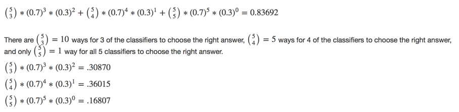

## Explanation of Combining Predictors -- Majority Vote

Within the [Combining Predictors](https://github.com/bcaffo/courses/blob/master/08_PracticalMachineLearning/025combiningPredictors/Combining%20predictors.pdf) lecture, Professor Leek describes a scenario with five independent classifiers to illustrate how a majority vote approach improves the predictive power of a model. That is, if a majority of the classifiers make the same prediction, the probability that it is the correct one quickly becomes very high (e.g. exceeds 0.8).

The calculation is based on the binomial theorem. If we have 5 independent classifiers and we need to calculate the probability that a majority will make the correct prediction, and the probability of any single predictor being correct is 0.7, we calculate the probability that a majority are correct as follows:

...and yes, there is a typo on the slide at 5 chooses 4.
