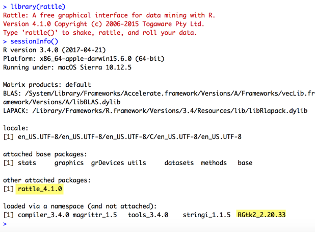
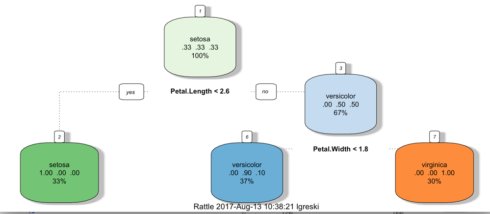

## Installing Rtgk2 and Rattle on Macbook OSX

The `rattle` package is referenced during the *Practical Machine Learning* course in the Johns Hopkins Data Science Specialization as a mechanism to print nice looking tree diagrams from the model output generated by the `rpart` package. Unfortunately, the package has a dependency on the `gtk2` library that is not present by default on Mac OSX.

Therefore, students using OSX frequently post questions about how to install the components necessary to use the Rattle `fancyRpartPlot()` function.

After a fair amount of effort I was able to install rattle on Mac OS X Sierra.

The install requires the gtk toolkit, and on Mac one must do the following, per a solution on [stackoverflow.com](https://stackoverflow.com/questions/15868860/r-3-0-and-gtk-rgtk2-error).  

1. [Install macports](https://www.macports.org/install.php) — tool for installing mac packages   
2. run SUDO to install gtk2 on mac  `sudo port install gtk2  ## (X11 -- not aqua)`  
3. export new path  `export PATH=/opt/local/bin:/opt/local/sbin:$PATH`  
4. From command line R, enter install rgtk2 with  `install.packages("RGtk2",type="source")` to compile from source  

**NOTE:** For the `RGtk2` install to work correctly from RStudio, one must first confirm that the `PATH` change listed above is applied to the shell that is used to start RStudio. 

The most complete set of instructions is located at [Sebastian Kopf's Gist page](https://gist.github.com/sebkopf/9405675) and verified by my own install on June 17, 2017. Once installed, loading the rattle library will generate the following output in the R console.

In order to use `fancyRpartPlot()`, students will also need to install the `rpart.plot` package.

      install.packages("rpart.plot")

## Example: Fancy Rpart Plot of Iris Data

Here we've replicated the code needed to generate a fancy tree diagram with `caret` and `rattle` that is discussed in the *Practical Machine Learning* lecture on *Predicting with Trees*.

      library(caret)
      library(rattle)
      inTrain <- createDataPartition(y = iris$Species,
                                     p = 0.7,
                                     list = FALSE)
      training <- iris[inTrain,]
      testing <- iris[-inTrain,]
      modFit <- train(Species ~ .,method = "rpart",data = training)
      fancyRpartPlot(modFit$finalModel)

*Last updated: 27 January 2018* 
