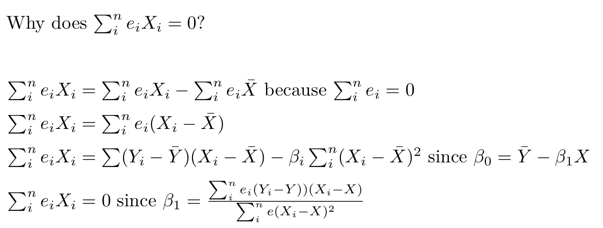

# Why does the sum of errors times X equal 0?

Additional background on the derivation may be found at [Least Squares Properties](http://bit.ly/2n2tlte) on the [Thinking with Data](http://bit.ly/2ogVpKo) website. 
