# Configuring knitr to Retain Markdown Output

Often students who are using knitr for the first time wrestle with its configuration options, especially those that control the output of markdown (.md) files and associated graphics.  This article provides a walkthrough that demonstrates how to retain these files when knitr creates an HTML document.

This process requires three major activities, including:

1. Configure knitr output options
2. Generate the document
3. Push all required files to Github

# 1. Configure Knitr Output


From the RStudio code editor, select the options icon and click the `Output Options...` menu selection.

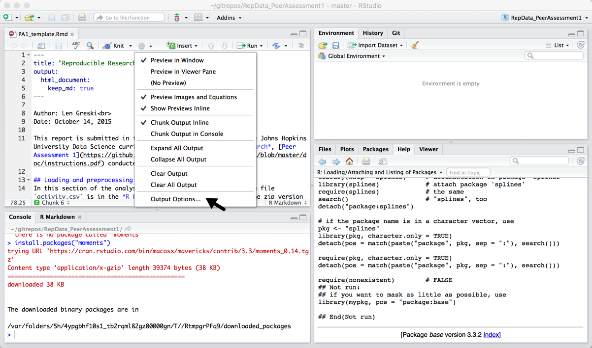


Next, in the Edit R Markdown Document Options dialog, click the `Advanced` button.

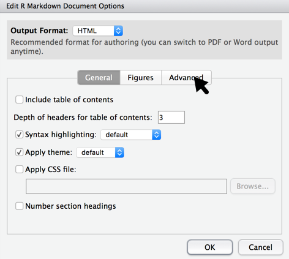


From the Advanced options dialog, check the box labeled `Keep markdown source file`. Note, that not only does this configure knitr to keep the markdown document, but it also saves any graphics that are generated by knitr.


# 2. Generate the HTML Document

Having configured knitr to retain the .md file and associated content, press the `<knit>` button to generate an HTML version of the document.

Once `knitr` completes, minimize the resulting HTML document window and take a look at the files pane in RStudio. There you'll see the files that were generated by knitr, including a folder where the graphics will be stored. For the purpose of this article, I created the default R Markdown document and named it `testAnalysis`.

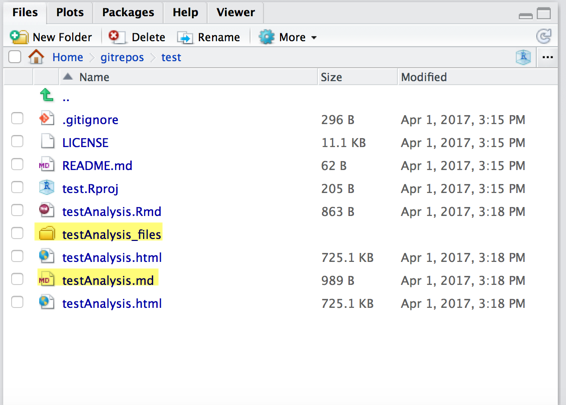

# 3. Upload Files to Github

The next few steps require that you've already configured RStudio to work with Git and Gitub, as I describe in my articles [Configuring RStudio with Git / Github: Windows Version](http://bit.ly/2bPxOL5) and [Configuring RStudio with Git / Github: Mac OSX Version](http://bit.ly/2c9Q2bf).

It also requires that you've set up the current project as a Git project within RStudio.

Select the Git tab within the `Environments` pane in the upper right quadrant of RStudio, and it will display a list of files that have yet to be added to the repository.

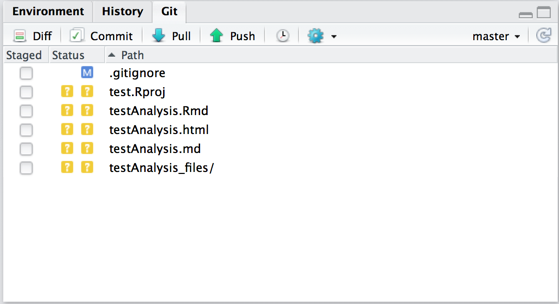

Click on the `Staged` checkboxes for all the files except the `.Rproj` file, because we want these to be added to the local repository and pushed to Github.

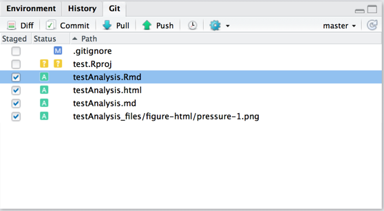

Next, press the `commit` button to display the `Review Changes` dialog window. Add a comment for your commit, and then press the `commit` button to commit the changes to the local git repository.

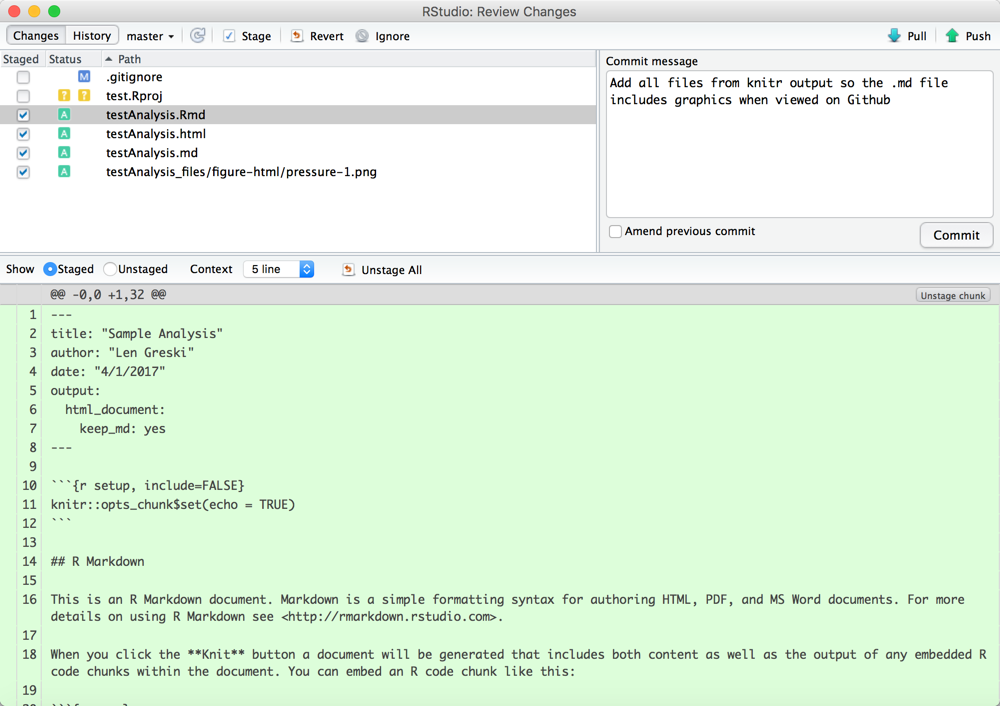

RStudio will display another dialog box to confirm that the files have been committed to the local repository. Press the `close` button to continue.

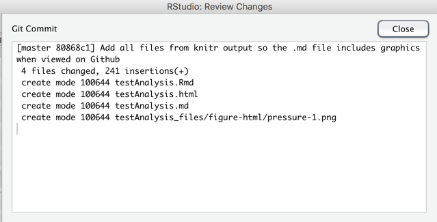

To push the committed files to Github from the local repository, press the `Push` button in the `Review Changes` dialog window.

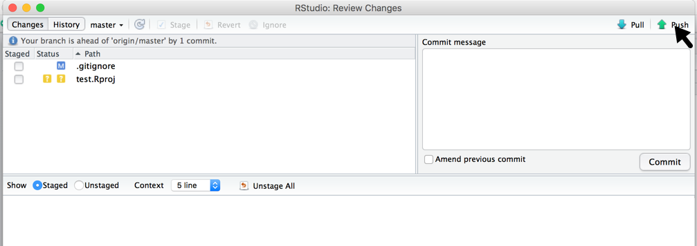

Once Git pushes the files to Github, you'll receive another dialog box confirming the push has completed. Press the `close` button to continue.

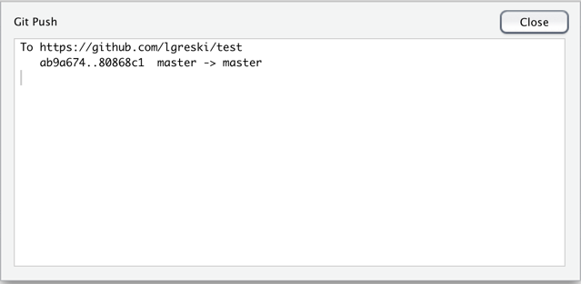

At this point, all the files have been transferred to Github and you can close the `Review Changes` dialog window to return to the RStudio main window.

# Validating the Results

Use a web browser to navigate to the repository where you pushed the knitr ouptut. For this article, we're using [lgreski/test](http://bit.ly/2onO2ou).

From the repository file list, select the .md file we generated with knitr. In this case, it's called `testAnalysis.md`.

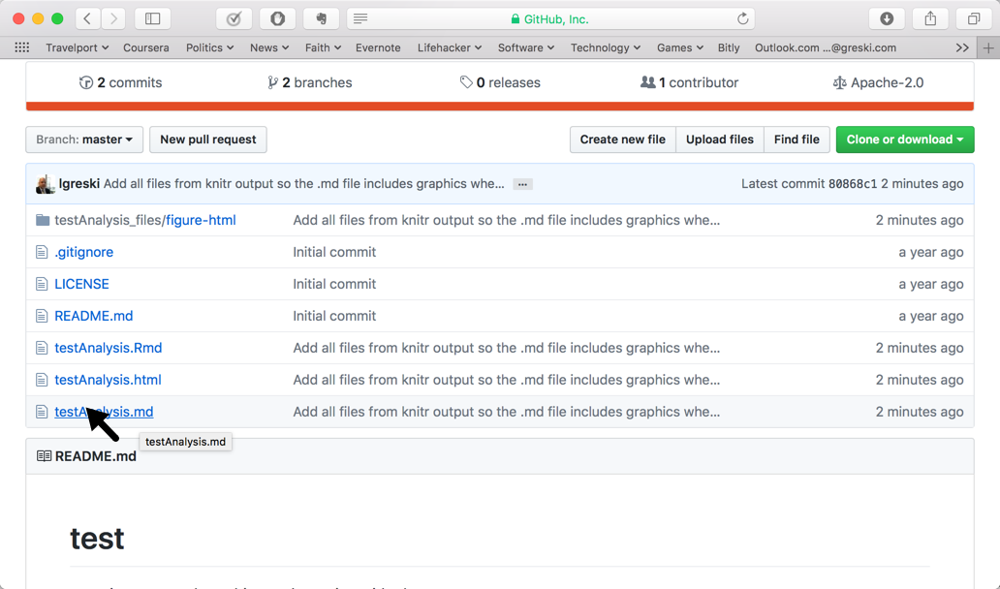

This will bring up a browser window that displays the markdown file. As you can see from the screen capture, the entire analysis is visible, including the x / y plot.

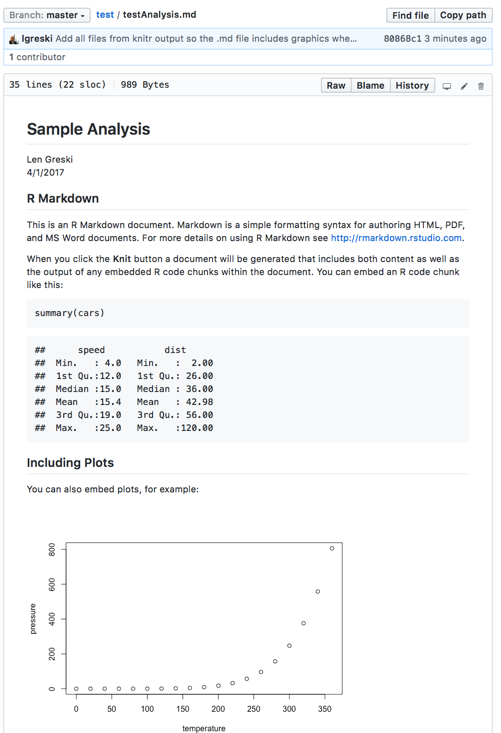

Finally, we can also see that the supporting graphics files have been uploaded to github, and stored in a subdirectory where they can be accessed by the markdown file when viewed on Github via a web browser.

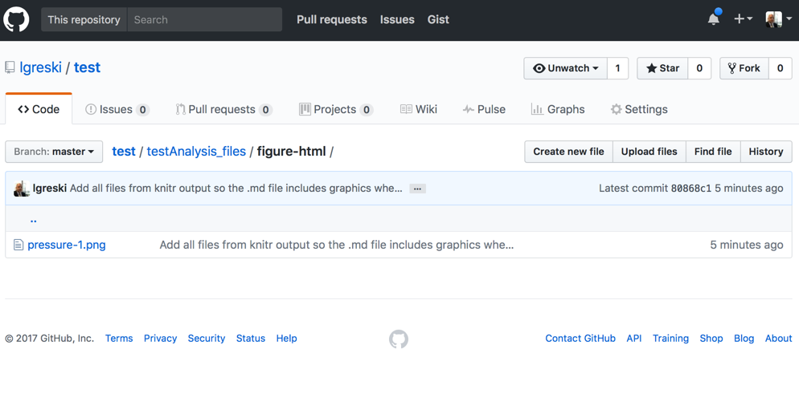

# Appendix: Beware of R Markdown Chunk Names

In R markdown language one can explicitly name an R code chunk. For example:

    ```{r analyze_human_harm}
    library(qcc)
    par(mar=c(3,1,1,1))
    par(las=2)
    pareto.chart(harm,
                 ylab="Total Injuries & Deaths",
                 main="Injuries and Deaths - All Event Types, 1996 - 2011",
                 ylab2 = "Cum. Percentage",
                 cex.names=0.5)
    ```    

If the name of an R code chunk has spaces in it, the file names for any graphics files generated by the code chunk will also contain spaces, and therefore be inaccessible from a markdown file on Github. Therefore, one should use underscores `_` or `camelCase` instead of spaces when naming R code chunks. 
