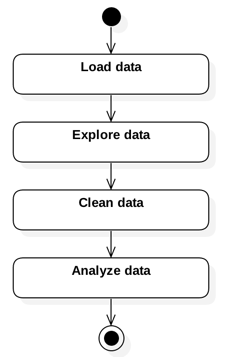

# StormData Analysis: A Comprehensive Guide

The course project for *Reproducible Research* is an assignment that tests the limits of the skills students develop during the first five courses in the Johns Hopkins University Data Science Specialization on Coursera.

This is the first course project in the Data Science Specialization that requires students to incorporate what they've learned in data cleaning, R programming, and exploratory data analysis into a research product: an analysis of the 2011 National Oceanographic and Atmospheric Administration (NOAA) *StormData* database.

There are four major categories of problems with the NOAA data that give students fits as they work to complete the assignment. In descending order of severity, they are:

1. Changing data and collection methods over time,   
2. Poor quality of data, including what Hadley Wickham would describe as ["untidy" data](http://bit.ly/2nyw5Ci),   
3. Low quality, disorganized documentation, and   
4. Large data size.

A number of articles to help students complete the assignment have been posted by Community Mentors on the *Reproducible Research* Discussion Forums. These articles usually provide tactical support to the students, helping them solve specific areas of ambiguity with the assignment, such as what the numbers, + and - signs, and letters H, K, M, and B mean in the `PROPDMGEXP` and `CROPDMGEXP` variables.

In *StormData Analysis: A Comprehensive Guide*, we will provide a "big picture" review of the four problems articulated above so students can spend more of their time working with the data, and less of their time running into the same roadblocks that have faced past students.

# The Assignment: It Looks So Simple...

The course project assignment instructions make the task seem simple, asking students to answer two basic questions about the storm data.

> Your data analysis must address the following questions:
>
> 1. Across the United States, which types of events (as indicated in the EVTYPE variable) are most harmful with respect to population health?  
>
> 2. Across the United States, which types of events have the greatest economic consequences?

For students who have completed *Exploratory Data Analysis*, they are well equipped to conduct a basic descriptive analysis of the data.

Also, for students who have completed *Getting and Cleaning Data* as well, the students have an understanding of a basic process to conduct a descriptive analysis, including how to clean and transform the data to prepare it for analysis.

<table>
<col width="275">
<col width="500">
<tr><td>
</td><td>1. Download and extract data from the compressed file included in the assignment instructions, and load it into an R data frame.  
2. Run basic R functions against the data to understand its features, and determine the types of cleaning and data transformations needed to restructure data in order to answer the research questions.  
3. Write R code to clean and transform the data.  
4. Analyze the data: answer the questions required for the assignment, and support the analysis with relevant graphics and statistics.  </td></tr>
</table>

The course project instructions include references to the [data file](http://bit.ly/2eXThs5), a [codebook](http://bit.ly/2fcseGm) provided by the NOAA, as well as the URL for the [frequently asked questions web page](http://bit.ly/2xXKlrf) from the NOAA.

Step 1, downloading and extracting data from the compressed file, is a straightforward process that students figure out by the time they complete *Getting and Cleaning Data*. One wrinkle in the download process is that the data file for this project uses the `bzip2` format instead of `zip`. Fortunately the `R.utils` package provides a `bunzip2()` function that can be used to extract the data.

The project instructions indicate that the data file is a comma separated values file. Therefore, it can be read into R with `read.csv()`. Depending on the speed of one's computer, the data load process can be more or less time consuming. After *Getting and Cleaning Data*, students can expect that 70 - 80% of the effort on this assignment will be related to cleaning the data. Therefore, the first decision to be made by the student is whether to simply load the data and start exploring it, or spend some additional time trying to make sense of the data by reading the NOAA documentation.

* strategies for figuring out what's in the file: stringsAsFactors? read a few lines? Read the codebook?

Loading the data in R is also relatively easy because the raw data file can be read with the `read.csv()`. That said, the large size of the data  Once the data has been loaded into R, the challenges begin.  

# Problem 1: Changing Data & Collection Methods

Most students
*

# Problem 2: Poor Data Quality

* Even the NOAA says the data isn't accurate (see 2012 NOAA presentation)
* Longitude / latitude information requires transformation before use, not documented

# Problem 3: Low Quality Documentation

Items to cover in this section include:

* NWS Directive is both too detailed and not detailed enough
* No useful index of how different pieces of documentation relate to each other
* Web documentation still looks like 1995-era website
* Low signal to noise ratio in the documentation
* Lots of unexplained jargon
* Critical documentation is buried on FTP servers, requiring a lot of effort to discover it
* NWS Directive does not explain how data collection varies over time
* Need the Operations manual to fully understand the data, and it's not easily accessible

# Problem 4: Large Data Size

# Solutions for Students: Defensible Responses to the Problems

Discuss the key to the assignment: any analysis decision that has a "defensible" answer will meet the grading criteria. Example: coding to Avatar the Last Airbender event types. According to the grading criteria, this is a valid way to analyze the data, and should receive full credit from graders.

## Overall Plan of Attack

Discuss how there needs to be a big picture to keep focused, avoid getting distracted on side issues (such as figuring out lat / long calculations). Focus on minimum required to get a "complete" assignment: one that fulfills the requirements of the [grading rubric](http://bit.ly/2c6XFhQ), and then expanding on it iteratively as time and curiousity permit.

## 1. Solutions for Changing Data & Data Collection Strategies

## 2. Solutions for Poor Data Quality

## 3. Solutions for Low Quality documentation

## 4. Solutions for Large Data Size

# Additional Considerations

## Passing the Peer review

Key theme here, quoting [David Hood's](http://bit.ly/2jrYY1x) advice in his commentary on the *Getting and Cleaning Data* final assignment, "Make it easy on your graders."

* use a checklist of requirements
* match your assignment to the checklist
* use headings that match the checklist to make the answers obvious to graders
* Provide a meaningful text narrative / don't just submit the code and expect graders to figure it out

## Fulfilling the Coursera Honor Code Requirements  

* comments here about balancing the use of outside sources and "doing your own work"
*

# Conclusions

# Appendix

## references

[Handling of Exponents in PROPDMGEXP and CROPDMGEXP](http://bit.ly/2nOFOVb) Exploratory analysis of the exponents data in the NOAA storm data. 

## Information Available from the National Oceanographic and Atmospheric Administration

[National Weather Services Directive 10-1605](http://bit.ly/2oNS1Hb). This version of the document matches the one provided in the course assignment instructions as of 20 April 2017.

[National Weather Service Operations Manual Chapter F-42](http://bit.ly/2nKdZLI) Contains the 1994 version of the *User's Guide for the Storm Data Database*, which provides important details on how data is entered into the database.

[National Weather Service Operations Manual Archives](http://bit.ly/2pYfUzB) Contains the list of climate-related operating procedures, including the *StormData* documentation.

[NOAA StormData FAQ](http://bit.ly/2xokLOX)

[NOAA Storm Data Details Documentation](http://bit.ly/2xoJraj)

[NOAA StormData Detailed CSV Files](ftp://ftp.ncdc.noaa.gov/pub/data/swdi/stormevents/csvfiles/)

[NOAA StormData Files and Documentation](http://bit.ly/2xoDCJF) includes access to all StormData content as downloadable files including the data, documentation, photographs, and presentations describing the content.

##
