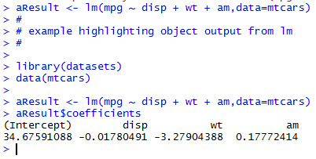
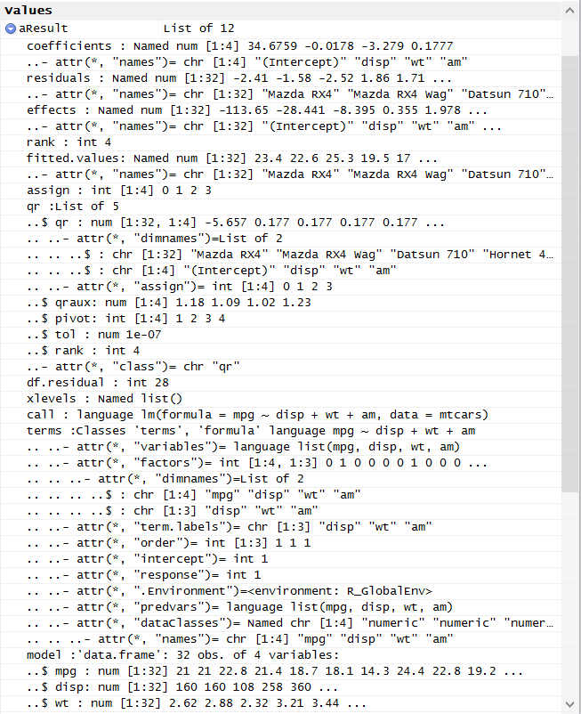

# Object Oriented Programming and R

In September 2016 a student asked the following questions on the *R Programming* discussion forum:

<blockquote>I have a question about the extend to which R packages (should) follow the OOP design principles. This stood out to me when experimenting with the lm() function but applies to almost every package that is widely used.

Here is a way (or the only way?) to access the coefficients of a regression model in R:</blockquote>

    fit <- lm(y ~ x, data = myDF);

    coef(fit)

<blockquote>Coming from an OOP background this rings a lot of bells, for example what stops the user from typing "coef(2)" or coef("abc")? Making coef() a function rather than a method of the "fit" object not only pollutes the global namespace but also makes code error prone. The same holds true for many other functions that in my opinion should have been class methods.

What is the reason behind this design?</blockquote>

R is built on the S language, so it contains the key features of S. In a [2014 use!R presentation](http://bit.ly/2cJGL8L), John Chambers explained three principles on which S (and R) are based, including:

1. Everything is an object,
2. Everything happens in a function, and
3. Functions are interfaces to algorithms.

In R, there are two underlying object systems: the S3 system and the S4 system. The S3 system is designed around the use of `list()` to create objects. I explain how this relates to Programming Assignment 2 in my articles [makeCacheMatrix() as an Object](http://bit.ly/2byUe4e) and [Demystifying makeVector()](http://bit.ly/2bTXXfq).

Regarding the student's specific question, given \#1 above, there is a way to access the coefficients output from `lm()` without using a function. They can be accessed with the `$` form of the extract operator as follows.

    #
    # example highlighting object output from lm
    #

    library(datasets)
    data(mtcars)

    aResult <- lm(mpg ~ disp + wt + am,data=mtcars)

    # now, access model coefficents from output object, aResult

    aResult$coefficients

In the example above `aResult` is an S3 object, i.e. a `list()`. The output object from `lm()` consists of 12 named list elements, as illustrated from the *RStudio Environment Viewer:*

To understand more of the details behind the design of R including its object oriented features, I highly recommend reading [Software For Data Analysis: Programming with R](http://amzn.to/2cmLFuR), by John Chambers.

Regarding the student's comments about object orientation, I've written code in at least four object oriented languages (Smalltalk, Java, Objective C, and R). Each has its idiosyncracies. That said, given the focus on R functions in the early lectures in *R Programming,* one can understand why R doesn't appear very "object oriented."

In Programming Assignment 2 one can see how the object created by `makeVector()` is an object. It has state (the elements `x` and `m`), behavior (the methods `set()`, `get()`, `getmean()`, and `setmean()`). Encapsulation exists because once an object of type `makeVector()` is created, one can only access `x` or `m` through the methods exposed through the final `list()` call at the end of the `makeVector()` function.

For more details on how `makeVector()` works, one can review my article [Demystifying makeVector()](http://bit.ly/2bTXXfq).
