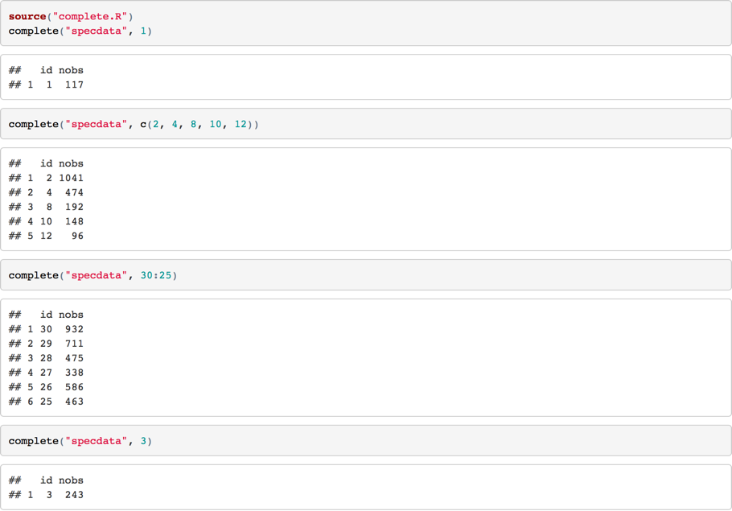

# R Programming Assignment 1 - Demo Output

Students in *R Programming* periodically have difficulties accessing the sample output files that are associated with the first programming assignment. For convenience, I've posted screenshots of the content here.

## Part 1: pollutantmean()

[Example output for the pollutantmean function](https://d18ky98rnyall9.cloudfront.net/_3b0da118473bfa0845efddcbe29cc336_pollutantmean-demo.html?Expires=1497916800&Signature=IQPv7V9hfmSIjZRKJxcp5O6GkCsFPItXubjRHUqc-z-ajQHFh~hd7RQ2~mHVYXxwACzJ1Axg2mL2FPG7jPRSVO4hb2rQNk73QaXyTn9JwzkevVj7wLIYW0g4PJEPBDxs2z93rn97sKjS-P1tHHIFxZglaTXUBEvTsssnETj3h5c_&Key-Pair-Id=APKAJLTNE6QMUY6HBC5A)

## Part 2: complete()

[Example output for the complete function](https://d18ky98rnyall9.cloudfront.net/_3b0da118473bfa0845efddcbe29cc336_complete-demo.html?Expires=1497916800&Signature=jPxH2SBZWrf9Sa-1rVsS3N~FEetPO6WfSZusEFJcyrhyMBSVrNJUBqdtnA9FRfE6fksNyZovjUpnly3MjHx3fYyankOx~vwZD3PyRcbRjNNKE5U3ASZmq9HvBr-6qu~lKmlmzqNLbiuaOlWyU8zkjCwu2gu-zGZDZEfiFjbJ0Sw_&Key-Pair-Id=APKAJLTNE6QMUY6HBC5A)

## Part 3: corr()

[Example output for the corr function](https://d18ky98rnyall9.cloudfront.net/_e92e575b8e62dcb1e3a086d2ff0d5a1e_corr-demo.html?Expires=1497916800&Signature=CRvn6GplUGq2uwaktu9GVproHN8skcrajwQ7CbU8K6Vf1c2ZgZnPm0czoh5JVx5tzI7FL-4bNMHuDIyJJTPqXbyvNQYFau7HMhCY4m76f~CJGcWJumMvQaS~EpKAb4U68GDNHANsSGBKDYDouISNzC22zZKpVooUpSBW6WGUZvk_&Key-Pair-Id=APKAJLTNE6QMUY6HBC5A)

