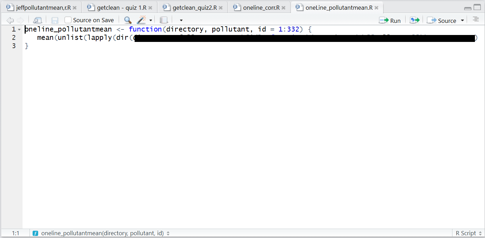
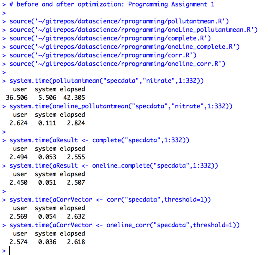
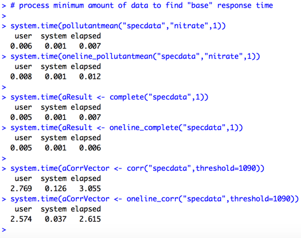

# Programming Assignment 1: a more elegant solution

Students in *R Programming* frequently ask to see other students' work once they have completed their versions of the three functions in the assignment, including `pollutantmean()`, `complete()`, and `corr()`. Often, after completing the assignment students want to see what a "good" or "elegant" solution looks like, which is a reasonable request.

Unfortunately the Community Mentors are not allowed to post solutions to these assignments due to the Coursera Honor Code, which stipulates that students are not allowed to post solutions to assignments or quizzes unless directed to do so by course instructors. In the Johns Hopkins University Data Science Specialization, a number of assignments are public, such as the *R Programming* lexical scoping assignment.

Community Mentors have published a variety of content that is applicable to well-written solutions for the first programming assignment, such as techniques for subsetting objects illustrated in the article [Forms of the Extract Operator](http://bit.ly/2bzLYTL). That said, beginning students in *R Programming* need to see how concepts are tied together into an elegant solution. Therefore, it's helpful to paint a more holistic picture of a well-formed solution to these assignments, without giving the assignment answers away.

**WARNING**

This article discusses approaches that are more advanced than the functions taught during the first two weeks of *R Programming*, and is intended for students who have already completed the programming assignment. It is to provide visibility into what "elegant" looks like. It is *not* a critique of any individual student's work.

Please note that the `pollutantmean()` function outline I discuss in [Breaking Down pollutantmean()](http://bit.ly/2cHyiCl) does not use any of the techniques covered in this article. Finally, for students who have read [Strategy for the Programming Assignments](http://bit.ly/2ddFh9A), the examples provided here represent the "make it fast" part of the programming aphorism I describe in the article.  
**END WARNING**

# What does an "elegant" R program look like?

I suggest that there are at least two key characteristics of an elegant R program, including:

1. Code that implements core R concepts (i.e. functional programming) in a minimum number of programming statements (that is, parsimonious code), and  
2. Code that runs efficiently: requiring a minimum amount of resources, and where execution time increases at a less than linear rate as the size of data processed by the function grows.

## Parsimonious R Code

On the first point, each of the functions required for *Programming Assignment 1* can be completed in a single statement consisting of nested R functions, once one understands how to use the `apply()` family of functions and comprehends the subtleties of the extract operator. For example, without giving the complete solution, my one line version of `pollutantmean()` uses `lapply()` to drive the bulk of the processing, simultaneously subsetting both the list of files to be read as well as the specific pollutant to be extracted from the raw data files, so the result of `unlist()` is a vector of numbers that becomes the input to `mean()`.

As one can see from the leftmost part of the one line of code above, by nesting functions we can use the output from the inner functions as input to the outer functions. If one connects them in the right order, one can build the function with a single nested set of R functions.

Similarly, one can code the `complete()` function as follows:

     complete <- function(directory,id=1:332) {
         data.frame(id=id,nobs= # magic happens here
                   )
     }

In this solution we simply pass the `id` argument to the output data frame, and then use code similar to what is in my one line version of `pollutantmean()` to read the files from a directory, and use the list of files as input to an apply function that reads the files and calculates the number of complete cases.

The one statement version of `corr()` is most challenging of the three functions because a single statement solution requires a slightly sophisticated anonymous function within an `apply()` function. One also has to cast the result as a numeric vector with `as.vector()` to ensure the case of an empty result is returned as an empty numeric vector.

## Code that Runs Efficiently

Execution speed for an R program is easy to calculate. To illustrate the differences between my original versions of these assignments and my optimized ones, my one line version of `pollutantmean()` is much faster than my original that used a `for()` loop and `rbind()`: 42.31 seconds vs. 2.82 seconds.

I used more efficient techniques in the original versions of other two functions for the first programming assignment, but still the one line versions were faster than the originals.

Regarding `complete()`, as I designed the program I realized that I could allocate all the memory required for the output file up front, rather than using `rbind()`. Even though I initially used a `for()` loop for this function, instead of building the output data frame with `rbind()` I directly wrote the `ID` and `nobs` values to the data frame by using vector subscripting. Therefore, the one line version of this function was not significantly faster than the original.

Here are the performance timings run against the minimum amount of data -- one sensor file for `pollutantmean()` and `complete()`, and setting the `threshold` argument high enough that a single correlation is calculated.

As expected, the response time for `pollutantmean()` is much closer to that of `oneline_pollutantmean()`. However, the response for `corr()` is slower with a higher threshold value than it is with a lower threshold. If I needed to run this function in a production process, I would investigate the "counterintuitive" response time performance.

<table>
<th>Function</th><th>Original</th><th>Optimized</th>
<tr>
<td halign="left">pollutantmean(): 1 file</td><td halign="right">0.007</td><td halign="right">.012</td>
</tr>
<tr>
<td halign="left">pollutantmean(): 332 files</td><td halign="right">42.305</td><td halign="right">2.282</td>
</tr>
<tr>
<td halign="left">complete(): 1 file</td><td halign="right">0.007</td><td halign="right">.006</td>
</tr>
<tr>
<td halign="left">complete(): 332 files</td><td halign="right">2.555</td><td halign="right">2.507</td>
</tr>
<tr>
<td halign="left">corr(): 1 file</td><td halign="right">3.055</td><td halign="right">2.615</td>
</tr>
<tr>
<td halign="left">corr(): 332 files</td><td halign="right">2.632/td><td halign="right">2.618</td>
</tr>
</table>

Note that the one line versions of `pollutantmean()`, `complete()` and `corr()` were definitely not my original versions of these programs. My first attempts used `for()` loops because I had background in other programming languages where `for()` loops weren't as inefficient as they are in R, and I was following the advice I give in [Strategy for the Programming Assignments](http://bit.ly/2ddFh9A), where I share the old programming aphorism "make it work, make it right, make it fast".

My original solution of `pollutantmean()` covered "make it work" and "make it right," because it produced the correct results, a weighted mean of non-missing cases for all sensor files that are specified by the `id` argument passed to the function. As I developed more skill with R, I was able to refactor the code into functions that perform well, use R more as it is intended, and with fewer overall programming statements.
