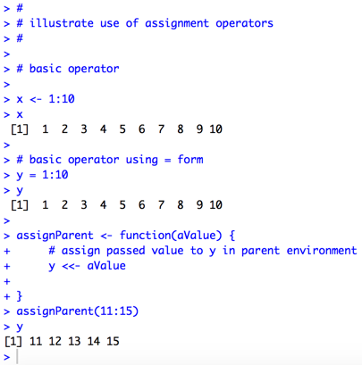
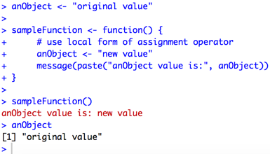

## Forms of the Assignment Operator in R

In the *R Programming* assignment on lexical scoping, students are introduced to the `<<-` syntax for assigning values to R objects. The sample code for this assignment often confuses people, because it is not clear how this syntax works.

`<<-` is one of three forms of the assignment operator. The following syntax from the `makeVector()` function for the lexical scoping assignment in *R Programming* assigns the object m the value of mean:

    #
    # assign value of mean to m in parent scope
    #
    setmean <- function(mean) m <<- mean

The double left arrow `<<` indicates that the assignment should be made to the parent environment, as opposed to the current scope within the `setmean()` function.

To make the scoping more obvious, one could rewrite the code this way.

    setmean <- function(mean) {
        m <<- mean
    }

The other forms of the assignment operator are `<-`and `=`. All of these are documented in the [Assignment Operators R Documentation](https://stat.ethz.ch/R-manual/R-devel/library/base/html/assignOps.html).

For example:

As one can see from the user of the `assignParent()` function, the value assigned to within the function is accessible after the function ends because we used the `<<-` version of the assignment operator.

One subtlety of the assignment operator is that it can be used bidirectionally.

    # leftward form
    x <- 15

is the same as

    # rightward form
    15 -> x

Note that the `=` form of the assignment operator is leftward form only, and that it has other restrictions on its use: `=` is only allowed at the top level (e.g., in the complete expression typed at the command prompt), or within a subexpression within a braced list of expressions.

Therefore, most people who work in R prefer `<-` over `=`.

# Appendix

This section contains questions and answers about topics related to the assignment operator.

**Question:** why must I use `<<-` to assign a value to an object in a parent environment? 

**Answer:** The `<-` form of the assignment operator will create a new object that is local to a function rather than traversing the environment tree to find whether there is an object of the same name in a parent scope. Therefore, one must use `<<-` to assign a value to an object in a parent scope.

We'll illustrate the point with the following code. Notice how `anObject` in the parent environment retains its original value after `sampleFunction()` is executed.

     anObject <- "original value"
     sampleFunction <- function() {
          # use local form of assignment operator
          anObject <- "new value"
          message(paste("anObject value is:", anObject))
     }
     sampleFunction()
     anObject

