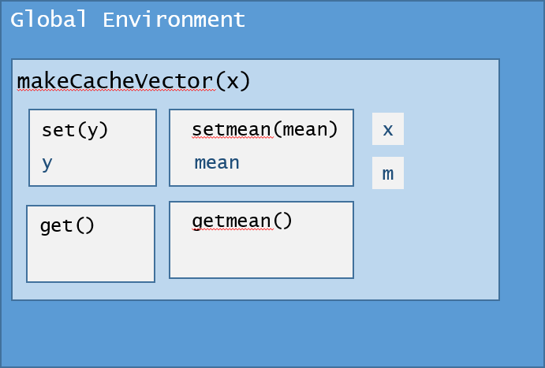
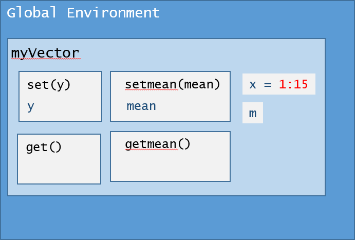

## Demystifying makeVector()

The second programming assignment in the Johns Hopkins University *R Programming* course on Coursera.org makes use of a prototype set of functions that illustrate caching of a mean from a vector. The overall objective of the assignment is to demonstrate the concept of lexical scoping. This assignment often confuses students because it is difficult for them to understand the concepts simply by looking at their implementation in code.

This article explains the code in the cachemean.R file, highlighting key R concepts and features that make the program work as expected. In addition to the concept of scoping, the assignment also introduces use of S3 objects without explicitly explaining how object orientation is implemented in R, causing large amounts of frustration in students when they are unable to get their implementations of `makeVector()` and `cacheSolve()` to work correctly.

## What is lexical scoping?

Scoping is the mechanism within R that determines how R finds symbols \(i.e. programming language elements\) to retrieve their values during the execution of an R script.

R supports two types of scoping: lexical scoping and dynamic scoping. As noted by Hadley Wickham, "Dynamic scoping is primarily used within functions to save typing during interactive analysis," and will not be covered here. Hadley Wickham's [Advanced-R website's section on scoping issues](http://adv-r.had.co.nz/Computing-on-the-language.html#scoping-issues) covers dynamic scoping.

Lexical scoping is used to retrieve values from objects based on the way functions are nested when they were written. Since *Programming Assignment 2* contains nested functions, to fully comprehend the assignment students must be able to visualize how the symbols are stored and accessed within the nested function. A more detailed explanation of lexical scoping is available on the [Advanced-R website's Function page](http://adv-r.had.co.nz/Functions.html), so I'll refer the reader there for the details.

Understanding of scoping is key to *R Programming Assignment 2*, because the fact that the "cache" works is due to how the code is built at design time, not how the code is called at runtime.

## Overall Design of makeVector() and cachemean()

The cachemean.R file contains two functions, `makeVector()` and `cachemean()`. The first function in the file, `makeVector()` creates an R object that stores a vector and its mean. The second function, `cachemean()` requires an argument that is returned by `makeVector()` in order to retrieve the mean from the cached value that is stored in the `makeVector()` object's environment.

## What's going on in makeVector()?

The key concept to understand in `makeVector()` is that it builds a set of functions and returns the functions within a list to the parent environment. That is,

        myVector <- makeVector(1:15)

results in an object, `myVector`, that contains four functions: `set()`, `get()`, `setmean()`, and `getmean()`.  It also includes the two data objects, `x` and `m`.

Due to lexical scoping, `myVector` contains a complete copy of the environment for `makeVector()`, including any objects that are defined within `makeVector()` at design time (i.e., when it was coded). A diagram of the environment makes it clear what is accessible within `myVector`.

Once the function is run, the environment containing myVector looks like:

Notice that the object `x` contains the vector `1:15`, even though `myVector$set()` has not been executed. This is the case because the value `1:15` was passed as an argument into the `makeVector()` function.  What explains this behavior?

When an R function returns an object that contains functions to its parent environment (as is the case with a call like `myVector <- makeVector(1:15)`), not only does `myVector` have access to the specific functions in its list, but it also retains access to the entire environment defined by `makeVector()`, including the original argument used to start the function.

Why is this the case? `myVector` contains pointers to functions that are within the `makeVector()` environment after the function ends, so these pointers prevent the memory consumed by `makeVector()` from being released by the garbage collector. Therefore, the entire `makeVector()` environment stays in memory, and `myVector` can access its functions as well as any data in that environment that is referenced in its functions.

This feature explains why `x` (the argument initialized on the original function call) is accessible by subsequent calls to functions on `myVector` such as `myVector$get()`, and it also explains why the code works without having to explicitly issue `myVector$set()` to set the value of `x`.

## makeVector() step by step

Now, let's break the behavior of the function down, step by step.

### Step 1: Initialize objects

The first thing that occurs in the function is the initialization of two objects, `x` and `m`.

    makeVector(x) {
      m <- NULL
      ...
    }

Notice that `x` is initialized as a function argument, so no further initialization is required within the function. `m` is set to NULL, initializing it as an object within the makeVector() environment to be used by later code in the function.

### Step 2: Define the "behaviors" or functions for objects of type makeVector()

After initializing key objects that store key information within `makeVector()`, the code provides four basic behaviors that are typical for data elements within an object-oriented program. They're known as "getters and settters."  As one might expect, "getters" are program modules that retrieve data within an object, and "setters" are program modules that set the data values within an object.

First `makeVector()` defines the `set()` function. Most of the "magic" in `makeVector()` takes place in the `set()` function.  

    set <- function(y) {
        x <<- y
        m <<- NULL
    }

Here we use the `<<-` [form of the assignment operator](https://github.com/lgreski/datasciencectacontent/blob/master/markdown/rprog-assignmentOperators.md), which assigns the value on the right side of the operator to an object in the parent environment named by the object on the left side of the operator.

When `set()` is executed, it does two things:

1. Assign the input argument to the `x` object in the parent environment, and
2. Assign the value of NULL to the `m` object in the parent environment.

Therefore, if there is already a valid mean cached in `m`, whenever `x` is reset, the value of `m` cached in the memory of the object is cleared, forcing subsequent calls to `cachemean()` to recalculate the mean rather than retrieving the wrong value from cache.

Notice that the two lines of code in `set()` do exactly the same thing as the first two lines in the main function: set the value of `x`, and NULL the value of `m`. 

Second, `makeVector()` defines the getter for the vector `x`.

    get <- function() x

Again, this function takes advantage of the lexical scoping features in R. Since the symbol `x` is not defined within `get()`, R retrieves it from the parent environment of `makeVector()`.

Third, `makeVector()` defines the setter for the mean `m`.

    setmean <- function(mean) m <<- mean

Since `m` is defined in the parent environment and we need to access it after `setmean()` completes, the code uses the `<<-` form of the assignment operator to assign the input argument to the value of `m` in the parent environment.

Finally, `makeVector()` defines the getter for the mean `m`. Just like the getter for `x`, R takes advantage of lexical scoping to find the correct symbol `m` to retrieve its value.

    getmean <- function() m

At this point we have getters and setters defined for both of the data objects within our `makeVector()` object.

### Step 3: Create a new object by returning a list()

Here is the other part of the "magic" in the operations of the `makeVector()` function. The last section of code assigns each of these functions as an element within a `list()`, and returns it to the parent environment.

    list(set = set, get = get,
         setmean = setmean,
         getmean = getmean)

When the function ends, it returns a fully formed object of type `makeVector()` to be used by downstream R code. One other important subtlety about this code is that each element in the list is [named](http://www.r-tutor.com/r-introduction/list/named-list-members). That is, each element in the list is created with a `elementName = value` syntax, as follows:

        list(set = set,          # gives the name 'set' to the set() function defined above
             get = get,          # gives the name 'get' to the get() function defined above
             setmean = setmean,  # gives the name 'setmean' to the setmean() function defined above
             getmean = getmean)  # gives the name 'getmean' to the getmean() function defined above

Naming the list elements is what allows us to use the `$` [form of the extract operator](https://github.com/lgreski/datasciencectacontent/blob/master/markdown/rprog-extractOperator.md) to access the functions by name rather than using the `[[` form of the extract operator, as in `myVector[[2]]()`, to get the contents of the vector.

Here it's important to note that the `cachemean()` function REQUIRES an input argument of type `makeVector()`. If one passes a regular vector to the function, as in

     aResult <- cachemean(1:15)

the function call will fail with an error explaining that `cachemean()` was unable to access `$getmean()` on the input argument because `$` does not work with atomic vectors. This is accurate, because a primitive vector is not a list, nor does it contain a `$getmean()` function, as illustrated below. 

    > aVector <- 1:10
    > cachemean(aVector)
    Error in x$getmean : $ operator is invalid for atomic vectors

## Conclusion: what makes cachemean() work?

To summarize, the lexical scoping assignment in *R Programming* takes advantage of lexical scoping and the fact that functions that return objects of type `list()` also allow access to any other objects defined in the environment of the original function. In the specific instance of `makeVector()` this means that subsequent code can access the values of `x` or `m` through the use of getters and setters. This is how `cachemean()` is able to calculate and store the mean for the input argument if it is of type `makeVector()`. Because list elements in `makeVector()` are defined with names, we can access these functions with the `$` [form of the extract operator](https://github.com/lgreski/datasciencectacontent/blob/master/markdown/rprog-extractOperator.md).

For additional commentary that explains how the assignment uses features of the S3 object system, please review [makeCacheMatrix() as an Object](https://github.com/lgreski/datasciencectacontent/blob/master/markdown/rprogAssignment2Prototype.md). 

## Appendix: cachemean.R

Here is the entire listing for cachemean.R.

    makeVector <- function(x = numeric()) {
         m <- NULL
         set <- function(y) {
              x <<- y
              m <<- NULL
         }
         get <- function() x
         setmean <- function(mean) m <<- mean
         getmean <- function() m
         list(set = set, get = get,
              setmean = setmean,
              getmean = getmean)
    }
    cachemean <- function(x, ...) {
         m <- x$getmean()
         if(!is.null(m)) {
              message("getting cached data")
              return(m)
         }
         data <- x$get()
         m <- mean(data, ...)
         x$setmean(m)
         m
    }

## References

1. Chi, Yau -- [R-Tutor Named List Members](http://www.r-tutor.com/r-introduction/list/named-list-members), retrieved July 20, 2016.
2. Wickham, Hadley -- [Advanced-R Functions](http://adv-r.had.co.nz/Functions.html), retrieved July 17, 2016.
2. Wickham, Hadley -- [Advanced-R Scoping Issues](http://adv-r.had.co.nz/Computing-on-the-language.html#scoping-issues), retrieved July 17, 2016.
