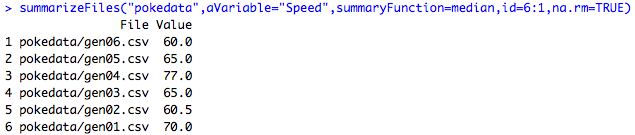
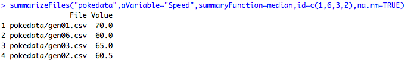
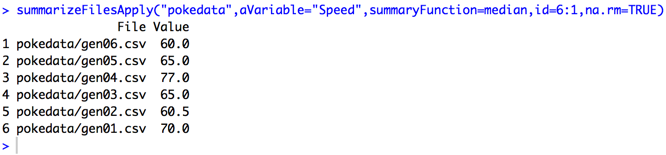

# Concepts: Techniques for Processing Sets of Files

As students in the Johns Hopkins University *R Programming* course work through the first programming assignment, one of the challenges they face in writing the `complete()` function is figuring out how to use a function to summarize each data file in the assignment, and return the output as a single `data.frame()`.

## A for()-Based Solution

To illustrate some of the concepts in this solution,
here is a function that takes a list of files from a directory and summarizes them with a function that is passed as another argument as is covered in Swirl lesson 9 on Functions.

      summarizeFiles <- function(directory,
                                 aVariable=NULL,
                                 summaryFunction=median,
                                 id=1:6,...){

           # read files and subset by id
           theFiles <- dir(directory,full.names = TRUE)[id]

           # initialize result array to NA so we can avoid
           # using combine function
           result <- rep(NA,length(theFiles))

           # process the files
           for (i in 1:length(theFiles)) {
                aFile <- read.csv(theFiles[i])
                # calculate summary function, including passing
                # ... argument to summary function
                result[i] <- summaryFunction(aFile[,aVariable],...)
           }
           # combine into an output data frame and return
           # result to parent environment
           data.frame(File=theFiles,Value=result)
      }

To illustrate how the code works, I used it with the [Pokémon Stats data set](http://bit.ly/2ovmmxu) that I obtained from Alberto Barradas. He originally posted this data on Kaggle.com. I broke out Alberto's single CSV data file into separate files, one for each of the first six generations of Pokémon that were available as of the time Alberto created the data set.

When we use the function to summarize the data by file with the median function on the Speed variable in the data set,  the function generates the following results.

Notice how the files are specified in the id argument, and how the function maintains the original order by using the argument to control how the results of `dir()` are saved in the file list. That is, by default `dir()` would return the files in ascending alphabetical order, but by using the \[ form of the [extract operator](http://bit.ly/2bzLYTL) on the result, we reorder the file names so they match the order of the id argument.

An important byproduct of this approach is that it always replicates the order of files on the `id` argument, even if they are not in an increasing or decreasing series.

## An apply()-Based Solution

During *R Programming* students learn about how `for()` loops are associated with slow performing R code. On the other hand, `apply()` functions aren't covered until after this assignment is due, so it's easier to illustrate a concept to new students with a `for()` loop rather than an `apply()` function. That said, an `apply()` based solution requires fewer statements than a `for()` based solution. Therefore, we include one here.

      summarizeFilesApply <- function(directory,
                                 aVariable=NULL,
                                 summaryFunction=median,
                                 id=1:6,...){

           # read files and subset by id
           theFiles <- dir(directory,full.names = TRUE)[id]

           # Read the files and keep the desired varible
           dataFrames <- lapply(theFiles,function(x) read.csv(x)[[aVariable]])

           # summarize the variable
           result <- unlist(lapply(dataFrames, function (x) {summaryFunction(x,...)}))

           # combine into an output data frame and return
           data.frame(File=theFiles,Value=result)
      }

 Again using the Pokémon data, output for this version matches the `for()` based solution.

