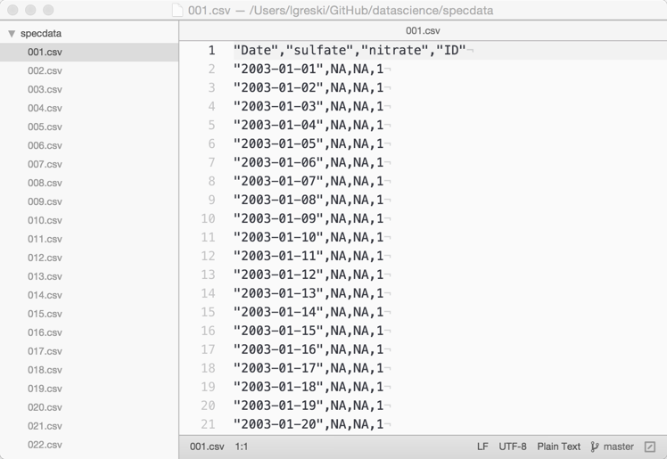
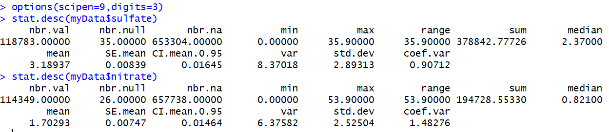

# Breaking Down pollutantmean()

As someone new to R or new to programming in general, it's important to have a plan of attack for writing the R functions required for the first programming assignment. One way to do this is to use the process I described in the article [Strategy for the Programming Assignments](https://github.com/lgreski/datasciencectacontent/blob/master/markdown/makeItRun.md).  Starting with an outline helps break what at first appears to be an overwhelming task into manageable chunks.

In this article, we'll apply the general concepts from [Strategy for the Programming Assignments](https://github.com/lgreski/datasciencectacontent/blob/master/markdown/makeItRun.md) to flesh out one of many potential solutions to `pollutantmean()`. We'll walk through the following steps:

1. Summarize the objective,
2. Describe the inputs and outputs,
3. Generate a list of working assumptions to guide subsequent design decisions,
4. Use information from the preceding steps to develop a design, and
5. Develop the function prototype, coding the design steps as comments into the function prototype.

Finally, we'll end with a set of next steps for the student.

## Overall Objective: Calculate a Mean

The first part of the assignment requires students to calculate a single average taken from a number of pollution sensors that collect data across the United States. Students are to write an R function, `pollutantmean()`, that reads the files and calculates the mean for a given pollutant.

## Inputs

Every computer program starts with one or more "inputs," and ends with some type of "output." `pollutantmean()` starts with three inputs, or *arguments,* each of which must be named within the `function()` function used to define `pollutantmean()`, also known as a function declaration:

<table>
<tr><th align="left">Argument</th><th align="left">Description</th></tr>
<tr><td>directory</td><td>The name of a subdirectory from which the 332 pollution sensors will be read. A key assumption for this assignment is that the name of the directory is <code>specdata</code>, and that it is a child directory from the <em>current R working directory</em>.  </td></tr>
<tr><td>pollutant</td><td>Each sensor file contains measurements for two pollutants, <em>sulfate,</em> and <em>nitrate.</em></td></tr>
<tr><td>id</td><td>a list of numbers that can vary from 1 to 332, indicating the sensor number(s) that are to be included in calculation of the mean. Each file is in a special format, comma separated values or <code>.csv,</code> such that the names of the files look like <code>001.csv, 002.csv,</code> ... <code>332.csv.</code> </td></tr>
</table>

To get a better picture of the data files, it's always a good idea to take a look at the raw data. As we can see from the following screenshot for `001.csv`, the file includes one row with header information, that is, the names of the variables in subsequent rows. The variables in each row include `Date`, `sulfate`, `nitrate`, and `ID`.

If you need a text editor with which to read the raw data files, I suggest [Atom](https://atom.io) since it is free.

In *Getting and Cleaning Data* you will learn how to develop a code book for a data set.  For now, we'll refer you to the [Assignment Instructions](http://github.com/lgreski/datasciencectacontent/blob/master/markdown/images/rprog-Assignment1Instructions.PDF) that explain the data that is in each comma separated value file. *Getting and Cleaning Data* also covers the fact that it's always a good idea to run some descriptive statistics on the data to understand what it looks like.

I like to use the `stat.desc()` function from the <em>pastecs</em> package because it provides a lot more information than the information provided by the `base::summary()` function.

Interesting... There are MANY missing values for both `sulfate` and `nitrate` across all 332 sensor files. In fact, only about 15% of the observations for `nitrate` and `sulfate` are non-missing.

## Key Assumptions

Every computer program includes a list of design assumptions, that is, conditions we expect to be constant across the users' consumption of the program. Reading through the assignment instructions and our inspection of the file names and contents of `001.csv` gives rise to the following set of assumptions.

* Data will be stored in a directory called `specdata`, which is a subdirectory of the R working directory.
* Column (variable) names in the data files are case-sensitive.
* There are 332 sensor files, and therefore, the values of `id` will vary between 1 and 332.
* The only files in the `specdata` directory will be the 332 sensor files.
* There are two types of pollutants stored in the sensor files, `sulfate` and `nitrate`.
* Some of the values of `sulfate` and `nitrate` are missing, and we will need to handle this within our function.
* The sensor files have data that is separated by commas, and therefore we will need to use an R function that reads these types of files.
* The files are organized by sensor number, and all files within the `specdata` subdirectory have the file type `.csv`. Therefore, we can use the `id` argument to decide which files to read.
* The file names contain leading zeroes (e.g. sensor 1 is stored as `001.csv`), which may be relevant depending on the technique we use to read the data files.

One of the benefits of listing the assumptions is that they allow us to begin to flesh out the design, or to limit the code we need to write.

For example, if we know that the `id` argument will be a list of integers that vary between 1 and 332, we don't need to write code to deal with values less than zero, greater than zero, or are non-integer values.  

It's also important to note what is NOT assumed to be constant, because these conditions must be accounted for within the design of our function. We can observe "non-assumptions" by looking at the test cases and output that are provided along with the assignment instructions that we referenced above.  

* `id` does not have to include all 332 files
* `id` does not have to start at 1
* `id` values do not have to be in ascending order
* `id` can be passed as a list of non-sequential integers

## Output

The output required for the assignment is a single number, the average calculated across all of the sensor files that were in the list of ID numbers passed into the function as an argument. Note that the average must be calculated across the non-missing values of the selected pollutant, because if one includes the missing values in the mean calculation, the result will be `NA`. Example output is provided in the [assignment instructions](https://d396qusza40orc.cloudfront.net/rprog%2Fdoc%2Fpollutantmean-demo.html) so students can validate the accuracy of their code before taking the quiz for a grade.

# Designing a Solution

Now that we understand the inputs and output required, we can discuss the process of converting the inputs to the output. The instructors in *R Programming* repeatedly discuss that there is more than one way to do things in R. To make it easier on the beginner, we'll take the conceptually simplest approach possible.

We know from the above discussion that we must read one or more files from disk to solve the problem. Because we need to return a single mean calculated across all of the files to be read, that means we must combine the individual files into a single file (or data frame) so we can calculate the mean correctly.  Conceptually we need to complete three steps within the function:

1. Read the files that are referenced in the `id` argument,
2. Combine the files into a single file / data frame, and
3. Calculate the mean of the requested pollutant and return it to the parent environment.

We can stub these steps out in R as follows.

    pollutantmean <- function(directory,pollutant,id=1:332){

        # Read the files

        # Combine the files into a single data frame

        # Calculate mean and return it to parent environment

    }

Breaking this down to the next level of detail makes the design a bit more complicated, as we account for the assumptions we discussed earlier in the article. One way to solve the problem is as follows:

1. Obtain a list of sensor files from the `specdata` folder, given the assumption that the `specdata` folder is a subfolder of the R Working Directory.  
2. Create an empty data frame into which you will collect all of the sensor files to be read  
3. Subset the list of sensor files down to only those to be used in the calculation of the mean. HINT: this can be done with vector subscripting, given some of the assumptions we listed above.  
4. Loop through each file in the subsetted list and do the following: read the raw data file with an appropriate file reading function, bind the file to the data frame you created in step 2.  
5. Calculate the mean and return it to the parent environment

While some of these steps can be combined by using `apply()` functions in combination with other R functions such as `do.call()`, I've written this approach using a loop in step 4 so we can highlight where to subset the file list: **do this BEFORE reading the data files from disk into memory.**

That said, a technique for reading and combining files with the `lapply()` function and `do.call()` is covered in [Forms of the Extract Operator](http://bit.ly/2bzLYTL).

Once you have your outline, you can organize your coding around the outline, like this:

    pollutantmean(...) {

       # obtain list of sensor files in specdata directory

       # create empty data frame

       # subset list of sensor files

       # loop through files in subset list and
       #    * read the csv file
       #    * bind to "collector" data frame

       # calculate mean and return to parent environment
    }

# Helpful R functions

As students work the problem they wind up searching for the right functions to perform various parts of the work. Here is a listing of R functions that are helpful for the assignment.

<table>
<tr><th align="left">Function</th><th align="left">Where to use it</th></tr>
<tr><td>dir() list.files()</td><td>Obtain list of files from the specdata directory</td></tr>
<tr><td>do.call()</td><td>Used with <code>lapply()</code> to combine data files in a more efficient manner than using a <code>for()</code> loop</td></tr>
<tr><td>for()</td><td>Loop through the list of files so they can be read and combined into a single data frame</td></tr>
<tr><td>lapply()</td><td>Process the list of files in a vectorized manner, allows one to write the <code>pollutantmean()</code> function without a <code>for()</code> loop. Note that this is a more advanced R function that is taught during Week 3 of the course.   Details explaining how to use this function are covered in <a href="http://bit.ly/2qK7tVX">Forms of the Extract Operator: Assignment 1 Concepts</a></td></tr>
<tr><td>mean()</td><td>Calculates the mean of a vector</td></tr>
<tr><td>paste() paste0()</td><td>Combine <code>directory</code> argument with default directory symbols as an argument to <code>list.files()</code></td></tr>
<tr><td>read.csv()</td><td>Loads the contents of a comma separated values file into a data frame</td></tr>
</table>

## A closing hint

Students often struggle to figure out how to code the handling of the pollutant name in the `mean()` function.  One approach is to use an `if()` statement. However, a more "R-like" approach is to use what is called *variable substitution within the Extract Operator.* I describe this technique in the article [Forms of the Extract Operator](http://bit.ly/2bzLYTL), specifically the section [Comparing Forms of the Extract Operator](https://bit.ly/36xxZrW).

# Next Steps

Having provided a relatively detailed walkthrough of the design process, all that's left is for the student to determine the R functions that are required for each step in the process.  Remember what the instructors said during *The Data Scientist's Toolbox,* "Google is your friend." Use it frequently, as I explained in [Strategy for the Programming Assignments](https://github.com/lgreski/datasciencectacontent/blob/master/markdown/makeItRun.md).

One last hint: if your program is more than 8 - 12 programming statements, it's too complicated. There are ways to solve this problem with as few as 1 - 3 programming statements if you combine the required R functions.

# Appendix: Variations on a Theme

Having given an outline for one potential solution, it can be modified in a number of ways. For example, to prevent a problem with files beyond `001.csv` to `332.csv` being in the `specdata` subdirectory, one could use R functions to build the filenames directly from the `id` vector instead of retrieving them by using a function that lists files in a directory. This technique could be employed in a `for()` loop or with an `apply()` function.

Another modification as stated above would be to use `apply()` functions rather than a loop to read and combine the files.

*Copyright Len Greski 2016 - 2020, copying with attribution permitted*
