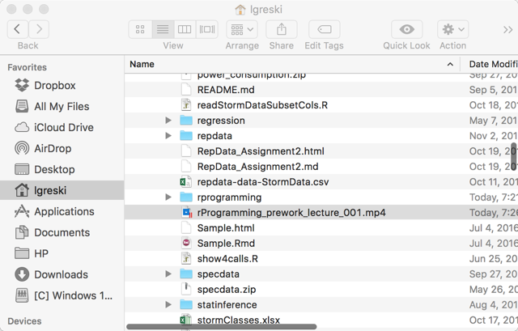
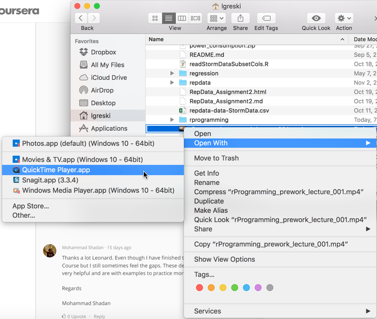
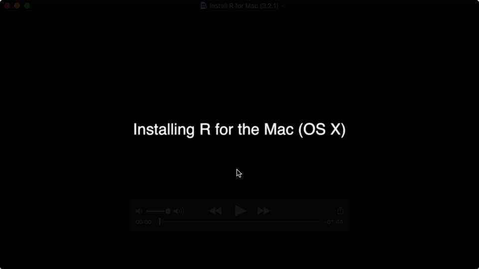

# Creative Use of R: Downloading Course Lectures

During the August 2016 run of *R Programming*, a student asked whether all of the lectures were available in a single tar or zip file.  As far as I know, the lectures aren't available for bulk download in a format that can be subsequently accessed on a local disk drive.

I thought it might be useful to show how one could use R to download the files, since it does have capabilities to download data files in a variety of formats, and the example would be a good illustration of techniques students will need in *Getting and Cleaning Data* and *Reproducible Research*.

The function `downloadLectures()` can be used to download files in a binary format, given a URL. We created function arguments for a list of files, and a prefix to add to each file that is downloaded.

    #
    # download lectures, requires curl package
    #

    downloadLectures<- function(fileList,courseName="rProgramming prework") {
         # configure set download method for windows vs. Mac / Linux
         dlMethod <- "curl"
         if(substr(Sys.getenv("OS"),1,7) == "Windows") dlMethod <- "wininet"
         for (i in 1:length(fileList)) {
              outFile <- paste(courseName,"_lecture_",sprintf("%03d.mp4",i),sep="")
              if(!file.exists(outFile)){
                   download.file(fileList[i],destfile=outFile,method=dlMethod,mode="wb")
              }

         }
    }

To execute the function, simply build a list of URLs at which the videos are stored, source, and call the downloadLectures() function.

    #
    # run downloadLectures() for video to install R on a Mac
    #
    theFiles <- c(
         "https://www.coursera.org/learn/r-programming/lecture/9Aepc/installing-r-on-a-mac"
    )
    downloadLectures(theFiles,courseName="rProgramming_prework")

The files will be downloaded to the *R Working Directory*. Once we've executed the function, we can check the files we've downloaded to ensure they work with an MP4 player.

Next, open the selected file with a video player.

Here is what the selected video looks like in Quick Time.

Ideas for enhancing this code on your own:

1. Add code to downloadLectures() to zip / tar the files once they've all been downloaded.
2. Add code to distinguish one week's lectures from another, enabling the function to download all the lectures for a course in a single function call.
