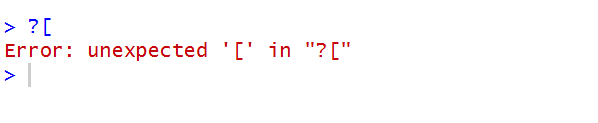
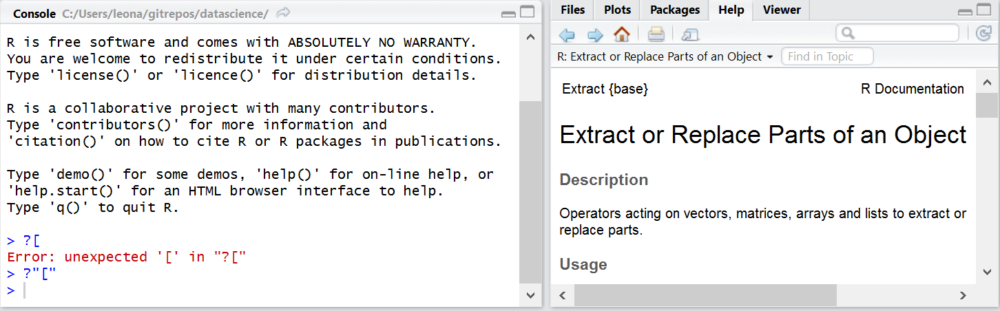
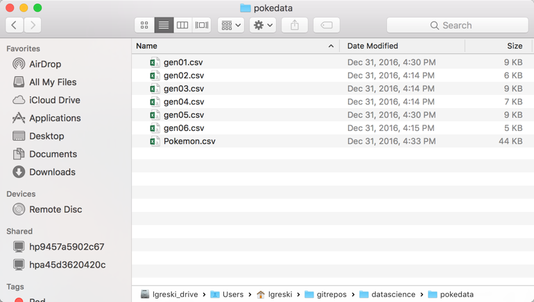
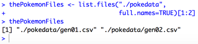
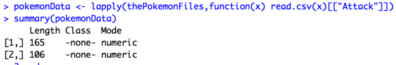
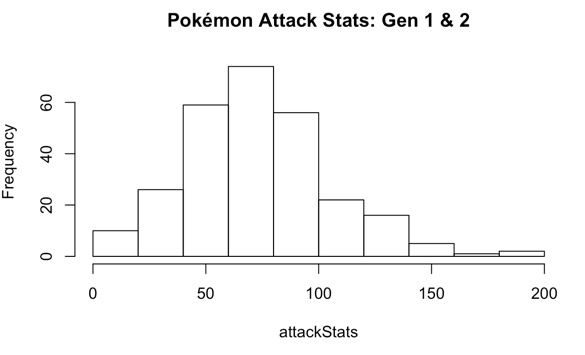
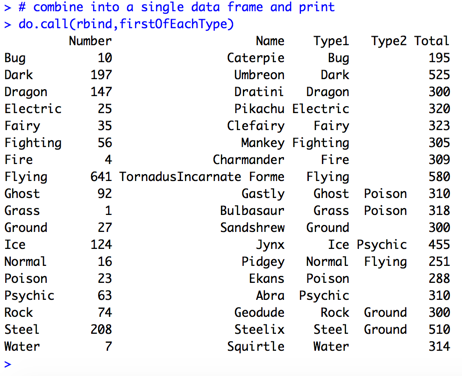
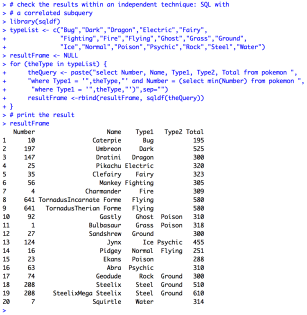
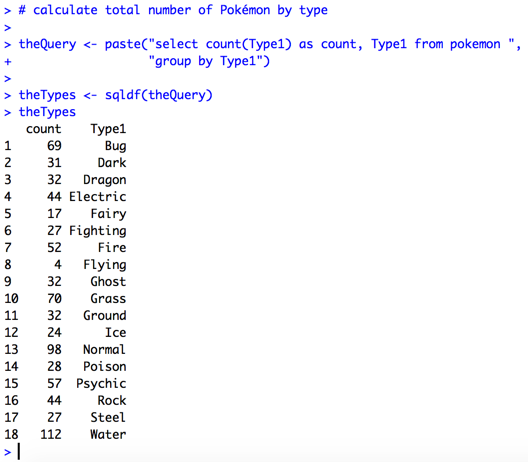
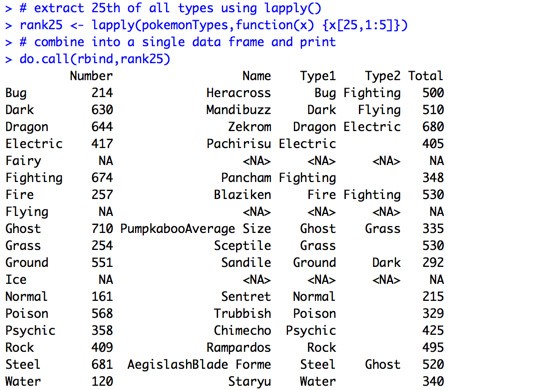

# Forms of the Extract Operator in R

One of the things that confuses students in the Johns Hopkins Data Science Specialization *R Programming Course* is that the extract operator is introduced in a way that does not emphasize how important it is as a concept in the R language. Often students watch the lectures and then have difficulty applying what they've learned to answer questions 11 - 20 in the first quiz, questions that require use of the extract operator in various ways.

The [extract operator](https://stat.ethz.ch/R-manual/R-devel/library/base/html/Extract.html) is used to retrieve data from objects in R. The operator may take four forms, including `[, [[, $,` and `@`. The fourth form, `@`, is called the [slot operator](https://stat.ethz.ch/R-manual/R-devel/library/methods/html/slot.html), and is used to extract content from an object built with the S4 object system, also known as a *formally defined object*. Use of the S4 object system is a more advanced topic so we won't discuss it further here.

In this article we will illustrate how to use the three most commonly used forms of the extract operator, focusing on how they work with data frames. Knowing how to use the extract operator with data frames is a key skill one must have to effectively use R. It's also important to note that [a data frame is also a list](http://bit.ly/2fmMRAp), which means that we can use the same extract operator techniques with data frames that one can use with a `list()` object. 

The first form, `[`, can be used to extract content from vector, lists, or data frames. Since vectors are one dimensional, i.e. they contain between 1 and N elements, we apply the extract operator to the vector as a single number or a list of numbers as follows.

     x[ selection criteria here ]

The following code defines a vector and then extracts the last 3 elements from it using two techniques. The first technique directly references elements 13 through 15. The second approach uses the length of the vector to calculate the indexes of last three elements.

    x <- 16:30 # define a vector
    x[13:15] # extract last 3 elements
    x[(length(x)-2):length(x)] # extract last 3 elements

When used with a list, `[` extracts one or more elements from the list.

When used with a data frame, the extract operator can select rows, columns, or both rows and columns. Therefore, the extract opertor takes the following form: rows then a comma, then columns.

     x[select criteria for rows , select criteria for columns]

The second and third forms of the extract operator, `[[` and `$` extract a single item from an object. Note that `$` does not support a computed index, as illustrated in an example in the next section of this article.  

To combine the elements from the list into a single vector for subsequent processing, we can use the `unlist()` function.

# Comparing Forms of the Extract Operator

Since the easiest way to see how the various features of the extract operator work is to see code examples, we provide a number of code snippets to illustrate various ways to use the different forms of the operator.

The following code examples use the `mtcars` data set from the `datasets` package.

    library(datasets)
    data(mtcars)

    # Here, we set up a column name in a variable to illustrate use
    # of various forms of the extract operator with a column name stored in
    # another R object
    theCol <- "cyl"

    # approach 1: use [[ form of extract operator to extract a column
    #             from the data frame as a vector
    #             this works because a data frame is also a list
    mtcars[[theCol]]

    # approach 2: use variable name in column dimension of data frame
    mtcars[,theCol]

    # approach 3: use the $ form of extract operator. Note that since this
    #             form accesses named elements from the list, you can't use
    #             variable substitution (e.g. theCol) with this version of
    #             extract
    mtcars$cyl

    # this version fails because the `$` version of extract does not
    # work with variable substitution (i.e. a computed index)
    mtcars$theCol

Having illustrated different ways to extract content with the extract operator, we will now illustrate its power as a way to subset rows or columns in a data frame, which is required for a number of questions in *R Programming* quiz 1. Note that we'll use the `head()` function to limit the number of rows returned when we print the data frame in various forms. For more information on `head()`, enter `?head` in the R console.

    #
    # subsetting columns
    #

    # approach 1: subset with column numbers
    head(mtcars[,1:3])

    # approach 2: subset with column names
    theCols <- c("mpg","cyl","disp")
    head(mtcars[,theCols])

    #
    # subsetting rows
    #

    # approach 1: use exact row references
    mtcars[20:22,]

    # approach 2: use logic in the row dimension of reference
    #             select cars with 4 cylinders and manual transmissions
    head(mtcars[mtcars$cyl == 4 & mtcars$am == 1,])
    head(mtcars[mtcars[,"cyl"] == 4,])

    # approach 3: use which() function
    #             select cars with 4 cylinders
    theSubsetRows <- which(mtcars$cyl == 4)
    head(mtcars[theSubsetRows,])

    # approach 4: use output from a function that returns a logical
    #             array instead of row numbers as in the prior example
    head(mtcars[!is.na(mtcars[,"cyl"]),])

# Getting Help with Operators

Students quickly learn that the help operator, `?`, is used to access R documentation. However, requesting help for an operator is a bit more complicated than it first appears:

Instead, one has to place the operator in double quotes, as in `?"["` to access help for the extract operator.

A more detailed explanation of the help function `help(...)` and help operator `?` may be found on the [Getting Help with R](https://www.r-project.org/help.html) page on the [R Project](https://www.r-project.org/) website.

# Advanced Operations with the Extract Operator

We've taken the extract operator through its paces with a variety of applications on a single data frame. Now, we'll expand on this to show how essential this operator is in combination with other R functions.

## Concepts for R Programming -- Programming Assignment 1

The first programming assignment in *R Programming* requires students to process a large number of pollution sensor files. The assignment is a big step up in complexity from the lectures in the first two weeks of the course, because it requires students to combine various elements of the lectures in ways that aren't obvious to a beginning R programmer.

To provide a similar example that processes multiple files without using the actual assignment 1 content, we've adapted Alberto Barradas' [Pokémon Stats](http://bit.ly/2ovmmxu) data from kaggle.com. Barradas' data includes basic statistics for the first 6 generations of Pokémon. By breaking the original data file into 6 files, one for each generation, we can demonstrate a number of concepts that are relevant to solving the three components of the programming assignment. The original CSV file and the 6 generation-specific CSV files are also available at the [lgreski/pokemonData repository](http://bit.ly/2nB2Zzy) on Github.

### Step 1: Retrieving File Names from a Subdirectory

Noting John Chambers' statement that <em>In R, everything is an object</em>, the `[` form of the extract operator can be used to extract data from the result of a function call. The following code executes `list.files()` on a subdirectory of the current R working directory that contains comma separated values files of Pokémon statistics, one file for each of the first 6 generations of Pokémon.

Notice that there are 7 files in the subdirectory, one for each generation of Pokémon, plus a seventh file that contains all the Pokémon.

    # return first two generations of Pokémon stored in
    # Pokémon data files retrieved from kaggle.com and
    # broken out into 6 csv files, one per generation

    thePokemonFiles <- list.files("./pokedata",
                                  full.names=TRUE)[1:2]
    thePokemonFiles

The above code executes `list.files()`, and then the extract operator `[1:2]` is applied to the output object, resulting in a `thePokemonFiles` object containing the first two files returned from the `list.files()` function.

### Step 2: Reading the Data

Now that we have the list of files stored in a vector, we can use it along with the `[[` form of the extract operator and `lapply()` to read a subset of columns from the data files.

    pokemonData <- lapply(thePokemonFiles,function(x) read.csv(x)[["Attack"]])

    # show the list of vectors
    summary(pokemonData)

The key feature of this code is use of an anonymous function within `lapply()` so we can apply the extract operator to the result of `read.csv()`. After the `lapply()` function executes, the `pokemonData` object is a list containing two vectors, the `Attack` column from each of the two files we read with `read.csv()`.

### Step 3: Using the Data

At this point the `pokemonData` object is a list that contains the `Attack` column from each Pokémon from generations 1 and 2 of the game. How might we display a distribution of the `Attack` stats in a chart?

First, we need to combine two vectors in the `pokemonData` object into a single object. Since the underlying data type is a numeric, we can use the `unlist()` function.

Next, we'll display the data in a histogram.

      attackStats <- unlist(pokemonData)
      hist(attackStats,
           main="Pokemon Attack Stats: Gen 1 & 2")

The histogram shows us that most generation 1 and 2 Pokémon have an Attack stat between 50 and 100. A `summary()` function tells us that the median of this distribution is 75, and the inter-quartile range is 50 - 93.5, confirming what we see in the histogram.

## Concepts for R Programming -- Programming Assignment 3

Having used the Pokémon data to illustrate concepts for the first programming assignment in *R Programming*, we now turn to assignment 3. This programming assignment also has three components, just like the first assignment. Students are required to use data from the U.S. Department of Health and Human Services [Hospital Compare Database](http://hospitalcompare.hhs.gov) to compare outcomes for specific illnesses at hospitals across the United States and U.S. territories.

Each function requires students to sort the data to find a ranked outcome for an illness, such as the **best hospital for heart attack outcome in Maryland**, or the **10th ranked hospitals for pneumonia across all states and territories**.

By this point in the course students have learned how to use `apply()` functions, and are therefore expected to use these techniques to write some of the functions for the assignment. One way to solve these problems is to use an `apply()` function with `split()`, because some of the functions require processing the data by state.  

Again, we'll use the [Pokémon Stats](http://bit.ly/2ovmmxu) data to illustrate these concepts.

### Step 1: Load the Data

First, we'll load the complete version of the Pokémon data, rather than the generation-specific files. Since the original data file is already sorted according to National Pokédex ID Number, this means that it is also sorted by generation.

     pokemon <- read.csv("./pokedata/Pokemon.csv")

For our example, we want to look at Pokémon by type. Pokémon may have two types, and they are represented in the Pokémon data with two columns, `Type1` and `Type2`. To simplify our analysis, we'll consider `Type1` as the primary type for each Pokémon.

How might we, for example, retrieve the first Pokémon of each type?

### Step 2: If Necessary, Sort the Data

In our case, we won't need to resort the data. However, since the `split()` function retains the sort order from the original data frame in all output data frames, if one needs to sort the data, sort it prior to using `split()`.

For a descriptions of techniques used to sort a data frame, please review [Functions to Sort Data Frames](http://bit.ly/2dxItzw).

### Step 3: Split the Pokémon by Type

The `split()` function breaks a single data frame into a list of multiple data frames, based on the values of a factor variable that is passed as an argument to `split()`.  For the Pokémon data, it works like this.

     pokemonTypes <- split(pokemon,pokemon$Type1)

### Step 4: Experiment with Extracting a Pokémon

At this point, `pokemonTypes` is a list of data frames, one for each of the 18 Pokémon types.
Since the `pokemonTypes` object is a `list()`, we need to extract the right data frame from the list, and then extract the desired information.

The individual data frames can be accessed by `Type1` name because the values of the factor variable used in `split()` are assigned as the element names in the output `list()` object.

To extract the first *Fire* type Pokémon, we simply need to extract the `Fire` element from the list, and from this object extract the first row. We'll also only select columns `1:5` from the data frame.

    # extract first Fire type, should be Charmander
    pokemonTypes$Fire[1,1:5]

Since the number of Pokémon by type varies by generation, extracting the last Pokémon for a particular type requires a bit more code. Here, we'll extract the last `Bug` type.

    #extract last Bug type, should be Vivillon
    pokemonTypes$Bug[nrow(pokemonTypes$Bug),1:5]

Since there are three forms of the extract operator that are commonly used, we can also show that the `[[` works for this type of extraction.

    # Also works using [[ form of extract operator
    pokemonTypes$Bug[nrow(pokemonTypes[["Bug"]]),1:5]

### Step 5: Use Extract with `apply()`

Having demonstrated how access an individual element in the list, we'll show how to extract a given row across a list of data frames.

The key feature we'll need to use is an anonymous function, where the code within the function controls the rows and columns to be extracted from each data frame in a `list()`. For this purpose we'll use `lapply()`.

    # extract first of all types using lapply
    firstOfEachType <- lapply(pokemonTypes,function(x) {x[1,1:5]})

At this point the `firstOfEachType` object is a list of 18 data frames, each containing a single row from the original list of data frames.

### Step 6: Combine the List into a Single Data Frame  

In contrast to the earlier example where we used `unlist()` to combine the `Attack` vectors in a list, we need to use a function that works with data frames. Fortunately, R provides a function, `do.call()`, that allows us to pass a list of arguments to another function. In this case, we'll use it with `rbind()`.

    # combine into a single data frame and print
    do.call(rbind,firstOfEachType)

As we can see from the output, the result is a single data frame containing the first 5 columns from the input CSV file, containing the Pokémon for each type that has the lowest National Pokédex Number.

#### Verifying Accuracy of the Results

We can verify the results with an independent technique that will be covered in *Getting and Cleaning Data*, the `sqldf()` function. `sqldf()` is an implementation of *Structured Query Language* (SQL) with data frames. We will use this technique because of a specific SQL feature: the `group by` clause. The `group by` clause allows us to find the minimum National Pokédex Number for each type of Pokémon.

     # check the results within an independent technique: SQL
     library(sqldf)
     theQuery <- paste("select min(Number) as Number from pokemon ",
                       "group by Type1")
     theIDs <- sqldf(theQuery)[,"Number"]
     # now use theIDs to subset original data
     resultFrame <- pokemon[pokemon$Number %in% theIDs,1:5]
     # order by type1
     resultFrame <- resultFrame[order(resultFrame$Type1),]
     resultFrame

The elegance of the R language is highlighted by the fact that the original version using `lapply()` requires significantly less code than the  `sqldf()` version.

### Why are there 20 rows in the output data frame?

The "data science" answer is that here we have another example of ["untidy" data](http://bit.ly/2nyw5Ci) -- multiple rows in a data frame represent the same Pokémon. This is due to changes in the mechanics of Pokémon games over the last 20 years. The new mechanics are tracked as new versions of a given Pokémon, but retain the same National Pokédex Number as earlier version(s) of the Pokémon.  

In our scenario that extracts the first Pokémon of each type, there are two Pokémon, Tornadus and Steelix, who have multiple entries because they either have multiple Formes (Tornadus) or whose stats can be enhanced with a Mega stone (Steelix). The additional Formes have the same National Pokédex Number, so all Formes are retained when we subset the final data frame by National Pokédex Number.

Modification of the code to eliminate the second Forme by using the `Total` stat is left as an interesting exercise for the reader.

# Selecting Beyond the End of the Data Frame

*Programming Assignment 3* includes test cases where students must handle missing values in the output data frame. We'll illustrate how this works with the Pokémon data. What we need to do is create a situation where we'll try to extract the n-th Pokémon by its primary type, with a number that exceeds the total number within a particular primary type for at least 1 type.

As illustrated earlier in the article, code to extract the first Pokémon from a list of data frames split by `Type1` is straightforward.

      # extract first of all types using lapply
      firstOfEachType <- lapply(pokemonTypes,function(x) {x[1,1:5]})

To find the number of Pokémon by type, we'll use the `sqldf` package.

As we review the output from the SQL query, we see that there are three types that have fewer than 25 Pokémon: Fairy, Flying, and Ice.

Now, we'll extract the 25th Pokémon from each data frame in the `list()` and combine them into a single data frame.

As we can see from the result of `do.call()`, the row label shows the three types that have fewer than 25 Pokémon: Fairy, Flying, and Ice. Since R sets the row names of the output data frame to the name of each input data frame, we can use the `rownames()` function to assign the missing values of `Type1` in the output data frame. 

One could further experiment with the data, say, "extract the 25th Pokémon for each primary type by descending Total stat." To do this, we'd sort the data by `Type1` and `Total`, split the data by primary type, and extract from the list. I'll leave that as an interesting exercise for the reader.

# Concluding Remarks

There you have it, a comprehensive overview of the extract operator, including a set of examples illustrating the key concepts for programming assignments 1 and 3 in *R Programming*. Specific nuances of the actual assignment problems are left to the students to solve, such as handling of missing values, sorting the data, and use of the parameters within each function.  

# References

1. [Extract {base} R Documentation](https://stat.ethz.ch/R-manual/R-devel/library/base/html/Extract.html), retrieved 22 May 2016.
2. [SlotOp {base} R Documentation](https://stat.ethz.ch/R-manual/R-devel/library/base/html/slotOp.html), retrieved 22 May 2016.
3. [Pokémon Stats by Alberto Barradas](http://bit.ly/2ovmmxu)

**last update date: 14 October 2017**
