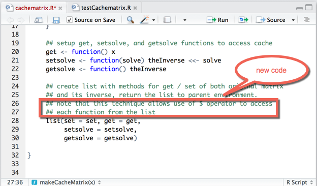
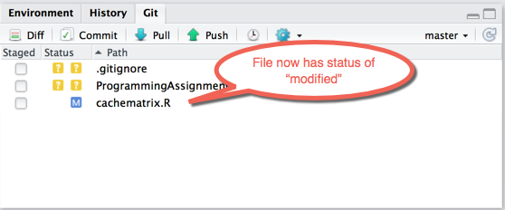
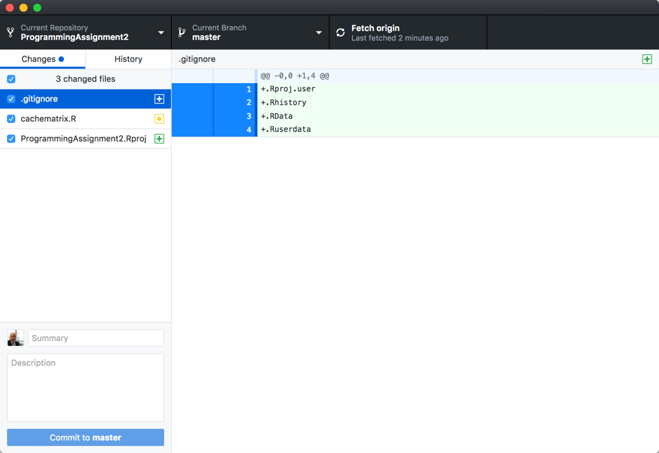
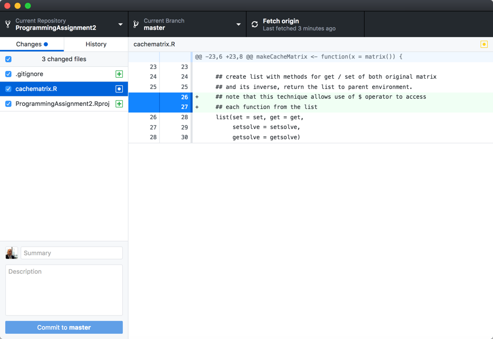
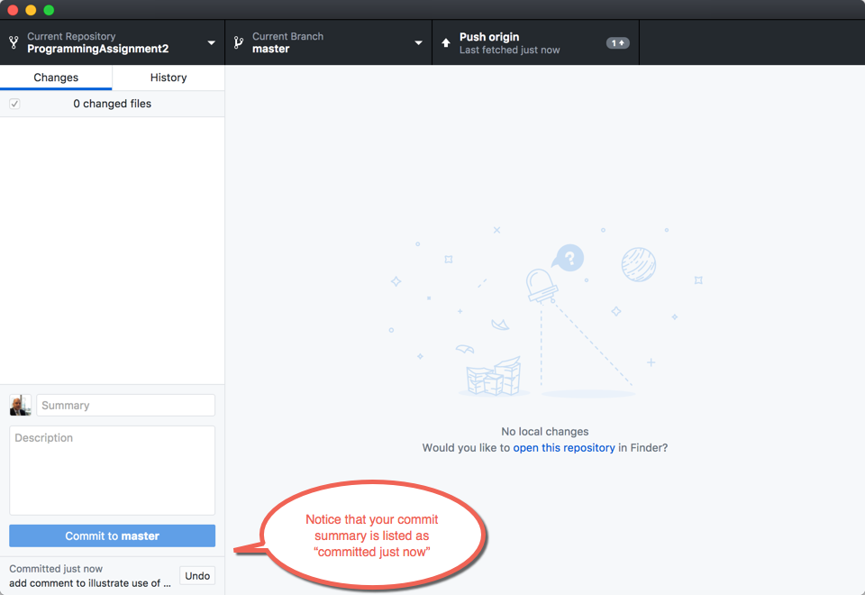
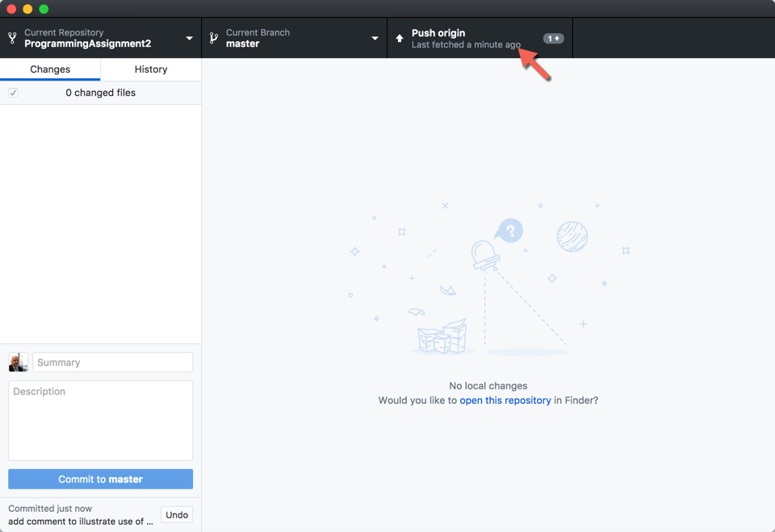
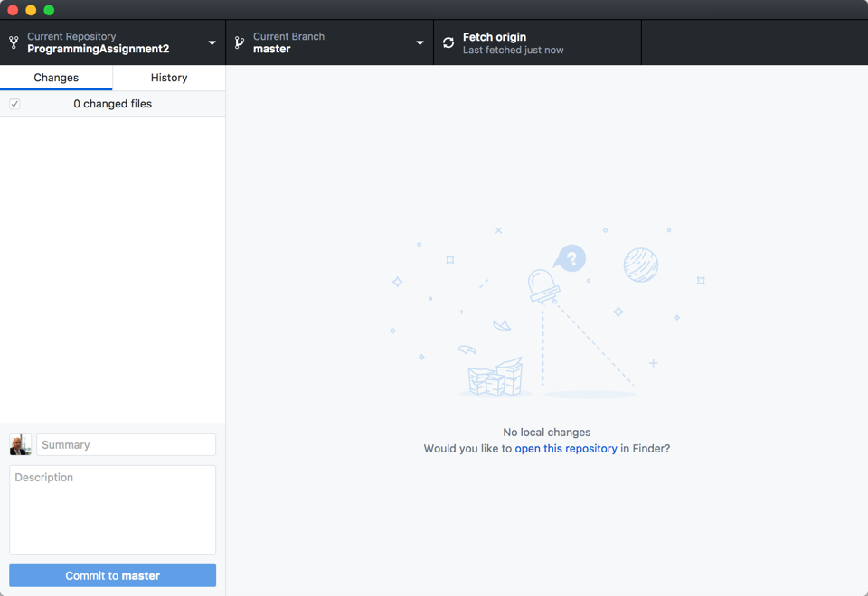
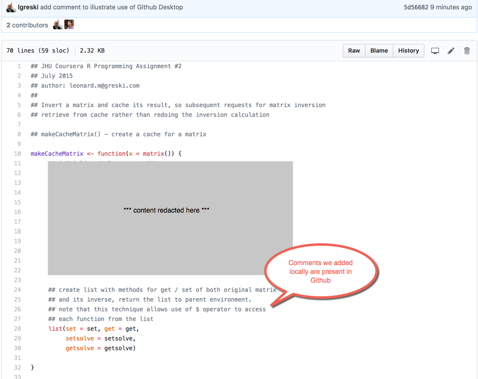
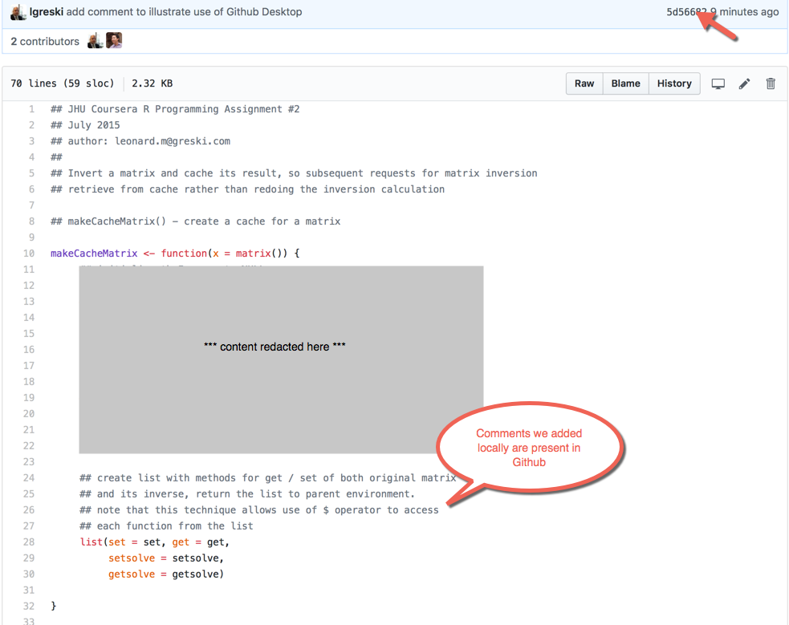
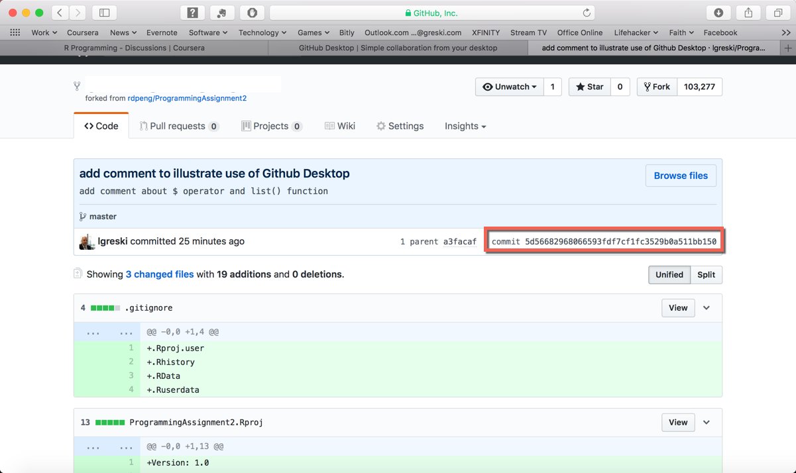

# Using Github Desktop for Assignment 2

This walkthrough is intended to illustrate how to save and post code for *Programming Assignment 2* from a local machine running RStudio to a forked copy of Professor Peng's [ProgrammingAssignment2](https://github.com/rdpeng/ProgrammingAssignment2) github repository.

## Prerequisites

* R and RStudio installed
* Github Desktop installed
* Professor Peng's repository forked and accessible from your Github account
* Local copy cloned from your remote Github repository and accessible in Github Desktop

## Step 1: Edit the cachematrix.R file

First, open the `cachematrix.R` file in RStudio, and edit to comply with the requirements of the programming assignment. Here is my version after adding a couple of comment lines prior to the `list()` function call at the end of `makeCacheMatrix()`.

Since I have configured RStudio / Git integration, I can now see that the file is seen as modified by Git within the Git tab of the *Environment Pane* in RStudio.

## Step 2: View the edited file in Github Desktop

Open Github Desktop, access the ProgrammingAssignment2 repository, and you'll now see that `cachematrix.R` is noted as modified, as illustrated by the yellow icon next to the file name.

To see details of the changes in a manner similar to what we did in RStudio, click on the `cachematrix.R` file name.

## Step 3: Commit changes

Each commit requires a text summary and description. Enter this information in the text entry boxes in the lower left corner of the Github Desktop window.

Then press the `<Commit to Master>` button in the lower left corner of the Github Desktop Window to commit these changes to the local repository.

Once the changes have been committed to the local repository, you'll see the window change and your commit is listed as "committed just now."

## Step 4: Push the changes to Github

To push the updated file to the remote Github repository, press the `<Push origin>` button in the top navigation bar of Github Desktop.

Once the push completes, the button will now say `<fetch origin>`, meaning that there are no local changes to be pushed to the remote.

## Step 5: Confirm changes are visible on Github

Now you can navigate to your remote version of the *ProgrammingAssignment2* repository on Github, and view that the change has been made on the remote repository.

First, we confirm that our commit information is present in the `last commit` area on the repository home page.

Second, we can click on the `cachematrix.R` file to view it, confirming that the comments we added locally are now present in the remote copy.

## Step 6: Find and Copy the SHA-1 hash code

Finally, since students must post the SHA-1 hash code along with the URL for the Github repository for the assignment, view it by clicking on the first few characters of the hash code in the upper right corner of the file viewer window.

The complete version of the hash code is displayed on the commit details page. Copy the entire hash code so you can paste it into the appropriate text entry area in the project assignment submission page.

