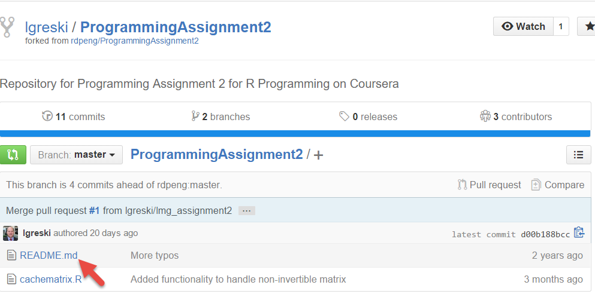
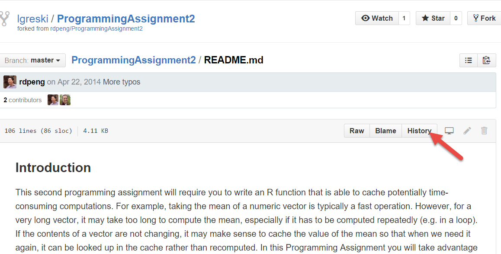
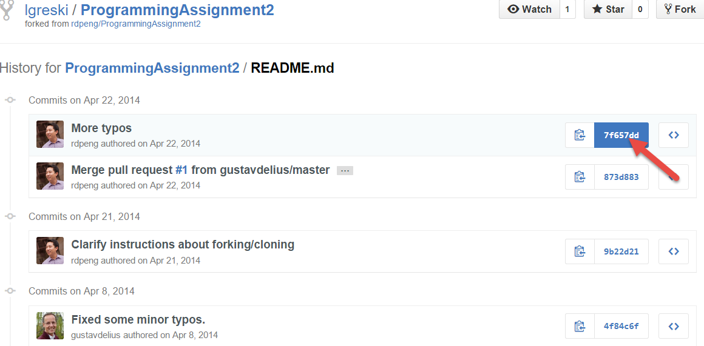
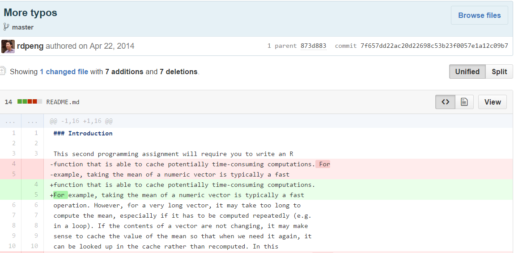

# R Programming Assignment 2: Grading the SHA-1 Hash Code
If the cachematrix.R has a newer commit date than the original from the forked repository, and the SHA key corresponds to an actual commit of an updated README.md in the student's repository, according to the grading rubric, award 2 points. To check the differences between the latest commit and the prior version, take the following steps.

1) From the main page of the forked repository, click on the README.md file

2) Next, select the History button on the README.md page

3) From the Commit History page, select the commit that corresponds with the SHA-1 code for which you want to compare the latest commit against the prior version

4) Finally, the next page will display the DIFF between the last two versions. If the DIFF output shows that the student changed the file in an observable way, it qualifies as a valid commit.

You can also check whether there is a different commit that contains the commit for cachematrix.R beyond the original fork and diff the files, using the same procedure outlined above.
