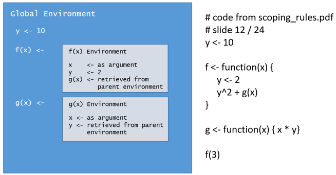
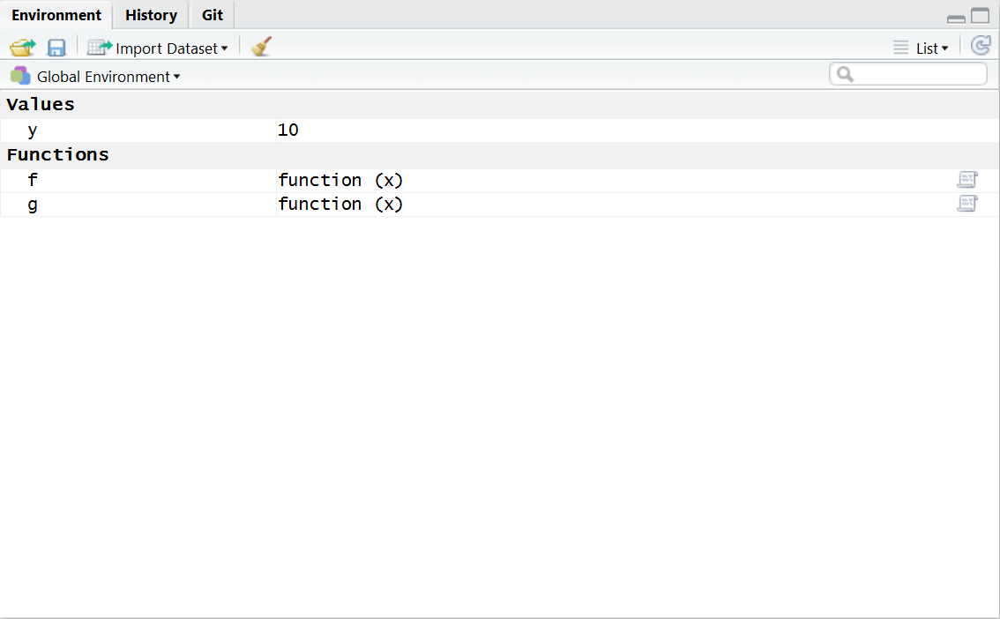
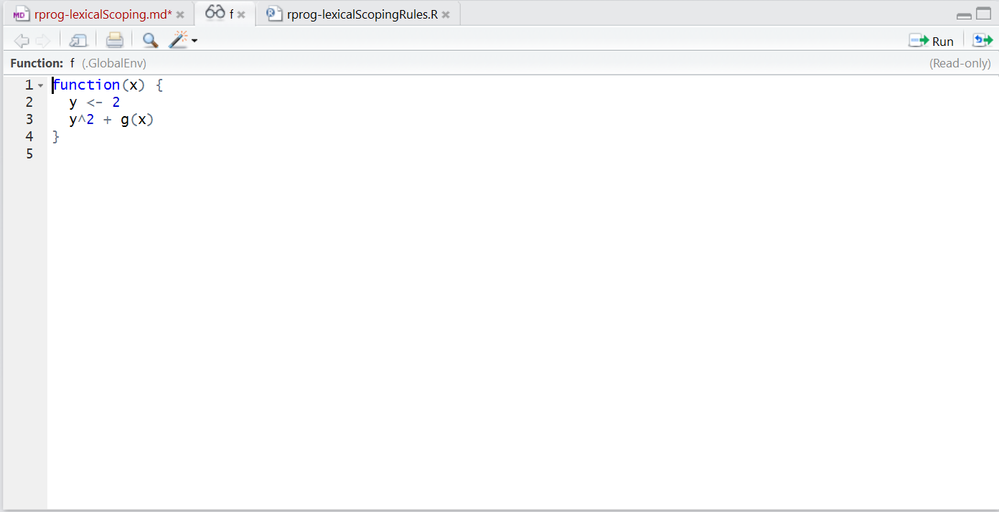

# S Objects, R Objects, and Lexical Scoping

Two key R design principles related to objects and lexical scoping are summarized in the following quote from John Chambers:

> To understand computations in R, two slogans are helpful: 
> &nbsp;&nbsp;&nbsp;-- Everything that exists is an object, and  
> &nbsp;&nbsp;&nbsp;-- Everything that happens is a function call.

John Chambers, quoted in *Advanced R*, p. 79.

After some additional research ("Google is your friend...") I located the original source of this quote, a [presentation by John Chambers that was given at the useR!2014 conference](http://user2014.stat.ucla.edu/files/chambers.pdf).

## What is an "object?"

First, we'll tackle Chambers' first slogan with a short overview of objects.

A basic definition of "object" in computing is that an object is a thing that contains *state* (information), and *behavior*. Another way to describe these concepts is that *state* represents what an object *knows,* and *behavior* represents what an object *does.*

These characteristics are implemented in object oriented languages when one writes the code that becomes the template for an object that is created when the program code is executed. This template is called a *class* in many object oriented languages. *State* is implemented as a set of variables or attributes defined within a class, and *behavior* is implemented as methods or member functions within a class.

At design / coding time we define classes in code, instantiate (load) them into objects, and instruct the objects to "do things" by calling their methods / member functions. The code we write is compiled and saved to disk so it can be executed.  At program run time, the code is loaded into memory and executed.

## Objects in S and R

In S, objects are stored at runtime in frames (which are in virtual memory) and databases (which may be on disk, or in virtual memory). This feature allows S to handle large amounts of data because an S program can use the disk to store the data, and only load small subsets when they are needed during a computation.

R, in contrast, stores objects in environments, which are always in virtual memory. Since each function in R must include a pointer to its parent environment, it must also be in virtual memory at the time it is defined.

Reference: _S Programming_,  p. 54 - 55.

Practically speaking, one has to load objects that are stored on disk into memory, including functions, before using them. This is why one cannot access functions from previously installed packages (which are collections of related functions) without loading them into memory via the `library()` function before calling them.

If you print the code for the `library()` function, you'll observe that it uses `readRDS()` to read the package content from disk into memory. As the serialized objects within a package are deserialized and loaded into memory, they are assigned to the hierarchy of environments, starting with the base or global environment.

Now we'll address Chambers' second slogan: *Everything that happens is a function call.*

This is a statement about behavior in R. All behavior in R is implemented through functions. This means that even things like the extract operator `[` are coded in R as functions. By virtue of Chambers' first slogan, we know that operators are also objects.

## S3 vs. S4?

In R there are two "systems" for implementing object oriented programming concepts, the S3 system and the S4 system.

R is based on the S language. Development of the S language began in 1976 and has gone through four major phases, or "epochs," as John Chambers describes in Chapter 6 of [Software for Data Analysis](http://www.springer.com/us/book/9780387759357). These epochs represent major changes in the ways that data and computations are structured within the language. All four are represented in R, as Chambers writes:

> 1. Object types, a set of internal types defined in the C implementation, and originally called modes in S;   
> 2. Vector structures, defined by the concept of vectors (indexable objects) with added structure defined by attributes;  
> 3. S3 classes, that is, objects with class attributes and corresponding one-argument method dispatch, but without class definitions;  
> 4. Formal classes with class definitions, and corresponding generic functions tions and general methods, usually called S4 classes and methods in R.

*Software for Data Analysis: Programming with R (Statistics and Computing) (Kindle Locations 1819-1822). Kindle Edition.*  

### The next level of detail...

Again, quoting John Chambers:

> **S3 classes:** As part of the software for statistical models, developed around 1990 and after, a class attribute was used to dispatch single-argument methods. The attribute contained one or more character strings, providing a form of inheritance. Otherwise, the change to data organization was minimal; in particular, the content of objects with a particular class attribute was not formally defined. S3 classes are needed today to deal with software ware written for them (for example, the statistical model software (Section 6.9, page 218) and also for incorporating such data into modern classes and methods (see Section 9.6, page 362 for programming with S3 classes).  
> **Formal (S4) classes:** The S3 classes and methods gave a useful return on a small investment in changes to the language, but were limited in flexibility  (single-argument dispatch) and especially in supporting trustworthy software. Classes with explicit definitions and methods formally incorporated rated into generic functions have been developed since the late 1990s to provide better support. That is the programming style recommended here for new software chapters 9 and 10, for classes and methods respectively.

*Software for Data Analysis: Programming with R (Statistics and Computing) (Kindle Locations 1830-1835). Kindle Edition.*    

## R Objects and Lexical Scoping

In R every object is tied to an environment. Specifically for functions, each function includes a pointer to its parent environment. This allows the function to have access to the objects that are defined in the parent environment, in addition to any objects that are created within the function. The combination of a function and the variables referenced in its environment is also known in computer science as a closure (see Appendix for additional discussion of closures).

This feature allows a developer to write functions within a function that can access objects defined in all of the parent environment(s) in the hierarchy between the child function and the R Global Environment.

The requirement that all R functions have pointers to their parent environments has desirable properties for statistical computing, such as the optimization example in an expanded version of the lexical scoping lecture documented in a 2003 [JHU Biostatistics class](http://www.biostat.jhsph.edu/~rpeng/docs/R-classes-scope.pdf).

Because environments in R are hierarchial, I have found it helpful to understand their relationships through pictures. Here is an illustration of the environments for the functions defined in Professor Peng's lexical scoping lecture, slide 12.

The diagram includes three environments:

1. The global environment, containing the objects `y`, `f()` and `g()`,
2. The `f()` environment, containing the objects `x` and a local version of `y`. Note that `g()` is retrieved from the parent environment versus using an object specific to the `f()` environment, and
3. the `g()` environment, containing the object `x`. Note that `y` is retrieved from the parent environment. Since `g()` is a sibling of `f()`, it accesses the version of `y` stored in the global environment, not the version stored in `f()`. 

Therefore, `f(3)` returns 34. 

We can confirm the accuracy of the diagram by inspecting the Global Environment with the Environment Viewer in RStudio.

Clicking on one of the functions will display its code in the code editor pane of RStudio, allowing us to see the objects defined within the function.

# Appendix: what is a closure?

*Closure* is a functional programming concept that is central to lexical scoping. A closure represents the association between a function and its environment, including the local variables that are defined within its scope and the name or reference to which the name was bound at design time. Since anonymous functions are unnamed, they are associated with environments by reference.  

A closure enables the function to access these variables through copies or references even when the function is accessed outside their scope, unlike a regular function that is defined without an environment.

Reference: <a href="https://en.wikipedia.org/wiki/Closure_(computer_programming)"> Closure (computer programming), Wikipedia</a>.  Accessed 22 October 2016.

## References

Chambers, John (2008) [Software for Data Analysis: Programming with R](http://www.springer.com/us/book/9780387759357), Springer Science+Business Media LLC, New York, NY.

Chambers, John (2014) [Interfaces, Efficiency, and Big Data](http://user2014.stat.ucla.edu/files/chambers.pdf) useR!2014. Retrieved from internet 23 October 2016.

Wikipedia.org <a href="https://en.wikipedia.org/wiki/Closure_(computer_programming)"> Closure (computer programming)</a>. Retrieved from internet 23 October 2016.
