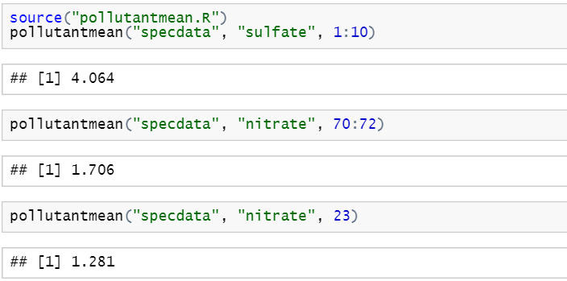
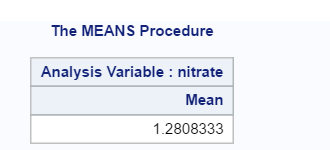
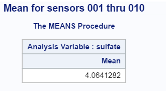
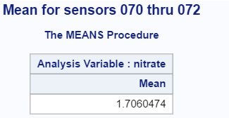
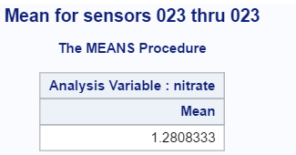

# A SAS Version of pollutantmean()?

Between summer 2015 and spring 2016 a number of students in the [Johns Hopkins University Data Science curriculum on coursera.org](http://wwww.coursera.org/specializations/jhu-data-science) have tried to approach *R Programming* based on their past experience with SAS. Unfortunately for these students, the programming paradigm in R is significantly different from the one used in SAS.  

A basic illustration of some of the differences between the two languages is covered in the article [Thinking in R versus Thinking in SAS](https://github.com/lgreski/datasciencectacontent/blob/master/markdown/exampleSortRvsSAS.md), where something that is very straightforward to a SAS programmer \(sorting a data set\), appears to be much more complicated in R.

That said, once a person knows R, things that are very easy in R can be much more complex in SAS. Ironically, one example of this phenomenon is the `pollutantmean()` function that is one of three components in the first programming assignment in the *R Programming* course. As I explain in [Assignment 1: a more elegant solution](http://bit.ly/2kwBBlK), the `pollutantmean()` function can be written in a single line of R code. It turns out that replicating this function in SAS requires quite a bit more than one line of code.

## Requirements for a SAS-based Solution

The specific requirements for `pollutantmean()` are covered in [Breaking down pollutantmean()](https://github.com/lgreski/datasciencectacontent/blob/master/markdown/rprog-discussPollutantmean.md), so we won't go into the details here. Generally speaking, we need to accomplish the following:

1. Read one or more of the pollution sensor files
2. Calculate a mean for one of the pollutants, either `nitrate` or `sulfate`
3. Write the code for 1 and 2 in a way that one can run the analysis by passing a set of parameters to the code, versus copying & pasting the code to handle different sets of sensors and/or pollutants, as illustrated in the [sample output from the assignment](https://d396qusza40orc.cloudfront.net/rprog%2Fdoc%2Fpollutantmean-demo.html).

Reading and calculating a mean of one sensor file in SAS is very easy. We will illustrate this with one of the examples from the assignment 1 instructions from the *R Programming* course.

     /*
      * read a sensor file
      */

      data sensor023;
      infile "/folders/myfolders/specdata/023.csv" dlm="," firstobs=2;
      input Date $12. sulfate nitrate id;
      run;

      proc means data = sensor023 mean;
      var nitrate;
      run;

The tricky part in replicating `pollutantmean()` in SAS is that it does not have an out-of-the-box capability for end users to easily develop a SAS procedure and access it from the base software. While [PROC FCMP and PROC PROTO](http://support.sas.com/resources/papers/proceedings10/024-2010.pdf) have been available since SAS 9.2, they are relatively new features in SAS that require a significant programming background to use them effectively. Instead, SAS provides a macro language that allows SAS users to parameterize and generate SAS code. Therefore, we will implement `pollutantmean()` as a SAS macro.

### Step 1: Identifying the Files to Read

The programming assignment instructions tell the student to assume that the raw data files to be processed by `pollutantmean()` reside in a `specdata` subdirectory from the R Working Directory. Given this assumption, we can generate a list of sensor files using the SAS macro language.

In an R-based solution, the student has a choice of design approaches: s/he can either obtain a list of the data files from the operating system with the right R function, or s/he can construct the file references from the list of sensor IDs passed in the `id` argument in the `pollutantmean()` function.

SAS provides a similar design choice, albeit with a more complex implementation. The SAS macro language can be used to generate file names based on the macro arguments, but in order to use them in a subsequent step we must add them to a SAS data set.

SAS provides a `pipe` option on the `FILENAME` statement that enables a SAS program to access operating system commands, such as `ls` in unix-based systems or `dir` for Windows. I'm using SAS University in conjunction with my activity as a student in the Johns Hopkins University Data Science Specialization on Coursera, and I don't have access to a commercial version of SAS.  Unfortunately SAS University is configured in `LOCKDOWN` mode, so we are not able to access the operating system commands necessary to demonstrate use of the `pipe` approach.

Of course, since students are trained in *The Data Scientist's Toolbox* to have a hacker mentality, we know there is more than one way to generate the file list we need. Therefore, we'll use the macro language within a `DATA step` to generate the required filenames.

Code for the first step looks like:

       /*
        * step 1: generate list of files
        *
        * Note that we need a "hack" to generate the list of filenames
        * because SAS University restricts access to the FILENAME PIPE
        * that is required to query the filenames in a directory
        */

       %let i = 1;
       %let word = %scan(&id,&i,%str( ));
       /* calculate first word for title statement in proc means */
       %let firstsensor = &word;
       data specdata;
         length aFile $100.;
       %do %while(&word ^= );
         * generate a variable for the file name and write to output data set ;
         aFile = "/folders/myfolders/&directory/&word..csv";
         output;
         %let i = %eval(&i + 1);
         %let word = %scan(&id,&i,%str( ));
       %end;
       /* obtain last sensor id for title statement in proc means */
       %let lastsensor = %scan(&id,%eval(&i - 1),%str( ));

       run;

## Step 2: Reading the Pollution Sensor files

This turns out to be the most challenging part of the solution. We must read a variable number of input files and combine them into a single SAS data set. Since the `DATA step` is a very flexible tool, we can use the following approach to read the data from each raw data file.

1. Read one input file name from the SAS data set created in the previous step, and use the file name as the argument to an `INFILE` statement.  
2. Using a `do while()` loop, read each line of the raw data file, and write it to the output SAS data set.  

This technique is more advanced than what is typically taught in a university level statistics class that introduces SAS.

    /* step 2: read the raw data files */;
    data sensors;
      length theFileName $100.;
      set specdata;
      infile dummy filevar = aFile length=reclen end=done missover dlm=","
      firstobs=2;
      do while(not done);
        input Date $12. sulfate nitrate id;
        output;
    end;
    run;

Note that we could make this data step more efficient by using the macro parameters to read only the required pollutant, but we'll leave that as an interesting exercise for the reader.

## Step 3: Calculate the Mean

This step is trivially easy given that SAS has a large library of canned procedures. Using the output data set from Step 2, the `means` procedure can be used to generate the required mean. This is the one area where the SAS solution is easier than the R solution, because SAS automatically eliminates missing values when calculating the mean, whereas R forces the programmer to tell R not to use missing values via the `na.rm=TRUE` argument.

      /* step 3: generate mean for selected variable */
      proc means data = sensors mean;
        var &pollutant;
        title "Mean for sensors &firstsensor thru &lastsensor";
        run;

## Simplifying Assumptions  

For the purposes of this exercise, we pass the list of sensors as numbers separated by spaces, a format that is easy to process by the SAS macro language. Since the macro language is primarily a string \(text\) processor, we include the leading zeroes needed to generate the correct input files.
With additional programming, we could parse the lengths of the sensor numbers and add the required number of leading zeroes to simulate the output of the R `sprintf()` function. 

Note that if we were able to use the `PIPE` feature on the `FILENAME` statement to generate the list of file names to be read in a `DATA` step, we'd need to develop mechanism to subset the filenames in the file list. 

## Putting It All Together

The last piece of the puzzle is the syntax for a SAS macro. We needed three parameters: a directory where the sensor data is stored, a variable on which to calculate a mean, and the list of sensors to include in the mean.

    %macro pollutantmean(directory,pollutant,id=);
    /*
     * programming statements go here
     */
    %mend pollutantmean;

## ...And Finally, the Output

Here is the output generated by executing the `%pollutantmean()` macro against the examples that were provided with the assignment instructions.

      %pollutantmean(specdata,sulfate,id=001 002 003 004 005 006 007 008 009 010)

      %pollutantmean(specdata,nitrate,id=070 071 072)

      %pollutantmean(specdata,nitrate,id=023)

For comparison, here is the output from the examples listed in the assignment instructions that we printed earlier in this article, demonstrating that the results are equivalent within rounding error.

## Relaxing the Simplifying Assumptions

At this point we've made the function work and we've made it right, using the lexicon from [Strategy for the Programming Assignments](https://github.com/lgreski/datasciencectacontent/blob/master/markdown/makeItRun.md). The requirements for the course assignment show that the `id` argument can be setup as a starting sensor and an ending sensor by using the `:` operator, as in `id=1:10`. This makes running the `pollutantmean()` function on all 332 files easy to specify: `pollutantmean("specdata","sulfate",1:332)`.

In contrast, our initial cut at the SAS version requires us to type all 332 sensor numbers in a space separated list. This operation is likely to be error prone and slow for a user to modify the analysis.  Fortunately we can automate this process with another SAS macro to generate the list of `ids` to be processed by the `%pollutantmean()` macro.

The `%ids()` macro takes two forms of input. It can generate a list of sensor ids by looping from a starting sensor to an ending sensor, or it can take a list of sensor numbers separated by spaces. The advantage of this approach is that the list of sensors does not need to include leading zeroes. The macro checks to see whether a list of sensors is present, and if not, it generates sensor numbers including leading zeros from the start argument to the end argument. Otherwise, it parses the list of sensors and adds leading zeroes as necessary.

, as follows:

    %macro ids(start=1,end=332,list=);
    	%local i word;
    	%let i = 1;
    	%let word=%scan(&list,1,%str( ));
    	&word
    	%if (&list = ) %then %do i = &start %to &end;
    		%if %length(&i) = 1 %then %do ;
    			00&i
    		%end;
    		%else %if %length(&i) = 2 %then %do;
    			0&i
    		%end;
    		%else %do;
    			&i
    		%end;
    	%end;
    	%else %do %while(&word ^= );
    		%if %length(&word) = 1 %then %do;
    			00&word
    		%end;
    		%else %if %length(&word) = 2 %then %do;
    			0&word
    		%end;
    		%else %do;
    			&word
    		%end;
    		%let i = %eval(&i + 1);
            %let word = %scan(&list,&i,%str( ));
    	%end;
    %mend ids;

Now we can use the `%ids()` macro as the argument to `%pollutantmean()`.

      %pollutantmean(specdata,sulfate,%ids(start=1,end=332))

I'll leave implementation of the `%ids()` operator so it supports the equivalent of the colon operator in R as an exercise for the reader, noting that the solution includes use of the `%scan()` macro function.

## Appendix: the complete %pollutantmean() macro

Here we put the three steps together in a single macro that produces the required output for the examples that are provided by the course instructors.

      %macro pollutantmean(directory,pollutant,id=);
         /*
          * data is stored in directory, which is a subdirectory
          * from main /folders directory in SAS
          *
          * assume id is a space-separated list of sensor ids
          * in three character format: 001, 002, ... 011, 012, ... 332
          */
          %local i word firstsensor lastsensor;

          /*
           * step 1: generate list of files
           *
           * Note that we need a "hack" to generate the list of filenames
           * because SAS University restricts access to the FILENAME PIPE
           * that is required to query the filenames in a directory
           */
          %let i = 1;
          %let word = %scan(&id,&i,%str( ));
          %let firstsensor = &word;
          data specdata;
          	length aFile $100.;
          %do %while(&word ^= );
          	/* generate a variable for the file name and write to output data set */
          	aFile = "/folders/myfolders/&directory/&word..csv";
          	output;
          	%let i = %eval(&i + 1);
          	%let word = %scan(&id,&i,%str( ));
          %end;
          %let lastsensor = %scan(&id,%eval(&i - 1),%str( ));
          run;
          /* step 2: read the raw data files */
          data sensors;
          	length theFileName $100.;
          	set specdata;
          	infile dummy filevar = aFile length=reclen end=done missover dlm=","
          	firstobs=2;
          	do while(not done);
          		input Date $12. sulfate nitrate id;
          		output;
      		end;
      		run;
          /* step 3: generate mean for selected variable */
          proc means data = sensors mean;
          	var &pollutant;
          	title "Mean for sensors &firstsensor thru &lastsensor";
          	run;
      %mend pollutantmean;
