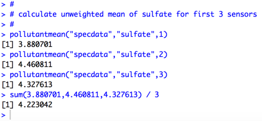
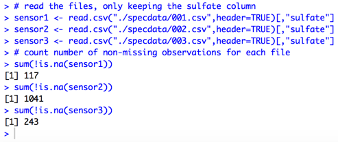
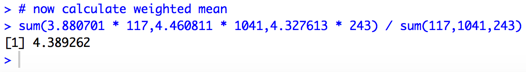
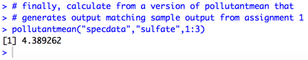
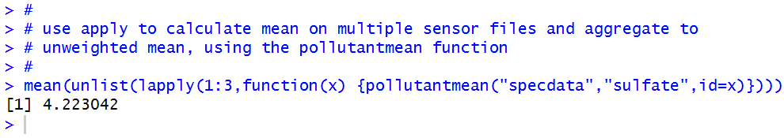
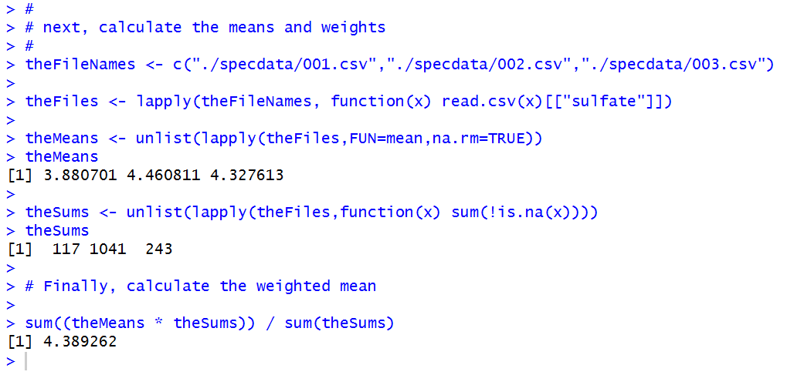

# Common Errors: Unweighted Means in Assignment 1

A number of students in *R Programming* check their calculations for the `pollutantmean()` function by comparing them with Microsoft Excel. Typically a student will calculate a mean from each Excel file in one of the sample problems and average the result. The resulting comparison matches the output from the student's `pollutantmean()` function, but does not match the sample output.

Why is this the case? It is because the student calculated the unweighted mean, or mean of means of each file, which I replicated in R as follows:

The assignment requires a weighted mean. To calculate the weighted mean on a file by file basis, we need to know the number of non-missing values for sulfate in each file.

The denominator in a weighted mean is the count of the number of observations that went into calculating each individual mean, and therefore we have to multiply each mean by the number of non-missing values to create the numerator.

Finally, to illustrate the fact that pollutantmean() should calculate the weighted mean across all files...

Here is all of the code that I screen captured above:

    #
    # calculate unweighted mean of sulfate for first 3 sensors
    #
    pollutantmean("specdata","sulfate",1)
    pollutantmean("specdata","sulfate",2)
    pollutantmean("specdata","sulfate",3)
    sum(3.880701,4.460811,4.327613) / 3

    #
    # next, calculate weighted mean
    #

    # read the files, only keeping the sulfate column by using
    # the extract operator on the data frame output by read.csv()
    sensor1 <- read.csv("./specdata/001.csv",header=TRUE)[,"sulfate"]
    sensor2 <- read.csv("./specdata/002.csv",header=TRUE)[,"sulfate"]
    sensor3 <- read.csv("./specdata/003.csv",header=TRUE)[,"sulfate"]

    # count number of non-missing observations for each file

    sum(!is.na(sensor1))
    sum(!is.na(sensor2))
    sum(!is.na(sensor3))

    # now calculate weighted mean

    sum(3.880701 * 117,4.460811 * 1041,4.327613 * 243) / sum(117,1041,243)

    # finally, calculate from a version of pollutantmean that
    # generates output matching sample output from assignment 1

    pollutantmean("specdata","sulfate",1:3)

# Appendix: The "R way" of calculating the weighted mean

The code above is deliberately repetitive to illustrate step-by-step how the unweighted and weighted means are calculated. Here is another way to do the same calculations, using techniques that take advantage of key R features.

First, we'll calculate the unweighted mean.

Next, to generate the weighted mean, we'll generate 2 arrays, multiply, and divide by the sum of the weights.

Here is the code from the screen captures that illustrate the second approach

    #
    # use apply to calculate mean on multiple sensor files and aggregate to
    # unweighted mean, using the pollutantmean function
    #
    mean(unlist(lapply(1:3,function(x) {pollutantmean("specdata","sulfate",id=x)})))

    #
    # next, calculate the means and weights
    #
    theFileNames <- c("./specdata/001.csv","./specdata/002.csv","./specdata/003.csv")

    theFiles <- lapply(theFileNames, function(x) read.csv(x)[["sulfate"]])

    theMeans <- unlist(lapply(theFiles,FUN=mean,na.rm=TRUE))
    theMeans

    theSums <- unlist(lapply(theFiles,function(x) sum(!is.na(x))))
    theSums

    # Finally, calculate the weighted mean

    sum((theMeans * theSums)) / sum(theSums)
