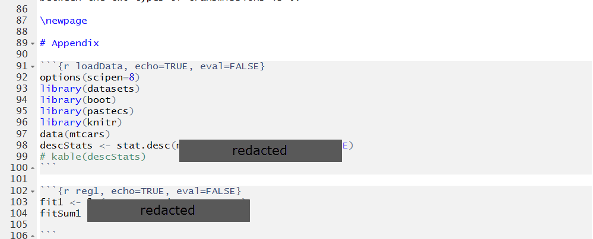
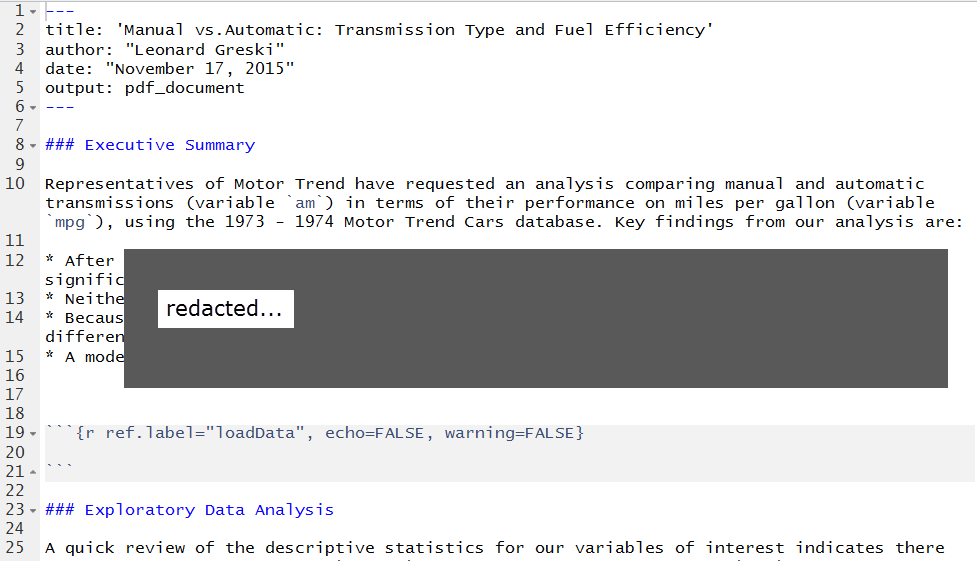
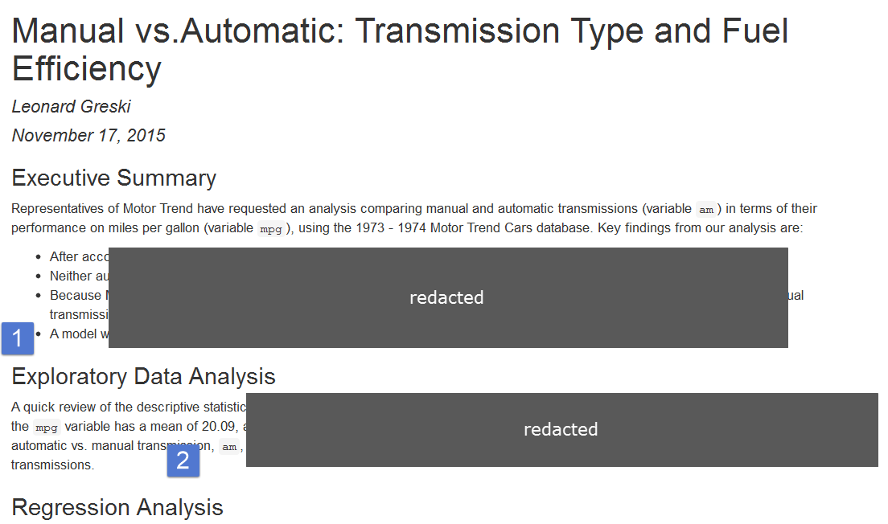
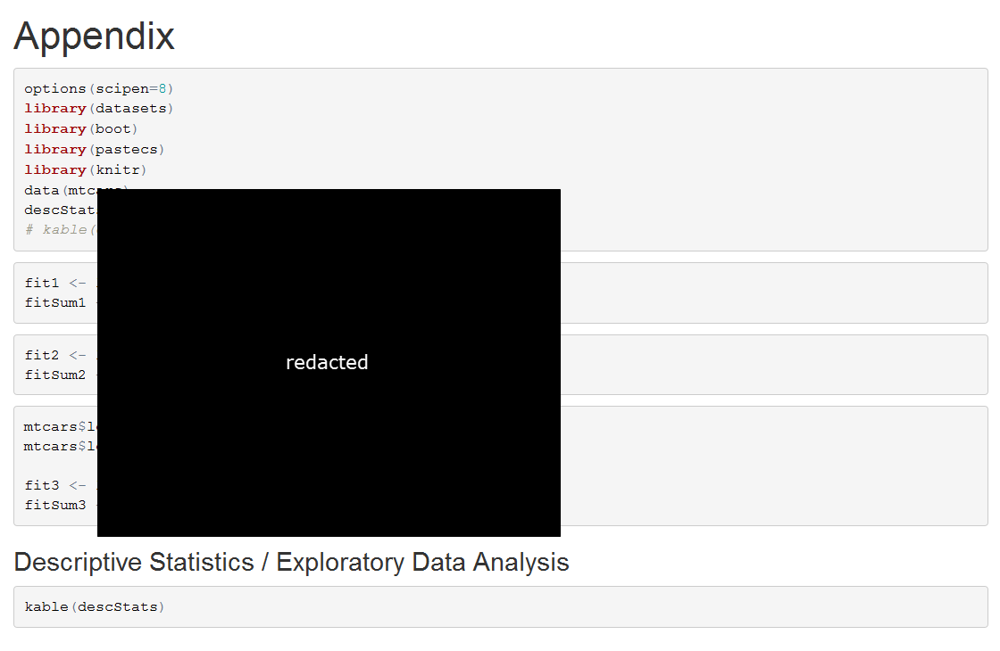

# ToothGrowth Assignment: Accessing R Code from a Report Appendix

Students often struggle to fit within the three page limit for the ToothGrowth portion of the *Statistical Inference* course project.

The instructions and grading criteria for part 2 do not explicitly require inclusion of the code, but it's usually a good idea to include the code so reviewers can see the steps that were taken to generate the content in the report. One technique for fitting into the page limit restriction for the course project while simultaneously including the code is to move it to an Appendix, and use `ref.label` within the report to execute chunks of code as they are needed to support the analysis text.

One can suppress printing of code in the report by using `echo=FALSE` in the knitr code to prevent knitr from printing the source code during the report. Since we're allowed to include code in an Appendix of up to 3 pages, I suggest that you include the code in the Appendix as follows.

I typically organize my Rmd reports in the following manner:

* Write all of the R code in an Appendix section, break it up into components, and give each component a name so I can execute it by reference during the report.
* Where I need to run a section of the R code during the report, add code to call it by reference and use echo=FALSE to prevent the code from printing.
* Add a \newpage LaTeX command right before the Appendix section to ensure the Appendix starts at the top of a new page.
* Optionally, allow the code to print in the Appendix section.

Here is how this looks in practice, based on my course project from *Regression Models*, with content redacted to comply with the Coursera Honor Code.

First, here is what the Appendix looks like:

Second, here is what the start of the report looks like, where I use `ref.label` to execute named sections of R code that are located in the Appendix:

Third, here is what the output in the beginning of the report looks like:

Notice that 1) there is no echoing of the code between the Executive Summary and the Exploratory Data Analysis headings, even though I executed code to generate descriptive statistics ahead of the EDA section, where at 2) I've retrieved a mean calculated from an R procedure and displayed it in the report.

Finally, here is what the appendix looks like, where the code is displayed but not evaluated.

In summary, the techniques above provide a straightforward way simultaneously manage the size of a report, include output from appropriate R functions in the report, and display code in an Appendix with or without executing it.
