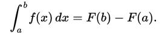
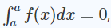
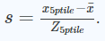
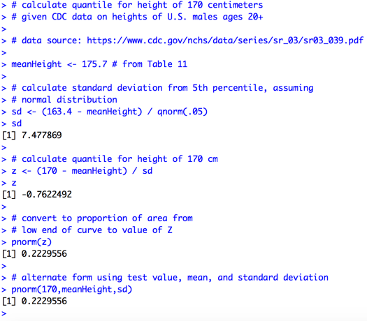
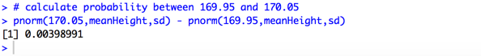

# Calculating Area for a Point on the Normal Curve

A student in the July 2017 run of the Johns Hopkins University *Statistical Inference* course asked how one could calculate the probability for a specific point on a normal curve, given Professor Caffo's statement that we assign probability values to ranges of continuous variables. The key question here is "Why can't we calculate the probability of a specific value for a continuous variable when we can calculate the probability of a specific value for a discrete variable?"

[Integral calculus](https://en.wikipedia.org/wiki/Integral) provides the mathematics to calculate the area under a curve. An integral is essentially the reverse of a [derivative](https://en.wikipedia.org/wiki/Derivative), and the [fundamental theorem of calculus](https://en.wikipedia.org/wiki/Fundamental_theorem_of_calculus) explains how the two relate for a continuous real function.

<blockquote> if <i>f</i> is a continuous real-valued function  defined on a <a href="https://en.wikipedia.org/wiki/Interval_(mathematics)#Terminology">closed interval </a>[a, b], then, once an antiderivative <i>F</i> of <i>f</i> is known, the definite integral of <i>f</i> over that interval is given by  

 
 </blockquote>

From the above definition it logically follows that . Therefore, the area under any specific point on the normal curve is 0 because *F(a) - F(a) = 0*. However, one can use the mean and standard deviation of a distribution along with a specific value to associate it with a [quantile](https://en.wikipedia.org/wiki/Quantile), as Professor Caffo defined on slide 21 of the Probability lecture.

A quantile calculates the area from the bottom of the curve to a specific point, allowing us to use the fixed integral technique as we described above. We can also calculate the area for a small slice of the normal curve surrounding the exact value in which we are interested.

We'll illustrate this technique with the details supporting the question asked by the student on the *Statistical Inference* discussion forum. Let's look at the heights of males in the United States. What would we do if we wanted to calculate the probability that an individual's height is 1.7 meters?

We can answer this question with data from the United States Centers for Disease Control's summary of the [National Health and Nutrition Index Survey - Anthropometric Reference Data for Children and Adults 2011 - 2014](http://bit.ly/2wa3d4E).

We will use the table that includes average height (in centimeters) and percentiles for varying age categories of adult males. We can calculate the standard deviation for height manipulating the formula for a Z score at the 5th percentile to solve for the sample standard deviation *s*, where 

For the purpose of this exercise, we will assume that height of males in the U.S. is normally distributed. Given the assumption of a normal distribution we can calculate where a height of 170 centimeters (1.7 meters) is on a normal curve (the Z distribution) as follows.

The resulting probability value (i.e proportion of the normal curve) means that approximately 22% of people are 170 cm or shorter, and 78% are taller than 170 cm. In other words, a height of 170 cm is at the 22nd percentile of the height distribution if height is distributed normally.

The closest we can get to an exact probability for a height of 170 cm is to use the [Reimann integral](https://en.wikipedia.org/wiki/Riemann_integral) technique to calculate the area under the curve between 169.95 and 170.05 cm, which is about 0.004.

