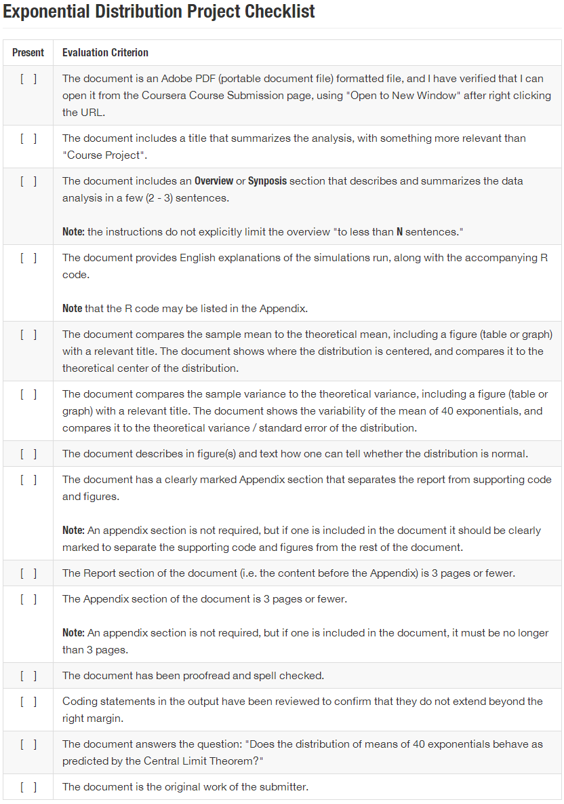

Working through the Data Science Specialization, students in numerous courses have lost credit on project assignments due to missing key points in the instructions. Here is a checklist for the Exponential Distribution / Central Limit Theorem analysis that can be used to ensure key requirements from the assignment are covered in your project submission.

  
