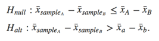
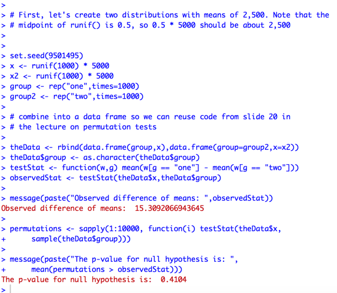
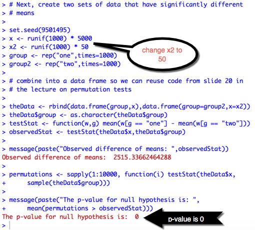

# Background on Permutation Tests

This article is an additional explanation of the content in the Johns Hopkins University Data Science Specialization course on *Statistical Inference*, specifically the lecture 13 content on [group comparisons and permutation tests](https://github.com/bcaffo/courses/blob/master/06_StatisticalInference/13_Resampling/index.pdf) starting on slide 17.

If we have a variable *x* and two groups *A* and *B*, the permutation test evaluates whether they come from the same underlying distribution. If our test statistic is a difference of means, we test the hypothesis:

The last line of code on slide 20 is the probability value associated with the null hypothesis. If this is less than alpha \(the rejection region\), we reject the null hypothesis that the two groups come from the same distribution.

For example, let's build some sample data containing two groups of normally distributed values with means of 5,000 and run the permutation test.

Notice that the probability value is *> 0.05*. Therefore, we would fail to reject the null hypothesis at alpha = 0.05 that the two groups came from the same distribution, and conclude that the two groups do in fact come from the same underlying distribution.

Now, let's change the data so that the second group has a mean of 50 instead of 5,000 and rerun the test.

Here we reject the null hypothesis that the two groups come from the same underlying distribution.

For more information on permutation tests, take a look at the [Wikipedia page for Resampling](https://en.wikipedia.org/wiki/Resampling_(statistics)).
