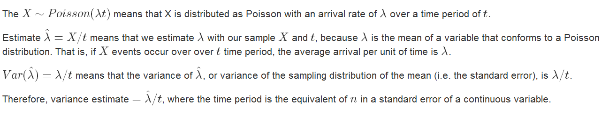

# Poisson Confidence Interval Explained

In February 2017 a student in the Johns Hopkins University *Statistical Inference* course requested a more verbose explanation of the content on calculating a confidence interval for the mean of a Poisson random variable. Specifically he wanted more detail regarding the content on slides 26 - 27 of the *Asymptopia* lecture.

## Explaining the Formulas

## Key difference: how wide is the interval?

Here is the R code from slide 27 of the lecture.

      > x <- 5
      > t <- 94.32
      > lambda <- x / t
      >
      > # manually calculated confidence interval
      > round(lambda + c(-1,1) * qnorm(.975) * sqrt(lambda/t),3)
      [1] 0.007 0.099
      >
      > # Poisson test version of confidence interval
      > poisson.test(x,t)$conf.int
      [1] 0.01721254 0.12371005
      attr(,"conf.level")
      [1] 0.95
      >

Notice that the manually calculated interval is more aggressive (narrower) than the `poisson.test()` version.

      > # manual
      > manualInterval <- round(lambda + c(-1,1) * qnorm(.975) * sqrt(lambda/t),5)
      > manualInterval[2] - manualInterval[1]
      [1] 0.09293
      > # poisson test
      > poissonInterval <- poisson.test(x,t)$conf.int
      > poissonInterval[2] - poissonInterval[1]
      [1] 0.1064975
      >
      
## Other Forms of Poisson Intervals

In July 2017, another student asked a question about a formula that was based on the square root of lambda, asking why this could be accurate given that the formula for the standard devision of a poisson distribution is sqrt(lambda). 

The literature on confidence intervals for poisson means is confusing because there are many different ways to calculate a confidence interval for a poisson mean, including:

* intervals based on event counts,   
* intervals based on a rate, and   
* intervals based on an average of several counts.   

When the event count is large, many of these formulas use an approximation to the normal distribution where the standard deviation equals the mean of the event count, leading to a formula that looks like

     lambda +/- Z * sqrt(lambda)
     
The clearest summary of these approaches that I found during my research on this question is from an article on [pmean.com](http://bit.ly/2tzbIbe). 

## Additional Information

For additional background on the Poisson distribution and calculating confidence intervals for it, see also [Introduction to the Poisson Distribution](http://bit.ly/2kJH86C), [Computing Confidence Interval for Poisson Mean](http://bit.ly/2lVyPdj), and [Comparison of Confidence Levels for the Poisson Mean: Some New Aspects](http://bit.ly/2lhIZlg) by Patil and Kulkarni.
