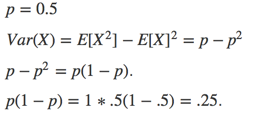
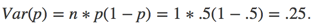
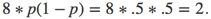

# Variance of Binomial Distribution

In the August run of the Johns Hopkins Data Science Specialization *Statistical Inference* course, a student asked a question about why the variance for a toss of a coin with a probability of heads (1) equal to *p* was *p(1 - p)* instead of <i>n * p(1 - p)</i>, referencing the Wikipedia article for the [Binomial Distribution](http://bit.ly/2vU528j).

In the lecture, Professor Caffo uses the [moment statistics](http://bit.ly/2iTE6zW) formula for the second central moment to calculate the variance, assuming a single coin flip.

In the case where we have multiple coin flips, each flip is independent, and all flips have the same probability of a TRUE / 1 result. In this situation, we have a random variable *X* with parameters *n* and *p* that represents the sum of *n* independent variables *Z*, each of which can take the value 0 or 1. Therefore, the variance of the total number of flips is equal to <i>n * p(1 - p)</i>.

In the case of a single coin flip for a binomial distribution, the binomial distribution variance is:

This matches the result of the calculation using the second central moment formula.

If we flip a fair coin 8 times, the variance of the binomial distribution of flips is:

That is, since the events *Z* are independent, the variance of the total of *n* events is equal to the sum of the individual event variances.

The conclusion is that the variance of a binomial distribution of *n* flips increases as the number of flips increases because we are measuring the mean of the counts of 1 over the total number of flips.

This makes sense intuitively because if *n = 10*, the mean of the count of 1s can vary between 0 and 10 with *E[X] = 5*, but if *n = 100* the mean of counts can vary between 0 and 100 with *E[X] = 50*.
