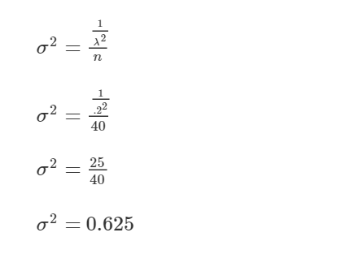

# Theoretical Variance: Sampling Distribution of the Mean

A number of students in Johns Hopkins University Data Science Specialization *Statistical Inference* course have asked questions about the theoretical variance for the distribution of sample means taken from an exponential distribution.

Within the assignment instructions we are told to use a value of lambda = .2 for the simulations we generate as we validate the Central Limit Theorem.

Given the assigned value of lambda, we derive the  value of the theoretical variance as follows:

