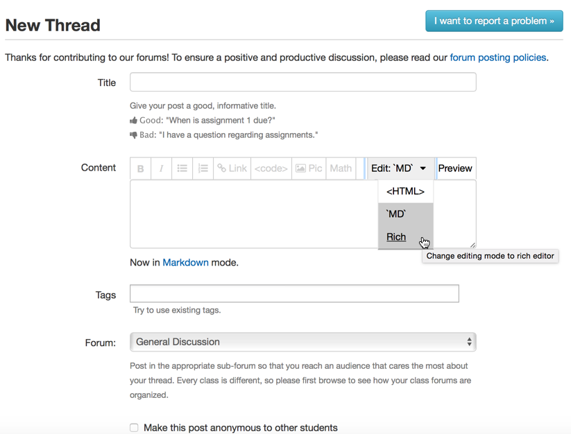
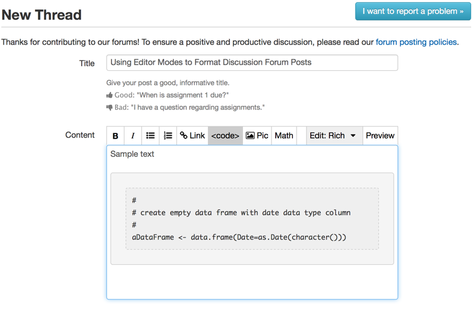

# Using Editor Modes in Discussion Forum Posts

As you progress through the Data Science Specialization, you will begin to notice forum posts that include a number of special features, including inline code references \(e.g. `str(anObject)`\), embedded pictures, and code blocks.

How does one use these features within a Discussion Forum post?

From the **New Thread** Window, a pulldown menu allows you to switch between three different ways to format a forum post, including:

1. HTML: write a forum post using HTML tags to format the content. Useful if you already know HTML, or want to use specific HTML features that aren't easily supported in the other modes.
2. Markdown: write a forum post using [Markdown](https://daringfireball.net/projects/markdown/syntax) a simplified version of HTML. Markdown is a key skill in the *Data Science Specialization*, and we begin using Markdown as part of the first project in *The Data Scientist's Toolbox*.
3. Rich Text: write a forum post using rich text, which supports basic formatting through a limited menu bar of features, as well as the ability to embed images in a post.

### Figure 1: Multiple Edit modes

To write a high quality post, sometimes we need to use multiple modes. When starting a new forum thread, the default mode is *Markdown*. This means that we can write the post using Markdown syntax to format the post.

The key feature from Markdown that is not available in Rich Text format is `inline code`.  To highlight text in this way, use the backtick \` key at the start and end of the text to be formatted, such as \`here is my inline code\`, which will be rendered as `here is my inline code` when it displays in the post.

To switch from Markdown to Rich Text, select the pulldown menu above the content entry box, and select **Rich Text**.

When Rich Text is the edit mode, you can then use the icons at the top of the content entry area to format content.

One of the most useful features in the Rich Text mode is the code block format. This format makes it easy to load a block of code into a forum post, and renders it in the standard format of a fixed point font on a gray background.

To add code in a code block to a forum post, place your cursor where you want to insert the code block, and select the \<code\> icon above the content entry area, which will insert the formatting for a code block.

### Figure 2: Adding a Rich Text Code Block

Once the code block is visible, you can manually type the code, or paste the code into the formatted area if it was previously written in R or RStudio.

### Figure 3: Pasting Code into a Code Block

By using these features, you can make it easier for readers to read the code within your forum posts.
